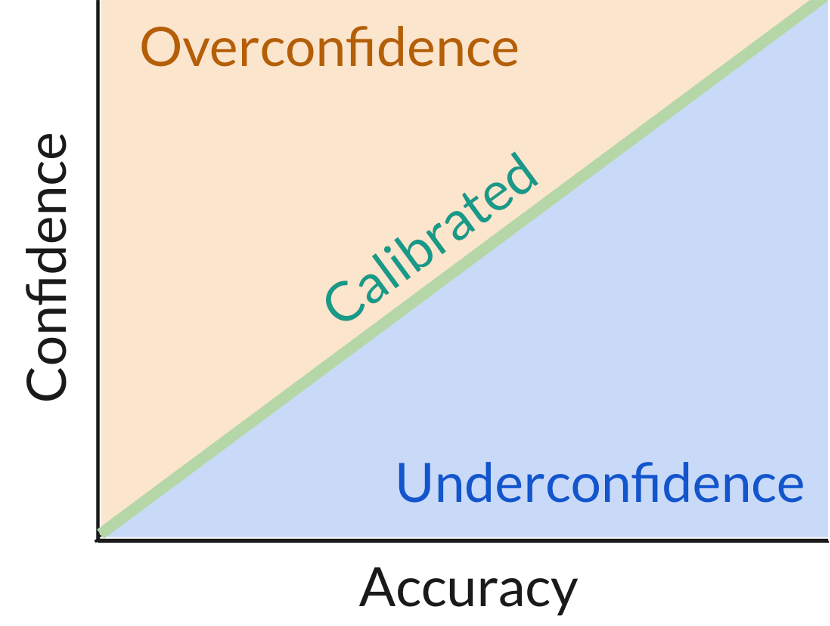

---
#output:
#  bookdown::pdf_document2:
#    template: templates/template.tex
#    citation_package: biblatex
    #latex_engine: pdflatex
#  bookdown::html_document2: default
#  bookdown::word_document2: default
#documentclass: book
#bibliography: [bibliography/references.bib, bibliography/additional-references.bib]
#header-includes:
#bibliography: bibliography/references.bib
#csl: bibliography/apa.csl
bibliography: [bibliography/references.bib]
---

# Introduction {#chapter-1}

\adjustmtc
\markboth{1. Introduction}{}

<!-- For PDF output, include these two LaTeX commands after unnumbered chapter headings, otherwise the mini table of contents and the running header will show the previous chapter -->

## Diagnosis and Error

Imagine a medical consultant within a hospital’s intensive/critical care unit. They are asking a colleague for advice about a particular patient. The patient has a series of symptoms, including dizziness, breathing difficulties and eventual chest pain. Her ‘vital signs’, including heart rate, body temperature, blood pressure, blood oxygen saturation and respiration rate are monitored continuously. There has been a slow decrease in her blood pressure and blood oxygen saturation. The consultant is deciding what are the most likely causes of this patient’s symptoms and how they may inform her future care/treatment. It is possible that the patient is suffering from pulmonary oedema secondary to heart failure, whereby fluid is collected in the air sacs of the lungs, causing severe and sometimes fatal congestion. The symptoms could also be suggestive of a pulmonary embolism (a blood clot in the lungs) or sepsis. Alternatively, there could be a cardiac cause of the patient’s condition. The consultant must integrate the information they have so far, align their individual mental models of the patient's condition (i.e., the most likely root causes and contributing factors of a patient's symptoms and risks associated with them) with colleagues (e.g., nurses, pharmacists) and decide the following:

1.  Do they have enough information to diagnose the patient’s condition?
2.  If not, what extra information do they need? Are there further tests that need to be performed?
3.  What actions should they start taking to treat the patient given the most likely diagnosis?

One of the difficulties within this scenario is that the symptoms are indicative of multiple underlying conditions, which is a common occurrence in medical decision making. This example is illustrative of why many medical decisions are ‘ill-structured’ problems, in that they present several possible courses of action, and can produce disagreements between clinicians over both the current hypothesis for the patient’s condition and desired end goal (be they or short-term or long-term) for that patient’s care [@jonassen_instructional_1997]. This thesis aims to elucidate the cognitive mechanisms of medical diagnoses. Diagnosis is a core aspect of several medical subdisciplines and we choose it as an area of study for several reasons. Firstly, accurate diagnosis is crucial to a patient’s care and treatment. Secondly, from a psychological standpoint, studying diagnosis allows for an extension of previous research on the relationship between information gathering and confidence to an ecologically valid, real-world setting. Finally, past work looking at diagnosis has not yet provided clarity on the causes of diagnostic errors [@van_den_berge_cognitive_2013; @norman_etiology_2014; @restrepo_annals_2020].

\
Diagnosis in medicine has been defined as "the science...to distinguish one disease from another and trace symptoms to causes from which they spring" [@fenwick_medical_1891]. Identifying the condition that a patient has is important for guiding subsequent treatment. Accurate medical diagnosis is crucial to safe, high quality patient care and is a core part of a doctor’s job. Research on diagnosis has therefore been grounded in the incidence of errors in order to better ensure safer patient care. Looking into medical errors allows healthcare systems to learn from past mistakes and improve both technical and safety processes for future patients. For instance, the Health Services Safety Investigations Body (HSSIB, formerly the HSIB) has reviewed patient case studies to guide future diagnosis of aortic dissection [@hsib_investigation_2021] and lung cancer [@hsib_investigation_2022] among others, due to these case studies exemplifying delayed recognition of these conditions and their negative consequences for patients. These are examples of investigating medical errors to guide future best practices.

\
Past work has attempted to quantify the scale of diagnostic errors within healthcare. A report from the US Institute of Medicine concluded that most patients will experience a diagnostic error within their lifetime. A review of records for new diagnoses for spinal epidural abscess in the US Department of Veteran Affairs, [@bhise_errors_2017] found that up to 55.5% of patients experienced a diagnostic error. Other papers have estimated a lower incidence of diagnostic error: the Harvard Medical Practice Study found that diagnostic errors were responsible for 17% of adverse events (injuries/harm that were caused by medical management, rather than the underlying disease) [@kohn_errors_2000], whilst the Canadian Adverse Events Study found this value to be 10.5% [@baker_canadian_2004]. The Quality in Australian Health Care Study found that 20% of adverse events were due to delayed diagnosis [@wilson_analysis_1999]. Even when using the most conservative of these estimates, the scale of the diagnostic error is substantial when extrapolated to the population of patients. Past work has hence attempted to find the sources of diagnostic error in order to identify how to reduce their prevalence. All in all, understanding the common sources of medical errors and adverse events can be extremely valuable for improving healthcare in the future.

\
With this scale of diagnostic errors in mind, another subset of past work has connected diagnostic errors to clinicians' diagnostic thinking, including how they weigh up diagnostic hypotheses (also known as differentials) against each other and how clinicians seek information to support or rule out these hypotheses. Around 32% of clinical errors have been found to be caused by clinician suboptimal assessment, particularly the clinician’s failure to weigh up competing diagnoses [@schiff_diagnostic_2009]. Another study estimated that 75% of diagnostic failures could be attributed to failures in clinicians' diagnostic thinking [@thammasitboon_diagnostic_2013], including having inadequate knowledge, faulty gathering of information, and not thoroughly verifying information. In terms of their downstream consequences, diagnostic errors have also been found to lead to longer hospital stays and increased patient mortality [@hautz_diagnostic_2019]. In addition to longer stays in hospital, errors also manifest in differences to treatment for patients. Unnecessary treatment (or ‘overtreatment’) was estimated to cost the US healthcare system 158-226 billion dollars in 2011 [@berwick_eliminating_2012]. There has been increasing emphasis in the research literature on overtesting, such as requesting costly imaging scans when they may not be medically necessary [@carpenter_overtesting_2015]. @salem-schatz_influence_1990 found that 61% of surveyed resident doctors had ordered unnecessary blood transfusions at least once a month due to a suggestion to do so by a more senior physician. Taken together, this set of literature illustrates the broad impact of diagnostic error and the amount of work that has gone into understanding its impact on patients.

\
Diagnostic error is by no means solely caused by individual clinicians' decision making. There are several factors tied to the wider work environment, culture and technology that can contribute to incidents and errors. This means that many diagnostic errors result from systemic failures rather than individual failures. Individuals involved in clinical decision making must frequently contend with an uncertain decision making environment, as well as time pressure and personal stresses [@yates_physician_2020]. However, by understanding the individual psychological factors that affect the diagnostic process, we can better understand how sociotechnical and environmental factors may interact with and amplify individual contributing factors to diagnostic error. Gaining a greater understanding of the causes of diagnostic error can have important implications for future interventions within healthcare settings and improvement of patient care. Studying diagnosis also has added insights for the field of cognitive psychology, within which decision making has been studied in the past. Such insights can then be applied to the real-world context of medicine with the aim of improving diagnostic decisions. The next two sections describe the extant psychology literature on decision making and how it has been previously applied to medical diagnoses.

## Cognitive Biases in Diagnoses

One potential account of diagnostic errors is that they stem from cognitive biases during the diagnostic decision making process. Cognitive biases have been investigated substantially in past psychology research on judgement and decision making. Studies of biases have aimed to elucidate the ways in which the decisions we make are reliant on heuristics that can often contribute to suboptimal or erroneous decisions. These heuristics are believed to be used as 'shortcuts' to make quicker and more automatic decisions. This was originally posited by @tversky1974 as part of the dual-system theory of thinking, such that decisions are either made on a fast, intuitive level (System 1) or on a slower, systematic basis (System 2). Certain biases were studied by @tversky1974, including availability (overweighting information that corresponds with a recent or memorable case/instance), anchoring (whereby individuals are highly influenced by a reference point that other options for a decision are judged against) and representativeness (basing judgements on a single prototypical example as a reference). This work inspired the the field of judgement and decision making to subsequently uncover other decision making biases. These include weighting information differently depending on whether they arrive earlier (primacy bias, @saetrevik_anchoring_2020) or later (recency bias, @chapman_order_1996) in a decision making process. They can also include judging a decision as better when it results in a success rather than failure ceteris paribus (outcome bias, [@baron_outcome_1988; @aiyer_outcomes_2023]) and judging members of an outgroup (i.e., a different social group identity to ourselves) less favourably when compared to an ingroup (ingroup bias, [@tarrant_social_2012]). The study of decision making biases has been broad and considered a large number of ways in which decision making deviates from what we might consider as optimal or rational.

\
The dual system theory of reasoning has been proposed as being applicable for diagnostic decisions [@croskerry_clinical_2009]. According to one review, 77% of studies in the allied health professions found evidence of a cognitive bias [@featherston_decision_2020], including anchoring and confirmation bias. Whilst the biases in the previous paragraph have tended to be implicated within System 1 thinking, there are also error-prone approaches that arise from the more analytical, deliberate mode of System 2 thinking: reasoning from a false premise, having inadequate contextual knowledge and being paralysed with indecision are a few notable examples [@croskerry_deciding_2014]. Making a simple 'debiasing' intervention to aid accurate diagnoses is not a trivial task given that in many cases, decision makers are not aware of their biases [@croskerry_mindless_2013]. It has been proposed that integrating education on cognitive biases within medical education would reduce diagnostic errors and improve patient safety [@royce_teaching_2019]. What complicates this picture however is the argument that the use of heuristics, which may seem biased or suboptimal, can actually be beneficial in many situations where environmental and cognitive constraints are placed upon the decision maker [@gigerenzer_why_2008], a situation that is common within healthcare. For example, a clinician who has less time with a patient than they would ideally want, due to other commitments, may employ certain heuristics to expedite their decision making process. Hence, it is important to understand the situations in which medical decisions are biased in a manner that increases the risk of errors and situations in which these biases instead reflect good decision making.

\
Although it seems intuitive that classical decision making biases affect those in healthcare too [@restrepo_annals_2020], the empirical evidence of the impact for medical decision making is scant [@van_den_berge_cognitive_2013]. One example from dermatology found examples of satisficing bias (also known as premature closure, whereby clinicians arrive at an incorrect diagnosis too early and subsequently stop considering alternatives or seeking other information) and anchoring bias, but far fewer examples of other biases, such as availability bias [@crowley_automated_2013]. These biases have been considered to be most applicable to medical decision making based on case studies and compelling anecdotal evidence [@groopman_how_2010]. For many of these biases, it can be challenging to establish a causal empirical relationship such that errors can be shown to be a result of a bias. For example, investigating availability bias requires researchers to simulate a patient situation that clinicians have experienced recently and then show that relating the current situation to that recent case is what caused a diagnostic error (if indeed the clinician does make an error).

\
The literature on cognitive biases is vast, with several different biases named and defined. In an attempt to condense the large number of defined biases, @oeberst_toward_2023 categorised several biases from psychology research under a number of groups of beliefs about how individuals process information. For instance, a belief that one's opinion is shared by many others (false consensus effect, @nickerson_how_1999) and the tendency to judge others as similar to oneself (social projection, @robbins_social_2005) are both heuristics/biases driven by a common underlining belief: that one's own experience is a reasonable reference to extrapolate others. Similarly, tendencies to believe that successes come from oneself rather than external factors (self-serving bias, @mullen_self-serving_1988) and that one's performance is better than others (better-than-average effect, @alicke_better-than-average_2005) are both underscored by a belief that we are good or high performing at what we do. This latter belief is of particular interest to our present work, as it is related to the estimation of one's own ability. In other words, it can be considered as one's subjective 'confidence'. Confidence is important to study, both because it is often not be matched to objective performance and because it underscores a large amount of medical practice [@croskerry2008; @berner_overconfidence_2008].

\
Confidence can be used as a marker of how sure a clinician is about a decision in the absence of clear feedback (e.g., the true condition of that a patient has), which can then be used to guide discussions between clinicians. In addition, in line with the implications of cognitive biases in diagnoses, one type of bias that has more consistently been revealed in experimental findings within medical decision making (when compared to other aforementioned decision making biases) is overconfidence [@berner_overconfidence_2008; @meyer_physicians_2013]. These findings revealed clinicians to report themselves as being more confident in their decisions than they should be given their objective accuracy. When making a diagnosis for a patient, clinicians likely do not receive unambiguous feedback about the correctness of their diagnosis. Generally, doctors gather information through tests, patient documentation and other means to generate a model of the patient’s condition, through which they can surmise a hypothesis for what could be the underlying cause of a patient's symptoms. Some may view diagnostic tests (e.g., blood tests) as a form of feedback: doctors use these test results to either reinforce or re-evaluate their prior beliefs. However, tests are not objective markers of feedback, as they have differing levels of sensitivity and specificity rates, leading to false positives, false negatives or even inconclusive results. Clearer feedback may be available to the clinician based on how a patient’s condition changes. A patient’s reaction to treatment, and their rate of recovery, can be seen as a form of feedback. This in itself is imperfect however, as patients can deteriorate or improve due to circumstances outside of the doctor’s control or awareness. This also requires a patient's condition to develop over time and cannot be known in the moment of a diagnosis. In the absence of clear feedback then, confidence is used as one of the only markers available for how likely someone is to be correct. We shall now explore how confidence has been studied within cognitive psychology and why it is very relevant to medical diagnoses.

## Confidence and Miscalibration

Confidence can be defined as a person's "subjective probability of their decision being correct" [@fleming_self-evaluation_2017] (pg. 1), and has been viewed as a way for humans to communicate their thought process to others (as per Kahneman's System 2 mode of thinking) [@shea_supra-personal_2014]. Individuals have been shown to be able to evaluate their own decisions without any objective feedback via judgements of confidence [@henmon_relation_1911] and evaluations of their own accuracy [@rabbitt_three_1968] that correlate well with objective performance. Confident individuals tend to be more influential with others in a group [@zarnoth_social_1997] and can even causally increase the confidence of other observers [@cheng_social_2021]. This effect has been observed in mock jury trials, during which participants heard eyewitness testimonies presented with high confidence and then perceived those testimonies as more credible than testimonies provided with lower confidence [@cutler_eyewitness_1989; @roediger_iii_curious_2012]. Confidence is a commonly used predictor of another person’s accuracy, especially when feedback is not readily available on an individual’s true accuracy or an individual's competence/expertise [@price_intuitive_2004; @pulford2018]. Confidence also varies across individuals with what may be considered a ‘subjective fingerprint’ [@ais_individual_2016], meaning that individuals tend to be underconfident or overconfident across different situations. Confidence has been explained computationally as the difference in the strength of evidence for a decision alternative compared to other alternatives [@vickers_effects_1982]. After a decision is made, we continue to process evidence (i.e., we continue to think about a decision after it has been made). Having ‘second thoughts’ or changes of mind are more likely with a lower level of confidence [@charles_dynamic_2019]. If an individual is systematically overconfident, they would be less likely to change their mind in the face of evidence that is contradictory to their beliefs (i.e., confirmation bias, @nickerson_confirmation_1998).

\
What can be surmised here is that confidence is important for decision making, as it allows for an indicator of how likely a decision is to be correct. This is especially useful in contexts where objective feedback is scarce, such as in medicine. In the absence of objective feedback, confidence can be used as a marker of how likely someone is to be correct [@price_intuitive_2004]. Confidence is also important for deciding when a individual commits to a decision or whether more information is needed first before committing. Building on the current research landscape of confidence is then important within medical decision making. If there is an assumption that others will calibrate their confidence to their true accuracy, this would mean that heeding high confidence advice/judgements would be an optimal strategy for maximising accuracy. However, this can be a serious issue when high confidence errors lead others astray. This is important, as in addition to seniority and specialty experience, a clinician’s confidence is one of the few markers available for other clinicians and for patients during key medical decisions.

\
We refer to confidence as being ‘calibrated’ if it closely predicts objective accuracy (i.e., such that the individual is neither overconfident nor underconfident, see [Figure \@ref(fig:calibrationgraph)](#fig:calibrationgraph) below). In experimental studies, confidence sometimes exhibits impressive calibration to objective accuracy [@boldt_shared_2015], which is thought to reflect people’s ability to evaluate the quality of evidence on which they base their decisions [@xue_challenging_2023]. But calibration is rarely perfect because confidence also depends on factors that do not directly correlate with accuracy, such as the time spent deliberating and the total amount of evidence considered (independent of the quality or consistency of this evidence) [@kiani_choice_2014], as well as the mood [@rouault_psychiatric_2018], personality [@schaefer_overconfidence_2004], gender [@syzmanowicz_gender_2011] and status [@see_detrimental_2011] of the decision maker. Miscalibrations of confidence come from a lack of deliberation over one’s decisions and confidence, leading to an overreliance on intuitive decision making [@mata_metacognitive_2013]. Overconfidence has also been associated with insufficient consideration of reasons to choose alternative options/decisions [@koriat_reasons_1980; @scherer_trust_2015]. The resulting under- and overconfidence matters: overconfident decision makers may leap to premature conclusions and ignore useful information or advice, whereas underconfident decision makers waste time collecting evidence that will not improve their decisions [@desender_subjective_2018]. Especially in the absence of feedback, decision makers may develop systematically incorrect evaluations of their general performance [@rouault_forming_2019] and their performance in comparison to their peers [@kruger_unskilled_1999]. Individual miscalibrations of confidence can also become amplified within groups. Effective decision making in groups depends on team members sharing calibrated information about their uncertainty: Confident team members tend to be listened to more, which can lead others astray if they are overconfident [@zarnoth_social_1997]. Conversely, underconfident team members may be ignored or may fail to share potentially useful information [@silver_wise_2021; @larson1996].

\newpage

```{r calibrationgraph, include=TRUE, echo=FALSE, out.width='100%', fig.align='center', fig.cap="Visual representation of confidence calibration when comparing objective accuracy (x-axis) to subjective confidence (y-axis). Confidence is said to be calibrated when the two are relative equivalent (green line). Individuals are considered underconfident when their confidence is lower than their true accuracy (blue area) and overconfident when their confidence is higher than their true accuracy (orange area).", fig.scap="Visual representation of confidence calibration"}



```

These findings of miscalibrated confidence are important to highlight specifically within healthcare, as overconfidence can lead to insufficient consideration of diagnostic alternatives and inadequate care in terms of seeking appropriate tests and treatment for patients [@kovacs_overconfident_2020]. In medicine, a lack of clearly communicated feedback can cause clinicians to proceed as if they have received positive feedback (also known as diagnostic momentum bias, @aron_diagnostic_2024). Without clear feedback on whether their decisions are correct, clinicians may not adequately update their internal model of the patient and then increase their confidence inappropriately, whether working individually or in teams [@jaspan_improving_2022]. As we shall explore in the next chapter, the link between confidence and eventual patient care/treatment has been explored in past work, demonstrating the importance of confidence calibration of studying in medical decisions.

\
Some past work has explored instances of miscalibrated confidence specifically within the context of diagnoses. @meyer_physicians_2013 found that instances of overconfidence in physicians, even with the receipt of further information, were especially stark for difficult cases when objective accuracy was very low. In a task that involved diagnosing ultrasound scans, it was found that overconfidence was inversely associated with the amount of clinical experience that the clinicians/participants had [@schoenherr_subjective_2018]. However, it has also been found that underconfidence can be more prevalent than overconfidence, especially when comparing medical students to residents [@schoenherr_subjective_2018]. Similarly, @yang_nurses_2010 found that experienced nurses exhibited similar performance to nursing students, but were more confident in their judgements, resulting in differences in confidence calibration across experience levels. However, @brezis_does_2019 found that compared to students, experienced physicians were both more confident and less accurate at making a diagnosis for a paediatric case. Similarly, @friedman_physicians_2005 found that residents were overconfident in their diagnoses on 41% of cases, whilst students were overconfident on 25% of cases. As can be observed from this research in diverse groups, past work has tended to focus on drawing out the link between experience and confidence calibration. The overall finding that additional experience as a clinician does not lessen (and could even exacerbate) miscalibration of confidence shows that studying the mechanisms of diagnostic confidence could have benefits for clinicians across all levels of experience. This is especially pertinent in healthcare environments where more experienced clinicians tend to be listened to more. Highly confident members within a group could unknowingly reduce the chance of less confident (or less experienced) members speaking up about potential errors [@hemon_speaking_2020]. Overconfidence has also been linked to a lower likelihood of sufficient patient management and clinical effort as per a field study in primary care settings within Senegal [@kovacs_overconfident_2020].

\
To summarise, confidence can be thought of as a subjective evaluation of a decision's quality that is based on the evidence/information received in favour of a particular decision relative to the evidence against that decision. Past work has not only shown evidence for miscalibration of confidence (i.e., overconfidence or underconfidence), but also that such miscalibration has an impact on patient treatment. In summary, one can infer that the decoupling between confidence and accuracy is linked to the way in which evidence/information is sought or received. This is pertinent within medicine where doctors must synthesise a vast array of patient information (e.g., documents, test results, examinations etc.). In addition, the fact that the evidence described above spans different medical subdisiciplines and experience levels indicates the broad relevance of and interest in confidence calibration across the field of medical decision making. The next section reviews the extant literature on the relationship between information seeking and confidence and how it may provide additional insight into how confidence can become miscalibrated during diagnoses.

## Information Seeking and its link to Confidence

The way that individuals seek information is important, as it affects what information they are using to make their decisions. For many decisions, people have some control over which information, and how much information, they will collect to inform their decisions. Information seeking is also thought to signal the importance of a task and quality of the source of the information among factors [@xu_who_2006]. Information seeking is an aspect of real-life medicine that should be considered: two clinicians confronted with the same patient case are unlikely to use the same information to make a diagnosis if they seek different investigations/examinations. In addition, analysing information seeking allow us to conceptualise decision making as an active, ongoing process where information is sought in response to previously acquired information. For instance, an individual may be more likely to seek further information when they receive information that is contrary to, and not supportive of, their prior beliefs [@adams_reduction_1961]. Similarly, individuals with staunchly held beliefs have been found to be less likely to seek new information to refine their beliefs [@schulz_dogmatism_2020]. Information seeking patterns could be a signal of certainty or uncertainty, especially when a clinician has to decide whether the information they have is adequate to make an accurate diagnosis or whether they need more information before coming to a decision [@gehlbach_illusion_2024]. Seeking confirmatory information has been thought of as indicative of calibrated judgements of confidence when information is not processed in a biased way [@rollwage_confidence_2020], such as weighting confirmatory information higher than corrective information [@schulz-hardt_biased_2000]. Taken together, information seeking as a research area from cognitive psychology has potential applications for a deeper study within medical diagnoses, improving our understanding of the process of medical decision making and, more importantly, how accuracy might be improved.\

The link between confidence and information seeking has been previously investigated in cognitive psychology research. This association can be studied in two directions, looking at either how the evidence collected subsequently informs confidence or how confidence informs subsequent information seeking. In relation to the former, confidence is primarily determined by the accumulated strength of evidence in favour of a particular decision alternative relative to others [@vickers_effects_1982; @pleskac2010]. However, it has also been shown that the mere quantity of information, even if some information favours the non-preferred option, increases confidence by itself [@ko_divergent_2022]. One potential reason for this increased confidence that has been suggested is that individuals experience ‘decision inertia’, whereby they tend to maintain their previous choices regardless of the evidence presented against those choices [@akaishi_autonomous_2014]. Alternatively, past decisions made by an individual may bias any subsequent information sampling (i.e., ‘confirmation bias’, [@nickerson_confirmation_1998]). The utilisation of confirmatory information has been found to be especially obvious when presenting information sequentially rather than simultaneously [@jonas_confirmation_2001], which can be the case in healthcare when it comes to requesting tests or examining the patient. Individuals have been shown to have a tendency to sample information that corresponds with a previous choice, with confidence increasing the extent to which information sampling is biased [@kaanders_humans_2022]. The qualities of the information received matters for confidence too however, with more variability in information (i.e. a higher range in the information available) being associated with lower confidence [@desender_subjective_2018]. Choosing when to stop gathering information has also been found to produce a ‘boost’ in confidence when compared to being forced to stop gathering information at a certain time [@wei_confidence_2021]. In summary, the process of seeking evidence is implicated in the confidence that individuals have in their decisions.

\
In relation to the latter directionality, such that confidence informs subsequent information seeking, confidence has been found to affect the accumulation of perceptual evidence @balsdon_confidence_2020, as well as the amount of time spent viewing [@rausch_cognitive_2020] and deliberating over evidence [@kiani_choice_2014]. Confidence also affects the type of evidence that is sought, as it has been found to be associated with a tendency to seek confirmatory evidence [@rollwage_confidence_2020], how likely incoming evidence is to change one's mind [@pescetelli_confidence_2021] and how likely individuals are to seek advice for a decision [@carlebach2023]. After a decision is made, we continue to process evidence, meaning that we continue to think about a decision after the decision is made. This means that having ‘second thoughts’ or changes of mind are more likely with a lower level of initial confidence (and hence a lower relative strength of evidence). When taken together, confidence and information seeking are deeply connected during the decisional process. Given that the confidence individuals have in their decision is based on the evidence evaluated either in favour or against that decision, systematic differences in information seeking and evaluation could be responsible for differences in confidence calibration. Hence, studying information seeking in the context of medical decisions can elucidate how clinicians' confidence can become decoupled from their objective accuracy. We now look at research on the link between information seeking and confidence during medical decisions.

\
One of the earliest papers to investigate the link between overconfidence and information seeking in clinical settings was by @oskamp_overconfidence_1965. This study focused specifically on clinical psychology and tasked participants with answering questions about a patient who had been displaying signs of post-traumatic stress disorder caused by the patient’s army service. Participants received some information about this former soldier named Joseph Kidd and were asked 25 multiple choice questions about Kidd’s past and predicted future behaviour. They finally reported their ‘confidence’ by estimating the percentage of questions they answered correctly, ranging from 20% (at chance) to 100% (all correct). Participants then received more information about Kidd in three subsequent stages, focusing on Kidd’s childhood, his time in school and his time in the army. After receiving each set of new information, participants could revise their answers to all questions and report their new confidence. Oskamp found that with each new set of information, participants increased their confidence but did not significantly improve their accuracy. In fact, participants were less likely to change their answers as more information was provided (see [Figure \@ref(fig:oskamp)](#fig:oskamp) below). This demonstrated that confidence could be linked to mere receipt of information and that participants were more confident than they should have been given their objective accuracy.

\newpage

```{r oskamp, include=TRUE, echo=FALSE, out.width='100%', fig.align='center',fig.cap="Graph representing the results from Oskamp (1965), which was plotted using the reported data (the original paper did not have such a figure). The graph shows at each stage of information being provided about the patient (x-axis), the average confidence (y-axis, red), accuracy (y-axis, blue) and proportion of answers that were changed from the answers provided during the previous stage (y-axis, orange). This graph, showing that confidence increased with more information whilst accuracy remained at a similar level, is representative of findings from other papers (e.g., Meyer, 2013) of overconfidence with the receipt of further information.", fig.scap="Graph representing the results from Oskamp (1965)"}

knitr::include_graphics("./assets/OskampGraph.png")

```

Studying the interaction between confidence and information seeking in medical diagnosis has revealed similar interactions and imperfections. Notably, @gruppen_information_1991 found that clinicians were less confident when they had to seek relevant information for themselves compared to when all information was already provided, indicating that information seeking as a task is contributory to formulating diagnostic confidence. While this shows the relationship in one direction, past work has also viewed confidence as contributory to further information seeking. Pathologists with more calibrated confidence were found to request more information, such as second opinions or ancillary tests, when unconfident (and hence less accurate) in their judgements [@clayton_are_2023] (whilst less well calibrated pathologists were as likely to seek helpful information whether they were confident or unconfident). In other words, pathologists who gave better confidence judgements were also better able to tell when they needed extra information/help to improve their own diagnostic accuracy. In a sample of 118 physicians who were presented with patient vignettes, it was found that higher confidence was associated with a decreased number of diagnostic tests being ordered, even if confidence and accuracy were largely decoupled/miscalibrated [@meyer_physicians_2013].

\
It has also been observed previously that physicians may ‘distort’ neutral or inconclusive evidence to be interpreted as supporting prior beliefs [@kostopoulou_information_2012]. Similarly, it has been found that a patient’s case history that suggests a particular diagnosis prompts selective interpretation of clinical features that favour this initial diagnosis [@leblanc_believing_2002]. Together, these findings have implications for how clinicians may seek and integrate evidence when making diagnostic decisions and how patterns of receiving information could affect decision confidence and in turn confidence calibration.

## Evaluation of Diagnostic Hypotheses

Information seeking has a clear goal during medical diagnoses: weighing up possible differentials (a clinical term used for diagnostic hypotheses). When making a diagnosis, clinicians generate hypotheses/differentials and then gather information to evaluate the likelihood of these hypotheses. They should ideally eliminate hypotheses from consideration only when it makes sense given the incoming evidence. By the same token, they should also not be attached to a hypothesis when there is overwhelming evidence to the contrary. One conclusion of the lab study from @wason_failure_1960 was that individuals struggle to remove a hypothesis from consideration even if they receive evidence against it. Individuals may look to seek evidence in favour of their generated hypotheses and then reject alternative hypotheses that they did not seek as much information in support of [@hunt_approach-induced_2016]. Past work has found confidence to be biased towards evidence/information that is in favour of a chosen decision rather than against the decision [@peters_perceptual_2017]. When taken together, hypotheses are potentially evaluated based on the quantity of evidence, rather than the balance of evidence for and against, which has relevance within the medical context for how clinicians evaluate differentials. Understanding how individuals generally reason about a possible space of hypotheses is especially important in a specialised domain such as medicine. We would argue that the information seeking process feeds into hypothesis generation during diagnosis: how clinicians seek information affects the diagnostic differentials they consider, which in turn impacts the accuracy of their diagnoses. Hypothesis generation and information seeking are linked together, as has been found in one study, in which individuals were more willing to integrate information that conflicted with a prior belief when they had already considered an alternative hypothesis that could explain said information compared when they had not considered an alternative explanation [@vallee-tourangeau_role_2000]. There is currently little known about how individuals seek information and form hypotheses in complex, knowledge-rich domains such as medicine.

\
Understanding how individuals generally reason (and vary from each other in their approach) about a possible space of hypotheses is interesting for understanding how the clinical reasoning process works. Contrary to experiments that prompt a set of two or three choice alternatives [@meyer_physicians_2013; @chartan_isolating_2019; @kuper_mitigating_2024], many real-world decisions have a large set of potential options (which depends on the individual’s task-specific knowledge in order to generate plausible hypotheses). In theory, individuals gather information in order to reduce the initial set of potential alternatives to a more manageable set (or in some cases, deciding on a single option). On the one hand, individuals with more domain knowledge will be able to generate a larger set of plausible alternatives (including more ‘obscure’ or lesser known options), but their knowledge also allows them to eliminate hypotheses earlier in a decision process based on less information. On the other hand, if an individual has a larger set of initial hypotheses, this could mean that the problem space is more complex and potentially harder to whittle down. A question here is how this reasoning process works during medical diagnosis: with a large range of potential hypotheses for a patient's condition, how do clinicians generate an initial set of hypotheses and then seek information to determine a definitive diagnosis from this set?

\
Diagnostic decisions have been thought of as ‘ideal’ when using the hypothetico-deductive process [@kuipers_causal_1984], whereby hypotheses are formulated based on specific features of a patient and are then linked to established criteria for a diagnosis, with further information gathering to test these hypotheses [@higgs_clinical_2019]. In other words, diagnosis is formulated as a process of starting with a set of hypotheses and than gradually narrowing down this initial set in a logical and systematic way, akin to a 'process of elimination'. This account was challenged by @coderre_diagnostic_2003, who found, via analysis of clinicians' verbal explanations as they worked through diagnostic cases, that more accurate diagnoses were based more on pattern recognition (matching observed information/symptoms to the most likely diagnosis), especially for more experienced clinicians. In other words, rather than seeking information to rule out alternatives from an initial set, the 'ideal' diagnostic process is framed more as forming an impression of the single most likely diagnosis and then evaluating this diagnosis against collected evidence. @gilhooly_cognitive_1990 proposed that both novice and expert clinicians used a mixture of reasoning strategies to arrive at a diagnosis. @arocha_novice_1995 utilised a think-aloud protocol that was similar to @coderre_diagnostic_2003, but found that novice clinicians at different stages demonstrated different abilities to narrow their diagnostic differentials, with intermediate students framed as lacking sufficient knowledge to eliminate differentials from consideration.

Regardless of what kind of reasoning strategy is truly 'optimal' for accurate diagnostic decisions, the bridge between confidence and information seeking could be considered as a function of the reasoning strategy utilised by clinicians. The reasoning strategy used impacts how many diagnoses are considered at once, how much information is needed to increase or decrease the number of diagnoses being considered and, in turn, how confidence changes as a function of the information received. For example, a clinician may consider many diagnoses to start with, require more information to eliminate the diagnoses being considered to form a more manageable set, and by eliminating more diagnoses, they increase their confidence to signal how much the information has refined their thinking. Diagnostic reasoning is currently taught using cognitive frameworks such as the surgical sieve (which prompts clinicians to individually consider each pathophysiological system in turn as a possible cause of the patient's condition) and the ABCDE mnemonic for patient assessment (Airway, Breathing, Circulation, Disability, Exposure). However, current education does not teach differences in reasoning strategies, whether strategies may vary meaningfully by case or by clinician, or how these strategies may have a downstream influence on the diagnostic process in terms of seeking information, generating differentials and formulating confidence. Making clinicians and medical students more aware of their own reasoning processes can be useful for addressing cognitive errors in seeking and integrating information [@nendaz_diagnostic_2012].

## Current Work

The literature review above indicates that there has been considerable progress made in understanding the sources of diagnostic error. This work has led to key insights, such as cognitive biases being implicated in diagnostic decisions and the role of information seeking in diagnostic errors. However, past research has often used simplified diagnostic tasks that do not capture the complex interplay between information seeking and decision making that are evident in real-world decisions, both medical and otherwise. There is evidence from both psychology and medicine that this rich interplay is important to study. As we have explained, lab experiments within the field of psychology have found imperfections and biases in the link between information seeking and confidence, and there is evidence of similar biases in clinicians. There is also evidence that clinicians vary in the strategies they use to seek and integrate information within their consideration of diagnostic hypotheses. Taken together, the current set of literature implies gaps in our understanding of how clinicians make diagnostic decisions on a cognitive level, which has implications for the development of cognitive interventions or educational/training resources on how to make accurate diagnostic decisions. We aim to fill these gaps with research that better represents the complexities of real diagnostic decisions, whilst also studying the cognitive mechanisms of how the decision making evolves over time and as more information is afforded to the clinician. In particular, we aim to study diagnosis not as a single decision but as a more continuous process of information interpretation, hypothesis evaluation and choosing when to commit to a particular course of action [@alby_diagnostic_2015]. With this more naturalistic framing of the diagnostic process, we can investigate potential sources of both diagnostic error and miscalibrations of confidence during diagnoses.

\
There is a need for the teaching and assessment of non-technical skills and human factors in healthcare [@higham_observer-based_2019], which is currently not addressed in a widespread standardised manner in medical curricula [@greig_lack_2015]. Curricula within medicine also place little emphasis on how uncertainty is communicated and approached in medical decision making (Hall, 2002). This is especially important to note given that doctors can be reticent to express their uncertainty [@katz_why_1984]. Clinical experience may also be connected to risk aversion and further information seeking behaviour [@lawton_are_2019], which offers an important avenue for future medical education. Uncertainty within medicine can stem from many sources, be they cognitive, emotional or behavioural [@han_varieties_2011; @lee_towards_2021], and the ongoing tolerance of uncertainty is an important skill that medical students develop but also is a source of stress for them [@hancock_tolerance_2020; @stephens_exploring_2021]. If we can understand the mechanisms by which uncertainty arises during medical decision making, this could be beneficial both for patients and for clinicians.

\
This research aims to inform medical education on non-technical skills such as diagnostic reasoning, especially around evaluating diagnostic differentials and seeking information during the diagnosis process. Past research utilising simple, controlled decisions has yielded insights into the possible causes of diagnostic error (and provided possible targets for improving clinical training). This current work also allows for the application of cognitive psychology to important real-world decisions, testing the ecological validity of the field's findings and using the field to better understand diagnosis as a complex decision making process. It seems plausible that there are valuable insights that can be derived from studying decisions with a more realistic level of complexity around the availability of information and range of choice options that characterise real-world medical decision making. This cross-disciplinary approach has been considered as a necessary avenue for research:

\
*“Problems in diagnosis have…been heavily dominated by physicians with little input from the cognitive sciences. What is missing…is foundational work aimed at understanding how clinicians in actual situations take a complex, tangled stream of phenomena…to create an understanding of them as a problem.”* [@wears_diagnosing_2014] (pg. 1)

\
Over the course of thesis, we aim to better understand the cognitive mechanisms that underpin medical diagnoses. In particular, we aim to gain a better understanding of how clinicians seek and interpret the information they receive pertaining to patients and translate their understanding into a set of diagnoses and their subjective confidence. Clinical reasoning is taught as a non-technical skill to medical students, but the field is currently lacking the input from cognitive sciences on how to foster accurate decision making and appropriate expressions of uncertainty. By emulating specific features of diagnosis that have tended to be lacking in past research, we can formulate some practical implications for medical education and clinical practice. We also aim to evaluate the methods from cognitive psychology and their applicability to everyday decisions that have significant real-world impact.

\newpage

## Thesis Structure

In this chapter, we presented an overview of past work studying medical diagnoses. In particular, we underscored the need to study their cognitive mechanisms due to the incidence of diagnostic errors and their impact on patient care. We laid out research that sought to draw a causal link between cognitive biases and diagnostic errors, with a particular focus on overconfidence/underconfidence. We outlined the importance of confidence from a cognitive psychology perspective, particularly in the field of medicine where objective feedback that could correct biases in confidence is scarce. Finally, we explored the link between information seeking and confidence, which has been investigated in cognitive psychology but only to a limited degree in the context of medical diagnoses. To this end, we orient our current work on further elucidating this link in diagnostic decisions. The overarching hypothesis of our work is that miscalibrations of confidence (when compared to objective accuracy) are caused by clinicians' suboptimal information seeking. For instance, a clinician may cease seeking information and decide on a diagnosis too early (known as 'premature closure'). Alternatively, a clinician may preferentially seek more information to confirm their beliefs, inflating their subjective confidence. We also aim to understand how information seeking relates to the breadth of diagnoses being considered by clinicians. By developing our understanding of how information seeking relates to diagnostic uncertainty, future researchers and medical practitioners/educators can build from this work to understand how to prompt appropriate information seeking, and in turn appropriate diagnostic confidence. The subsequent chapters in this thesis process as follows.

\
In Chapter 2, we present a systematic scoping review of the medical and psychological literature in which confidence or certainty has been studied within diagnostic decisions. Some of the extant literature is reviewed above, but we use this review to describe the existing literature more thoroughly. This is especially pertinent given the broad relevance of diagnostic confidence across medicine alongside the siloed nature of literature within the various medical specialties, necessitating a more systematic approach to capturing the relevant literature. The main aim of this review is determine whether past work has found evidence for calibration of confidence judgements provided during diagnostic decisions. We also summarise how clinicians' confidence in their diagnostic decisions predicts aspects of the patients' care pathway. Alongside these research aims, the review is used to map out the themes of the extant literature and types of methodologies used. We use the reviewed literature to propose a conceptual model for how diagnostic decisions are affected by decisional, clinician-based and contextual factors.

\
In Chapter 3, we present an online behavioural study where participants (medical students) freely sought information and provided diagnostic differentials at different stages during a series of patient vignettes. This study allows us to investigate how diagnostic differentials and confidence are affected by patterns of information seeking. In particular, we introduce and investigate different aspects of information seeking, namely how much, how valuable and how variable the information that medical students seek is, with these aspects differentially informing diagnostic confidence and accuracy.

\
In Chapter 4, we present an in-person study using a similar vignette-based paradigm in which medical students verbalised their thought process as they were making these diagnoses, with the aim to use these think-aloud utterances to classify different diagnostic reasoning strategies. We use this paradigm to investigate how reasoning strategies affect confidence and information seeking. This study also allows for a qualitative analysis of medical students' thought process whilst they are making diagnoses, including their main considerations regarding the evaluation of diagnostic hypotheses.

\
In Chapter 5, we present the third empirical study, in which we investigate diagnostic decisions in a more naturalistic manner by using virtual reality paediatric scenarios to investigate differences in information seeking and confidence. This paradigm allows for the study of information seeking in an open-ended manner that is more akin to real medical practice. Given the higher fidelity of this paradigm, we also study how the ongoing treatment of patients is informed by confidence and information seeking.

\
In Chapter 6, we present a reflective chapter based on observations in both Adult Intensive Care and Emergency Medicine, whereby the findings from this DPhil are contextualised within the decisions made during actual medical practice. This chapter is used to better characterise the strengths and limitations of the studies within this thesis by evaluating how well they relate to aspects of everyday medical decision making, as well as discussing real examples of where diagnostic uncertainty arises. This section acts as a precursor to our General Discussion section, such that evaluations of the ecological validity and generalisability of the research reported in this thesis can be grounded in everyday medical practice.

\
In Chapter 7, we present an overall discussion of the studies conducted in the context of the current literature on diagnostic decision making. We aim to demonstrate how the cognitive mechanisms of confidence and information seeking impact medical diagnoses. We discuss the implications of this work for both the field of cognitive psychology and medicine (in particular, how our findings can inform future medical education given our focus on medical students). We finally evaluate the generalisability of our work and suggest directions for future research (within both cognitive psychology and medical decision making) and medical practice.
