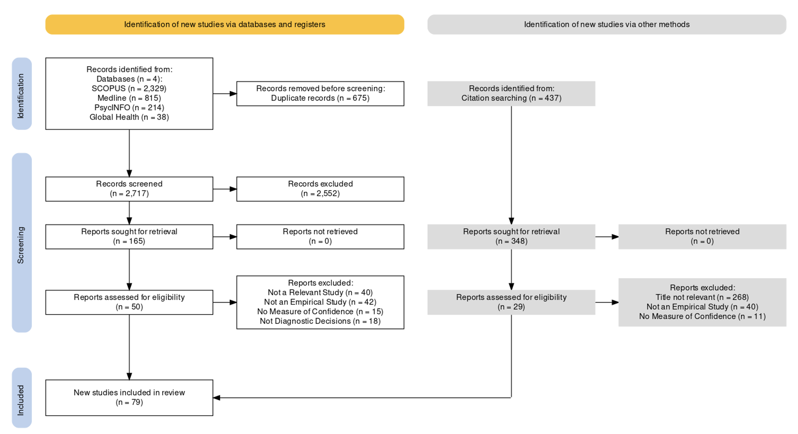
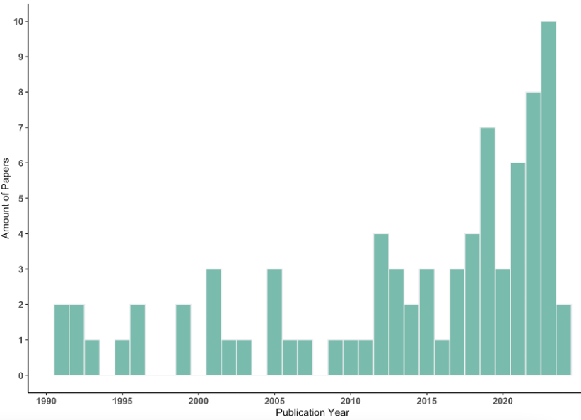
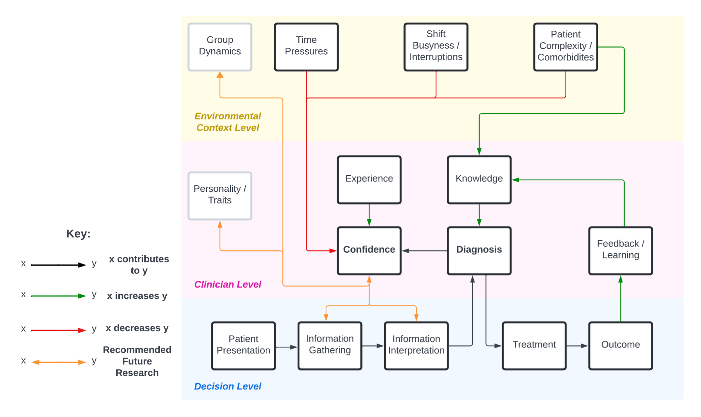

---
#output:
#  bookdown::pdf_document2:
#    template: templates/template.tex
#  bookdown::html_document2: default
#  bookdown::word_document2: default
#documentclass: book
#bibliography: [bibliography/references.bib, bibliography/additional-references.bib]
#editor_options: 
#  markdown: 
#    wrap: 72
bibliography: [bibliography/references.bib]
---

# Systematic Scoping Review on Confidence and Certainty in Diagnoses {#chapter-2}

\adjustmtc
\markboth{2. Scoping Review}{}

<!-- For PDF output, include these two LaTeX commands after unnumbered chapter headings, otherwise the mini table of contents and the running header will show the previous chapter -->

## Introduction

There is extensive evidence of diagnostic error in most healthcare specialities. As we discussed in the Introduction section, overconfidence is an important source of medical error. It has been suggested that cognitive biases, such as overconfidence, are causally linked with these errors. To our knowledge, there has not been existing work to synthesise past research on diagnostic confidence. Such a review would enable us to understand the factors that contribute to clinicians’ confidence in their diagnoses, as well as how diagnostic confidence affects treatment and patient care.\
\
In this chapter, we present a systematic scoping review to collate and synthesise the existing literature studying diagnosis as a cognitive process. To our knowledge, this is the first scoping review with such a remit to include studies of confidence across medical subdisciplines, given its broad importance across medicine. The use of scoping review is suitable given this remit. We aimed to identify key determinants of confidence and characterise how judgements of confidence affect the wider medical decision making process. For the purposes of this review, and in common with practice in the reviewed articles, we treat “confidence” and “certainty” as interchangeable terms, while noting that the psychological literature discusses whether they are subtly different concepts [@pouget_confidence_2016].

\
We systematically searched SCOPUS, MEDLINE, PsycINFO and Global Health. Articles were categorised according to methodology and clinical speciality. Findings were analysed thematically. Our review methodology adheres to the JBI’s PRISMA-ScR Checklist for Scoping Reviews. We then performed citation tracking within these papers' references to identify additional articles. Papers were included if they reported quantitative results from an empirical study in which participants reported their confidence or certainty during a diagnostic decision. Studies comprised several medical subdisciplines. 79 articles met the inclusion criteria.

\
We organised articles under two main themes: the determinants of confidence and the uses of confidence during the patient’s care pathway. Firstly, we find little evidence that clinicians’ confidence is aligned to their diagnostic accuracy, even when using certain cognitive interventions or aids. Confidence is found to be affected by several factors including case complexity, early diagnostic differentials, and the healthcare environment. Factors that affect confidence, but not accuracy, demonstrate how the two can become decoupled, resulting in overconfidence/underconfidence. Secondly, confidence is predictive of actions in many parts of the patient care process, such as ordering investigations, referrals to specialists or prescribing, which may be suboptimal if confidence is miscalibrated.

\
Based on the literature from this review, we propose a theoretical model of factors that affect diagnostic confidence/certainty and accuracy throughout various stages of the patient care process. The proposed conceptual model highlights our current understanding of diagnostic confidence and how future research might focus on underexplored areas, particularly on group decisions, individual differences in confidence, and on the link between information seeking and confidence. Such a model can inform future work on how appropriate diagnostic confidence can be prompted and communicated amongst clinicians. Improving the calibration of confidence should hence be a priority for medical education and clinical practice (e.g., via decision aids), with this model acting as a starting point for future work to target specific factors that contribute to misclibrated confidence.

## Methods

### Search Strategy

Our review protocol was preregistered on the Open Science Framework: <https://osf.io/wz5se>. We conducted a systematic scoping review of empirical studies on confidence and certainty in medical diagnosis using JBI’s PRISMA-ScR Checklist for Scoping Reviews [@peters_scoping_2024]. The search strategy was designed in cooperation with a subject specialist librarian at the University of Oxford’s Bodleian Libraries group. The search string comprised keywords that captured the intersection of four elements: confidence/certainty, medical diagnoses, decision making and a study population of medical staff/students (i.e., clinicians, physicians, doctors and medics). The full search terms were as follows:

\
*(clinicians OR physicians OR doctors OR medics)* *AND* ( confiden\* OR uncertain\* OR certain\*) *AND* ( diagnosis AND medical ) *AND* *( decision OR ( decision AND making ) OR decision-making )*

\
The databases SCOPUS, MEDLINE, PsycINFO and Global Health were searched during February 2024. Finally, we hand-searched the citations of the included articles from these databases for further relevant articles via backward and forward scanning [@webster_analyzing_2002; @tranfield_towards_2003].

### Study Selection

The inclusion criteria for screened studies were as follows:

1.  Studies must report original empirical work with quantitative results.
2.  Studies must be written in the English language.
3.  Studies must use an experimental paradigm with medical diagnostic decisions
4.  Confidence or certainty in diagnoses must be measured as a dependent variable
5.  Studies can be from any medical discipline.
6.  Editorials, review papers and opinion papers are all excluded

Identified articles were uploaded onto Rayyan (<https://rayyan.ai/>) to detect duplicate papers for manual checking and removal. This is the only part of the review process in which an automation tool is used. Data from the papers was collected using manual review. Research characteristics were derived iteratively and can be found on OSF (<https://osf.io/4g6s3/>).

### Research Synthesis

Papers selected for review were first categorised by their broad research methodology (e.g., patient vignettes, in situ questionnaires, etc.) and their medical population of study (e.g., medical students, general practitioners/hospital physicians etc.). We reviewed the experimental procedures to extract their key manipulations and independent variables (e.g., case complexity, use of a cognitive intervention, level of medical experience). We also extracted dependent variables as they pertain to confidence/certainty and, where relevant, recording of both diagnostic differentials and information seeking. Each of the paper’s key findings were summarised and then all findings were categorised under recurring themes.

## Results

### Findings of Scoping Review

The initial search returned a total of 3,332 articles. Applying the inclusion criteria identified 50 eligible articles. 439 further articles were retrieved for review from the included articles’ citations. After applying both exclusions of duplicates and our inclusion criteria, 29 further articles were identified. This produced a total of 79 articles for inclusion and synthesis (see [Figure \@ref(fig:primsa)](#fig:primsa) below for PRISMA diagram). The full set of papers can be found in [Table \@ref(tab:paperstable)](#tab:paperstable) of the Appendices.

\newpage

```{r primsa, include=TRUE, echo=FALSE, out.width='150%', out.height='50%', out.extra='angle=90', fig.align='center', fig.cap="PRISMA Diagram of Literature Review.",fig.scap="Scoping Review: PRISMA Diagram"}



```

#### Study Characteristics

```{r reviewcharstab, include=TRUE, warning=FALSE, message=FALSE, echo=FALSE}

reviewchars <- as.data.frame(read.csv("./assets/ReviewPapersBreakdown.csv",header=FALSE))

colnames(reviewchars) <- c("Group","Characteristic","Number of Papers")

ft <- flextable(reviewchars)
ft <- align(ft, part = "all", align = "center")
ft <- set_caption(ft,"Characteristics of Included Studies, including year of publication, study environment used and medical population (recruiting single or multiple levels of participant experience, medical subdiscipline, sample size). A full list of all included papers can be found in the Appendices (Table A.1).")

ft <- flextable::merge_at(ft, i = 1:4, j = 1)
ft <- flextable::merge_at(ft, i = 5:8, j = 1)
ft <- flextable::merge_at(ft, i = 9:10, j = 1)
ft <- flextable::merge_at(ft, i = 11:17, j = 1)
ft <- flextable::merge_at(ft, i = 18:21, j = 1)

ft <- flextable::border(ft, border.top = fp_border(color = "black"))

ft <- width(ft, width = 2)

ft

```

```{r reviewyears, include=TRUE, echo=FALSE, out.width='100%', fig.align='center',fig.cap="Distribution of Scoping Review Papers by Publication Year",fig.scap="Scoping Review: Paper Distribution by Publication Year"}



```

[Table \@ref(tab:reviewcharstab)](#fig:chartable) above summarises study characteristics and [Figure \@ref(fig:reviewyears)](#fig:reviewyears) shows that 36 of the 79 studies (46%) were published since 2019, indicating a recent surge of research interest in this field and the timeliness of this scoping review. The studies appeared in 59 different publications, including both medical and psychological journals, with medical education journals being most common (19 studies). Clinical areas most represented were Primary Care/General Practice, Emergency Medicine and Nursing.

\
Study designs were split roughly evenly between focusing on how confidence varies across individuals (35 studies) and on how confidence varies according to features of the patient case (31 studies), with remaining (13 studies) studying both. Thirty-four studies (43% ) looked at the level of medical experience or training’s effect on confidence, either measured as a dependent variable or by recruiting participants in ‘novice’ versus ‘experienced’ group. Nineteen studies (24%) manipulated the complexity or difficulty of the patient case. Finally, ten studies (13%) investigated how diagnostic confidence varies with the information presented or the opportunity to seek information.

\
Most of the studies (44 (56%)) used clinical patient text vignettes. For vignettes, there is an established ground truth in each case (which may not be possible for in situ studies involving real patients) to compare the participants’ confidence to their true accuracy in order to gauge calibration. Because vignettes are quick and simple to administer, participants can complete several diagnoses during a single study such that both their confidence and accuracy can be averaged across cases. Other experimental methodologies include the use of imaging (e.g., ECG, X-Rays, MRI) for diagnosis, high-fidelity simulations (either using extended reality tools or a patient mannequin), or questionnaires administered in situ to measure confidence during real patient cases as they are happening ([Table \@ref(tab:reviewcharstab)](#tab:reviewcharstab)). The preponderance of vignette studies is noteworthy given the finding from one study that nurses were both less accurate and less confident in a high-fidelity simulation compared to a paper-based vignette [@yang_effect_2012], suggesting the need for caution when generalising experimental findings to how medical professionals behave in their everyday practice.

\
Studies varied in how confidence and diagnostic accuracy were assessed. Studies mostly used a self-reported scale for confidence (usually 1-10 or 1-100) as opposed to verbal expressions of confidence (e.g., “not sure” to “certain”) or visual analogue scales. The use of self-report numerical scales is common within cognitive psychology, where measured confidence values predict other behavioural indices of uncertainty, such as the tendency to seek further information or to opt out of making a decision [@gherman_neural_2015]. Twenty-four studies (30%) allowed participants to input multiple diagnostic differentials rather than a single diagnosis. Confidence is then either measured for each differential or in the set of differentials as a whole.

\
In terms of accuracy, most studies prompt clinicians for a single diagnosis that is marked as correct or incorrect. However, clinicians may consider multiple possible diagnoses in their everyday practice. Hence, 24 studies (30%) allowed participants to record multiple differentials in their diagnosis. This complicates scoring accuracy and confidence: If accuracy is operationalised as whether a correct diagnosis is included in this set of multiple differentials, clinicians are more likely to be correct with more differentials, and it may remain unclear how clinicians weigh up competing differentials. Hence, the operationalised calibration of confidence judgements is heavily contingent on how diagnoses are recorded.

#### Emerging Research Themes

##### Miscalibration of Confidence and Certainty Judgements to Objective Accuracy

Calibration is assessed by comparing confidence ratings with objective diagnostic accuracy: When clinicians rate 100% (or 50% or 60%, etc.) certainty in their diagnosis, are they in fact correct 100% (or 50%, 60%, etc.) of the time? Calibration is then an indirect measure that is calculated by comparing two other observed measures: confidence and accuracy. In our study sample, there was limited evidence of calibrated confidence judgements, with some studies reporting underconfidence [@mann_relationship_1993; @yang_effect_2012; @brezis_does_2019]and others overconfidence [@friedman_are_2001; @fernandez-aguilar_use_2022; @garbayo_metacognitive_2023]. To examine these findings in more detail, we considered factors that impact and promote calibration in diagnoses.

##### The Impact of Experience on Calibration

The first major theme of interest is whether calibration improves with experience. This was not always observed in the results [@yang_nurses_2010; @clayton_are_2023]. However, experienced clinicians seem better able to identify when a case is more complex and adjust their confidence accordingly [@tabak_clinical_1996; @brannon_nursing_2003]. Looking at the link between calibration and experience alone may be too simplistic, and there are other aspects of experience that influence diagnoses. Experienced clinicians were found to be less likely to ‘distort’ neutral information to be in support of their reported diagnoses, indicating a lower tendency toward confirmation bias [@kostopoulou_information_2012]. Past work has also suggested a distinction between experience (operationalised as years of experience or role seniority) and knowledge (measured using standardised tests of medical knowledge). In medical students, the calibration of confidence judgements were found to improve with years of education but not with medical knowledge [@hautz_diagnostic_2019]. Information ‘distortion’ was found to affect novice clinicians more [@kostopoulou_information_2012] and lower knowledge was found to be related to higher susceptibility to irrelevant, distracting features of a patient [@mamede_role_2024], However, the latter study from @mamede_role_2024 found that medical knowledge on the part of resident physicians was not directly associated with calibration.

##### The Impact of Contextual Factors on Calibration

The second major theme relates to contextual and environmental factors. Studies have found that calibration is affected by the complexity or difficulty of the presented case [@meyer_physicians_2013; @hausmann_sensitivity_2019; @li_relationship_2023]. When confidence judgements are not sensitive to the difficulty or complexity of the case, confidence stays fairly constant for difficult cases whilst accuracy decreases, leading to increased overconfidence (and decreased calibration) [@meyer_physicians_2013]. In past studies, complexity is manipulated by either presenting patient cases with more comorbid conditions [@hausmann_sensitivity_2019] or by showing conflicting information about the patient to indicate multiple possible conditions [@yang_nurses_2010]. Calibration can be improved by the presence of feedback during a training period [@kuhn_improving_2022; @staal_impact_2024].

\
Contextual factors that pertain to the situated medical environment can also affect overall levels of confidence (rather than calibration), as found using naturalistic paradigms. For example, clinicians may be constantly interrupted by other tasks [@soares_accuracy_2019], especially during busier shifts where they have to manage more patients [@gupta_associations_2023] and may not be present for the sharing of information during handovers [@bergl_factors_2024]. Studies that simulated these situations found they resulted in lower diagnostic confidence. However, such studies cannot assess the effect of contextual factors on confidence calibration with diagnostic accuracy because they were conducted in-situ, meaning that researchers do not yet have a ground truth of the patient’s condition. At this stage, we can only determine how these contextual factors affect confidence, rather than calibration.

##### Imaging and Decision Support Systems

A subset of papers found evidence for an increase in confidence when providing clinicians with specialised imaging for a patient to assist diagnoses, be they MRI scans [@mackenzie_magnetic_1996; @albrechtsen_impact_2022], CT scans [@abujudeh_abdominopelvic_2011], evacuation proctography [@harvey_evacuation_1999] or photos of wounds [@sanger_diagnosing_2017]. Another subset of papers used various forms of computer-aided decision support systems with the goal of increasing confidence [@hillson_effects_1995; @berner_influence_1999; @dreiseitl_physicians_2005; @neugebauer_clinical_2020]. @hillson_effects_1995 found that the adoption of diagnoses that were recommended by a computer-aided decision support system was not associated with an increase in confidence. @neugebauer_clinical_2020 did find evidence for such an association, however, with use of decision support leading to both increased confidence and increased diagnostic accuracy when compared to diagnoses made without using the system. On the other hand, both @berner_influence_1999 and @dreiseitl_physicians_2005 found that usage of decision support recommendations were associated with lower confidence when compared with decisions in which such recommendations were not utilised. Taken as a whole, whilst useful imaging increases confidence when available to clinicians, the efficacy of decision support systems at increasing confidence is likely dependent on other factors that require future work to elucidate.

##### Interventions at the Point of Generating Differentials

The process of generating diagnostic differentials has been subject to experimental manipulations and interventions (such as early diagnostic suggestions) to investigate their effect on accuracy and confidence. This work is applicable, for instance, to understanding how a clinician transitions care of a patient to another clinician and gives a handover of relevant information. A general theme of this work is that there is a tendency toward higher weighting of early information. Early diagnostic suggestions have been found to be highly influential in the subsequent decision process where clinicians find these suggestions difficult to ignore and have more confidence in them [@kammer_differential_2021; @kourtidis_influences_2022]. This also affects the breadth of differentials considered, with fewer differentials considered when provided with early suggestions [@kourtidis_influences_2022; @staal_does_2022] and an underweighting of differentials if they were considered later in the diagnostic process [@eva_influence_2001]. Interventions aimed at mitigating this tendency by asking clinicians to explicitly consider alternatives, increased their accuracy and calibration [@feyzi-behnagh_metacognitive_2014], or prompting the consideration of the patient’s ‘red flags’ in diagnoses, which increased confidence on simpler cases but not accuracy [@chartan_isolating_2019]. These interventions seem to require explicit instructions: Simply asking clinicians to reflect on their decision without guidance [@lambe_guided_2018; @costa_filho_effects_2019] or participate in an educational training course [@benvenuto-andrade_level_2006; @kuhn_learning_2023] does not seem to improve diagnostic accuracy and calibration.

\
Studies have also investigated how confidence is affected by the manner in which information is presented to clinicians during the diagnostic process. Higher confidence was found when clinicians were presented with additional patient information even when this did not carry diagnostic value [@heller_heuristics_1992] and when given all available patient information rather than having to gather information themselves [@gruppen_information_1991]. Clinicians were also found to be more confident and more accurate when presented with an Electronic Health Record of the patient alongside other information [@ben-assuli_improving_2015] and when presented with the patient history first rather than out of order [@tio_effect_2022]. This finding indicates that complete patient history available early on has a positive impact on confidence. However, an erroneous patient history has also been found to cue both novice and experienced clinicians to incorrect diagnoses whilst confidence remained relatively high, resulting in overconfidence [@fawver_seeing_2020].

##### Uses of Confidence

With more naturalistic studies, it is possible to isolate ways in which confidence is utilised within the wider diagnostic process, especially where healthcare involves transitions of care between multiple clinicians and departments. Past work has attempted to establish a link between confidence and further seeking of patient information and tests, with mixed results. US hospitalists (medical staff who provide care for patients specifically within US hospitals) with lower confidence were found to order more tests [@gupta_associations_2023] whilst pathologists who were better calibrated (i.e., who tended to report confidence judgements that were closer to their true accuracy) were found to be more likely to request further tests when they were unsure [@clayton_are_2023]. Confidence has also been linked to prescribing medication, though overtreatment with unnecessary medications has been linked to both underconfidence [@levin_antimicrobial_2012] and overconfidence [@garbayo_metacognitive_2023]. Higher confidence has also been linked to more referrals to specialists in other departments [@calman_variability_1992] and to a lower willingness to admit mistakes [@brezis_does_2019]. One study found that whilst experienced clinicians were not more accurate in their initial diagnoses, they were more willing to change diagnoses and request more information [@krupat_avoiding_2017]. Lower confidence has been found to result in less specific diagnoses for patients in situ [@hageman_surgeon_2013]. Although psychology research on confidence has examined its role within groups (as discussed in the Introduction), only one article looked at confidence in group decisions in medicine. This study found that a multidisciplinary panel was more confident and better calibrated than a single clinician [@thorlacius-ussing_comparing_2021].

### Conceptual Model for Diagnostic Decisions

We synthesised the reviewed findings into a theoretical model ([Figure \@ref(fig:reviewmodel)](#fig:reviewmodel)) that illustrates how various factors distinctly impact diagnostic confidence and accuracy. This model aims to clarify existing research and identify directions for future work. The model starts by mapping out the stages of the diagnostic process ([Figure \@ref(fig:reviewmodel)](#fig:reviewmodel), bottom panel). Based on initial patient presentation, clinicians gather and interpret patient information (e.g. history, examinations, tests) to inform their diagnosis of the patient’s condition. The clinician’s confidence in their diagnosis guides their judgment on when they have enough information to begin treatment versus whether further tests or additional information are needed. Once a diagnosis is reached, this guides patient treatment and care, the success of which is evident in the outcome for the patient.

\
The middle panel of [Figure \@ref(fig:reviewmodel)](#fig:reviewmodel) characterises the cognitive processes of the clinician that determine the accuracy of the diagnosis and confidence with which the diagnosis is made. A key feature is that many factors have dissociable effects on accuracy vs. confidence. Diagnostic accuracy depends more on the level of medical knowledge and the quality of information gathering and interpretation; confidence depends more on years of medical experience and the quantity of information gathered [@kostopoulou_information_2012; @hautz_accuracy_2019; @mamede_role_2024]. Knowledge is improved through feedback on how a patient case was handled and its outcome, which in turn improves future diagnostic accuracy (though this feedback loop’s impact on later confidence is yet to be explored).

\
The top panel of [Figure \@ref(fig:reviewmodel)](#fig:reviewmodel) highlights factors pertaining to the medical environment/context. Separately from the patient case, confidence is reduced by time pressures [@yang_effect_2012], interruptions to work [@soares_accuracy_2019], busy shifts [@gupta_associations_2023] and complex patient cases (either due to conflicting information or comorbidities) [@meyer_physicians_2013; @hausmann_sensitivity_2019; @li_relationship_2023].

\
[Figure \@ref(fig:reviewmodel)](#fig:reviewmodel) highlights three primary directions for future research. First, given the focus of research to date on diagnosis by individual clinicians, we recommend that future work also studies diagnoses in groups, given that diagnoses are often made by teams rather than individuals, particularly in secondary care settings. This is especially pertinent given the social influence that experience/seniority can have within a group: junior clinicians may be less likely to speak up about potential errors in the presence of more experienced clinicians [@hemon_speaking_2020]. Second, future work should study individual differences on the part of clinicians to characterise how personality and trait level factors impact diagnostic confidence. In particular, factors such as personality [@schaefer_overconfidence_2004], gender [@syzmanowicz_gender_2011] and status [@see_detrimental_2011] may impact a clinician’s confidence in their diagnoses. Finally, we recommend future work investigate the association between the ongoing receipt of information and confidence. We recommend future work on the implications of diagnosis as a dynamic process where confidence and information seeking interact. Past work has tended to frame information seeking as a further action after diagnosis, rather than information seeking as a process that forms the diagnosis in the first place. Future work should prioritise examining how to prompt appropriate information seeking (i.e., neither overtesting nor undertesting) via educational tools or cognitive interventions.

\newpage

```{r reviewmodel, include=TRUE, echo=FALSE, out.width='100%', fig.align='center', fig.cap="Conceptual model that depicts the various factors that impact the course of a diagnostic process, with links established between concepts based on findings from this systematic scoping review. Factors are categorised in three levels: the level of the diagnostic decision process (bottom box, blue, where the course of the decision proceeds from left to right), the level of the clinician (middle box, pink) and the level of the environmental context within which the clinician operates (top box, yellow). Black arrows represent a progression from one concept to another. Green arrows indicate positive impacts between concepts; red arrows indicate the opposite (i.e. a negative relationship). Orange arrows represent links between concepts that are areas for future research. Light grey boxes represent factors that are known to affect decisions and confidence within the psychology literature but are currently less understood in the context of medical decisions.", fig.scap="Scoping Review: Conceptual Model"}



```

## Discussion

### Review Findings

The present work comprehensively maps out the literature on confidence in medical diagnoses, thus extending previous work exploring how cognitive biases contribute to medical error [@kostopoulou_diagnostic_2008; @graber_cognitive_2012; @saposnik_cognitive_2016] and characterising medical uncertainty more broadly [@hall_reviewing_2002; @bhise_defining_2018]. This scoping review shows the importance of, and the recent surge in interest in, diagnostic confidence. Although confidence has been linked to diagnostic error in the past [@berner_overconfidence_2008], full understanding will benefit from leveraging insights from cognitive psychology to inform medical education and practice [@wears_diagnosing_2014]. How clinicians evaluate their decisions contributes to their effectiveness: An overconfident clinician may overlook diagnostic possibilities, delay treatment or ignore crucial information. Conversely, an underconfident clinician may be less likely to speak up in a group about potential errors [@hemon_speaking_2020].

\
Our review finds that confidence and accuracy are rarely aligned during diagnoses. Notably, miscalibration of confidence is not only a function of social and environmental factors: Miscalibration is consistently observed in vignette studies performed by individual participants, where decision makers tend to be overconfident particularly when dealing with complex cases. Nevertheless, social and environmental factors may amplify systematic tendencies toward misaligned confidence/certainty. Overconfidence is associated with overlooking differentials, ignoring important patient information and being less willing to admit mistakes. Hence, mitigating overconfidence is an important direction for future research. Underconfidence has received less attention, but is observed in medical trainees [@mann_relationship_1993; @yang_effect_2012; @brezis_does_2019] and can lead to negative outcomes such as delayed treatment [@thompson_nurses_2004] and ordering of unnecessary tests [@gupta_associations_2023]. Interventions have been tested to improve confidence calibration (such as considering alternative diagnoses and guided reflection), but these have not proven fully successful [@lambe_guided_2018; @costa_filho_effects_2019]. More work is therefore needed to design interventions to improve calibration, as one can surmise here a link between miscalibrated confidence and suboptimal patient care. Findings from metacognition are already being used to inform educational practices outside medicine to improve students’ memory retention [@dunlosky_strengthening_2013; @putnam_optimizing_2016]. Although cognitive interventions such as considering alternative diagnoses and guided reflections have been tested, there is yet to be a standardised cognitive framework to teach non-technical skills such as constructive confrontation or expressions of uncertainty.

\
Our conceptual model of the diagnostic decision process reflects how different levels of factors (related to clinician and environmental context) differently impact accuracy and confidence. This model demonstrates the importance of both behavioural and work system factors within healthcare and how environmental aspects can inform an individual’s decision process. Considering the work environment is important given our findings of lower confidence due to environmental factors such as shift busyness and time pressures. This corresponds with other findings of stress being associated with decreased confidence for intermediate levels of uncertainty [@heereman_stress_2011] and this stress could be contributed to by the healthcare environment that the clinician operates in. Future interventions on diagnosis can refer to this model to understand the part and context of the decision process at which they are administering the intervention.

\
Beyond these key research themes, two further points emerge from the scope and variety of work identified in our review. First, our review highlights the broad relevance of confidence across different medical subdisciplines, suggesting the value of focusing on confidence calibration within medical education as a generally applicable approach to improve diagnostic decisions. Second, in terms of methodology, we find that confidence and certainty have been studied in a variety of ways (e.g. using ‘assessments’ or ‘interpretations’ as well as diagnostic decisions), but can sometimes be seen a primary outcome measure to improve. Increasing the confidence of clinicians without considering their objective accuracy may exacerbate instances of overconfidence. Future work should focus instead on prompting calibrated rather than increased confidence given the aforementioned impacts on patient care. As objective feedback is often unattainable in medical settings, confidence could be studied using methodologies like virtual reality and high-fidelity simulations that better emulate real medical settings when compared to vignette methodologies whilst also having markers of objective accuracy.

### Implications for Future Clinical Research

The current healthcare context presents additional challenges to clinicians with substantial increases in clinical workload in the aftermath of the pandemic, and workforce stress and burnout at their highest in the NHS since recording began [@noauthor_state_2024]. Support to enhance clinical decision making through improved confidence/accuracy calibration could help to relieve pressure on the frontline.

\
Through our conceptual model of the diagnostic process, we identify three primary areas for future work that have been relatively underexplored in the extant literature. First, the majority of the studies we reviewed have studied diagnosis as a linear process in which information is presented sequentially prior to a final diagnosis, at which point confidence is assessed. This is a helpful idealisation of a process that is often more complex and dynamic in practice, with diagnosis evolving via back-and-forth between seeking information and evaluating that information in the context of currently considered diagnostic possibilities. Moreover, patients’ unexpected responses to initial treatment can lead to revision of an initial diagnosis and prompt further information seeking. Effects of (miscalibrated) confidence are likely to be amplified within these dynamics, such as an overconfident clinician paying too much attention to evidence supporting their diagnosis and neglecting opposing evidence, resulting in greater overconfidence. These dynamics could be studied in more naturalistic, in situ methodologies that are closer to everyday medical practice. Interrupting clinicians in real time to report their diagnostic thinking can be a distraction and potentially a patient safety risk. However, some methodologies permit capturing diagnostic reasoning as it evolves with time and the receipt of new information, such as asking clinicians to think aloud as they make diagnoses [@arocha_novice_1995; @coderre_diagnostic_2003] or using a visual representation of clinicians’ thought processes to capture paths and sources of diagnoses [@feyzi-behnagh_metacognitive_2014]. The use of high-fidelity or virtual reality simulations may also be useful for emulating the pressure and work environment of the clinician (which may affect decision making) [@schmidt_simulation_2013; @jans_examining_2023], as well as providing an actual ‘patient’ to observe (unlike in textual vignettes). Use of such paradigms would also improve the generalisability of results.

\
Secondly, the vast majority of studies have investigated confidence from the perspective of individual clinicians. However, diagnosis and treatment decisions are often made by teams rather than individuals, particularly in secondary care settings. Evidence from organisational psychology indicates that group decisions depend critically on communicated confidence and uncertainty [@silver_wise_2021]: Overconfident team members can anchor a group on an incorrect decision [@mahmoodi_equality_2015]. Conversely, underconfident team members may fail to share important information that is unknown to the rest of the group, exacerbating the problems of ‘hidden information’ and ‘shared information bias’ [@stasser_pooling_1985]. In addition, clinicians may modify how they communicate certainty with others, especially given the collaborative nature of healthcare and the social benefits of communicating opinions with confidence in order to be listened to in a group [@brezis_does_2019]. Situational awareness (SA) is also important in a group, and higher stress may be associated with overconfidence in SA [@price_acute_2016]. Taken together, group medical decisions are clearly an important and naturalistic area for future study.

\
Finally, the papers in this review have also not looked at individual differences in expressions of confidence, where past work from cognitive psychology has found individual systematic tendencies toward higher or lower confidence [@ais_individual_2016; @navajas_idiosyncratic_2017]. Hence, individual clinicians may have a consistent tendency toward underconfidence or overconfidence that impacts their clinical practice and that training or cognitive aids could address.

### Empirical Studies of the Current Work

In terms of empirical work within this DPhil, we focus on the foremost of these underexplored avenues within the current research landscape. Namely, with the experimental studies presented in the remainder of this thesis, we aim to elucidate how diagnosis evolves over time, particularly with the back-and-forth between seeking information and evaluating that information in the context of currently considered diagnostic possibilities. Throughout our studies, we record diagnostic hypotheses whilst allowing participants to seek information they find most useful for determining a diagnosis for a patient and recording their confidence in their diagnosis. Clinicians have been found to be less confident in their diagnoses when they have to seek information themselves compared to when they are provided with all available patient information straightaway [@gruppen_information_1991]. Hence, the information seeking process during diagnostic decisions impacts confidence. Understanding in more detail how information seeking patterns impact confidence can help the future design of cognitive interventions for appropriately calibrated confidence. For example, clinicians could reflect on their confidence by considering what information has been made available to them on the patient and what further information they may need to determine a diagnosis. In addition to studying the interplay between information seeking and confidence, we also use a variety of methodologies to study the cognitive mechanisms of medical diagnoses. Across the remainder of the thesis, we increase the naturalism of our methods with each chapter in order to address our point on the lack of high-fidelity methodologies in the extant literature. We start with a dynamic version of previous vignette studies that allow us to study information seeking patterns whilst maintaining the experimental control afforded to us by the use of vignette paradigms. We then use a think-aloud methodology to record the thought processes of clinicians as they make diagnoses. This is followed by the use of a virtual reality paradigm that allows for the simulation of more realistic clinical situations whilst still allowing for the recording of information seeking patterns. Finally, we use a rapid ethnography approach within real clinical settings to record instances of diagnostic uncertainty and information seeking within medical practice. Taken together, these approaches allow us to triangulate our findings and ground them in real medical practice. In the next chapter, we start with the first of our studies that uses a dynamic version of previous vignette paradigms where diagnostic hypotheses are recorded and updated over the course of a patient case, with participants able to freely seek information to inform their diagnoses.
