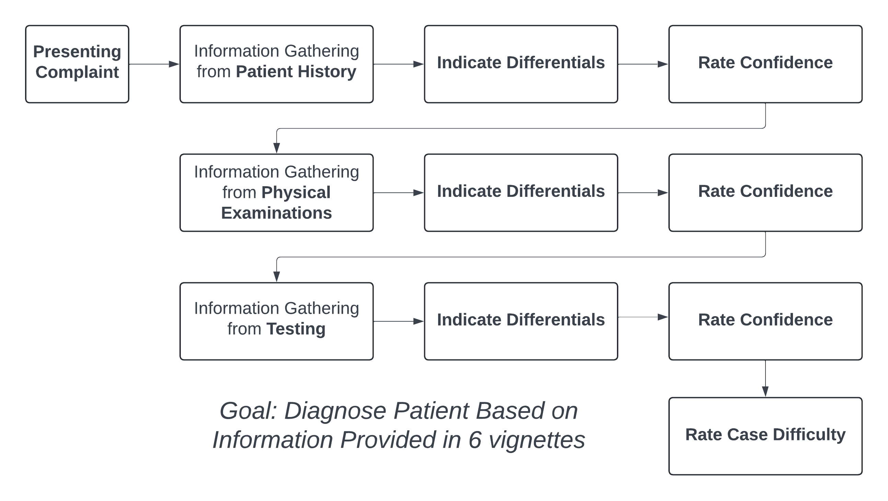
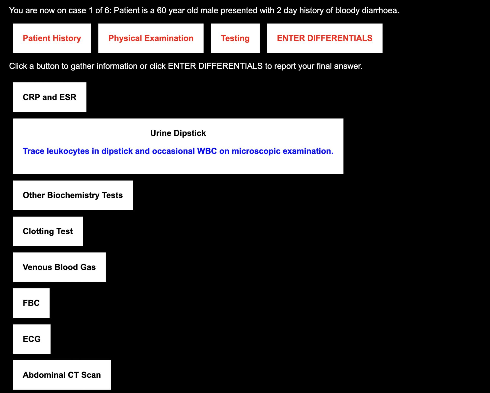
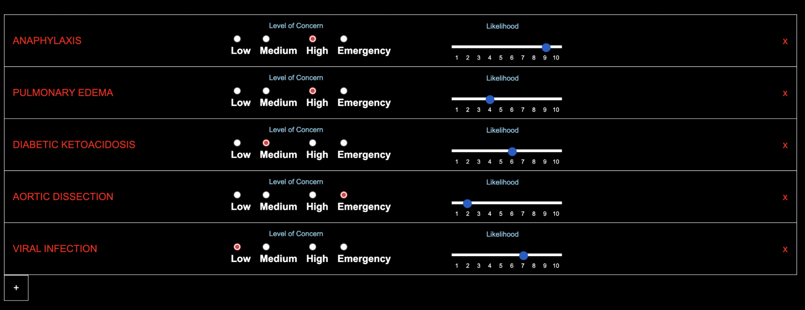

---
#output:
#  bookdown::pdf_document2:
 #   template: templates/template.tex
 #   citation_package: default
#  bookdown::html_document2: default
#  bookdown::word_document2: default
#documentclass: book
#linespacing: 22pt plus2pt # 22pt is official for submission & library copies
bibliography: [bibliography/references.bib]
#biblio-style: "apalike"
#csl: bibliography/apa.csl
---

```{r setup, include=FALSE}
knitr::opts_chunk$set(cache =TRUE)
```

# Information Seeking and Confidence During Medical Diagnoses {#chapter-3}

\adjustmtc
\markboth{3. Online Study}{}

<!-- For PDF output, include these two LaTeX commands after unnumbered chapter headings, otherwise the mini table of contents and the running header will show the previous chapter -->

## Introduction

In the previous chapter, we presented a systematic scoping review of the extant literature on certainty and confidence during medical diagnoses. One output from this review was that we identified a gap in the literature, in that past work has not studied the association between the ongoing receipt of information and confidence. Past work has tended to frame information seeking as a single action/choice taken after diagnosis, rather than an ongoing activity that causes regular reconsideration of a diagnosis and course of treatment. In this chapter, we aim to fill this gap by presenting results from an empirical study that investigates the interaction between confidence and information seeking during medical diagnoses.

\
In this study, we aim to retain the control and simplicity of vignette-based approaches while incorporating some of the complexities that characterise real diagnostic decision making. By doing this, we aim to study diagnostic confidence and accuracy as it develops over the course of a diagnostic decision. In this chapter, we first introduce our paradigm and its flexibility in allowing free information seeking and updating of diagnostic differentials over time. We then introduce the research questions that such a paradigm allows us to investigate.

\
Our systematic scoping review on confidence during diagnoses revealed two main findings. Firstly, past work that measured confidence and accuracy during diagnostic decisions found that confidence was rarely calibrated to objective accuracy, leading to either overconfidence [@friedman_physicians_2005; @fernandez-aguilar_use_2022; @garbayo_metacognitive_2023] or underconfidence [@mann_relationship_1993; @yang_effect_2012; @brezis_does_2019]. Secondly, confidence was associated with many aspects of the patient care process, such as prescriptions [@levin_antimicrobial_2012; @garbayo_metacognitive_2023], referrals [@calman_variability_1992] and requesting investigations [@tabak_clinical_1996; @gupta_associations_2023]. The lattermost of these factors is of particular relevance to our research interests. As we identify in our scoping review, the link between information seeking and confidence is a current gap in the extant literature. This link currently made between confidence and information seeking in the literature is that confidence is a subjective judgement that then guides a clinician's subsequent testing and requests for information [@tabak_clinical_1996; @gupta_associations_2023].\

Crucially, this past work studies information seeking by asking participants/clinicians a single question of whether they would (hypothetically) seek further information or not. However, the link between confidence and information seeking can be expanded upon in three ways. Firstly, we can study how information seeking prior to the point at which confidence is reported affects this confidence. Secondly, we can look at specific aspects of information seeking that are linked to confidence aside from merely the intention to seek or not seek. This includes the amount of information sought, how relevant the information is to the patient case, and the degree to which clinicians vary their information seeking on a case-by-case basis. Finally, confidence and information seeking are likely to influence each other over time. Past work has tended to study diagnosis by asking clinicians to provide a single diagnosis/condition after being provided all available information on a patient. Whilst this is a useful simplification for the sake of empirical study, it leaves open the key aspects of how the diagnostic process unfolds in real clinical work. In everyday practice, clinicians engage with diagnosis as an active, ongoing decision process that develops with more time and as more information about the patient becomes available. With a more open-ended paradigm, we investigate how diagnoses evolve over time. For instance, does a clinician reach an initial diagnosis and then change their mind when they received unexpected information (e.g. a test result)? And does a clinician tend to have a single diagnosis in mind or do they tend to keep an open mind by having considering several diagnostic possibilities at once? Then, with these questions in mind, how does a clinician seek information to further validate their diagnosis?

\
With these points in mind, we aimed to design a paradigm that better reflects the evolving nature of diagnosis and allows to us to study aspects of the information seeking process. Our paradigm is then a step towards more realistic diagnostic decisions, as it retains the simplicity and control of vignette-based diagnosis whilst allowing more flexibility in information seeking and committing to a diagnosis (or set of diagnoses). This allows us to investigate more fine-grained aspects of information seeking and how they impact diagnoses. Specifically, is clinician confidence informed by the quantity and quality of information sought during the diagnostic process?

\
For this study, we designed and implemented a novel vignette-based experimental paradigm where participants are asked to provide a list of all diagnostic differentials they are considering based on the information they have received. We ask clinicians to update this list and their confidence at each of a series of stages related to the information sought about the patient: Patient History, Physical Examinations and Testing. We then ask participants to update this list in light of new information by adding or removing differentials. This allows us to more comprehensively capture their thought process in terms of how differentials are being weighed up against each other. Participants report how severe and likely each of their differentials are to draw a more nuanced distinction between differentials. Whereas past work has tended to provide a preset amount of information to clinicians, we instead prompt participants to actively seek out information that they feel is useful for diagnosing the patient they are presented with. This is more analogous to real medical practice where all the required information is not immediately available to clinicians when presented with a patient. We can then look at information seeking patterns within participants to study how such patterns impact confidence.

\
Past work from cognitive psychology has shown a link between the quantity of information received and confidence, even if the information is disconfirmatory of one's beliefs [@ko_divergent_2022]. We can hence investigate in this experiment if this holds during medical diagnoses; if so, we would observe that higher amounts of information seeking would be associated with higher confidence. Information seeking could also be a marker of accuracy in addition to confidence though, as we can study whether clinicians who make more accurate diagnoses seek more appropriate information for the patient. This is important to study as some tests/information are less relevant than others for helping to reach a diagnosis for a patient, with instances of overtesting occurring if clinicians seek information indiscriminately. With all this in mind, allowing clinicians to freely seek information was an important tenet for designing this experimental paradigm.

\
Another aspect of past work we aimed to expand on was generating differentials (a term used in medicine to refer to hypotheses for diagnoses that a clinicians could have for a given patient). Past work has tended to frame diagnosis as a single decision where a clinician responds with either a single diagnosis [@redelmeier_fallacy_2023] or a limited number of conditions that a patient could have [@meyer_physicians_2013]. In the latter case, clinicians may report multiple differentials when prompted to consider alternative differentials via a cognitive intervention that encourages clinicians not to miss other possible diagnoses [@feyzi-behnagh_metacognitive_2014]. These experimental approaches do not necessarily represent the manner in which clinicians make diagnoses in their everyday medical practice. While clinicians may focus on a single differential at a time, they may also generate multiple diagnostic possibilities that past experimental paradigms do not capture. For instance, a clinician usually has to weigh up differentials [@schiff_diagnostic_2009], based on their likelihood (taking into account the base rate of medical conditions within a given patient population) and severity (e.g. some conditions may be less likely for a given patient, but would be more dangerous if missed by the clinician as a possibility). In this sense, a clinician may have, at least, a primary diagnosis that is most likely for the patient and a more serious diagnosis that is less likely but can be dangerous if not considered. Our paradigm should then allow clinicians to report multiple differentials at a time without constraints, in order to capture both the primary differentials being considered and the differentials that clinicians keep 'in the back of their mind'. We can then use the breadth of differentials considered by clinicians as another marker of uncertainty that may guide their subsequent information seeking. By allowing participants to record a list of all differentials they are considering at each stage, we can capture their thought process as it pertains to the information they have received prior to that point.

\
As our paradigm is designed to capture the diagnosis process as it evolves over time, we can also study confidence differently to past work. Rather than seeing confidence as a static quantity, confidence may shift to reflect the current relative strength of evidence in favour of a decision alternative [@vickers_effects_1982]. Our paradigm then records confidence alongside the participants' list of differentials as it is being updated. We can not only use this facet to link confidence to the breadth of diagnoses considered but also to examine how confidence changes over the course of a case. For instance, a clinician may receive a surprising or inconclusive test result for a patient, causing them to reduce their confidence and seek more information as a result to increase their confidence. Our measure of confidence is also distinct from measures used in past work as we aim to capture the diagnostic process as it pertains to subsequent treatment of patients. An ideal diagnostic process would involve a clinician seeking information to formulate a diagnosis for a patient and, in the process, create a treatment plan to address this diagnosis. We then capture confidence in this study specifically to measure how ready the clinician is to treat the patient, as opposed to past studies that have tended to ask clinicians how confident they are that their diagnosis is the correct one.

\
There are multiple ways we can define how calibrated participants' confidence is. To recap, measuring calibration requires a subjective judgement of confidence and an objective measure of accuracy to compare this confidence judgement against. For past work where a single differential is provided by clinicians when they are asked to make a diagnosis, accuracy is relatively easy to measure, as it simply requires marking the provided differential as either correct or incorrect. In our paradigm however, participants not only provide all possible differentials that they are considering but also provide assessments of how likely each differential is. We must then consider how to assess each set of differentials as being accurate or not. A lenient definition of accuracy is to simply mark a set of differentials as accurate if it includes a correct differential. Henceforth, we refer to this measure as Differential Accuracy. However, this measure does not take into account the likelihoods assigned to differentials, so it does not consider how clinicians weigh up differentials against each other. Participants are also more likely to be correct by simply including more differentials in their list. A stricter definition of accuracy would be to look at whether the most likely differential (as rated by the participant) is correct and use the likelihood value assigned to this. Henceforth, we refer to this measure as Highest Likelihood Accuracy. However, this penalises participants who consider the correct differential as likely but not as their primary diagnosis. We therefore use the following measure of accuracy as our primary measure: we look at the likelihood rating assigned to the correct differential if it is present in the participant's list. This provides a more nuanced measure of accuracy that takes into account how differentials are weighed up against each other, which marks a difference from accuracy as it is defined in past work. We should note however that assessing the calibration of participants' confidence judgements is potentially contingent on the accuracy measure used. We therefore measure calibration using our primary measure of accuracy (the likelihood of the correct diagnosis), but also provide results using the other two measures mentioned here (Differential Accuracy and Highest Likelihood Accuracy).

\
For our studies, we chose to focus on medical students who were relatively advanced in terms of their medical education but were still early in their clinical experience. Medical students are yet to settle on a particular medical subdiscipline to specialise in, which allows our vignettes to cover a variety of medical conditions and pathologies. We also focus on students as findings from our work could have implications for future medical education, with respect to how clinical reasoning and cognitive psychology is taught. Finally, recruiting students allows us to collect a relatively large sample to facilitate detailed analysis of information seeking patterns.\

### Research Questions

With this study, we investigated the following research questions:

-   **Is confidence calibrated to accuracy within medical students?** - Although past work has found disassociations between diagnostic confidence and accuracy, these were found in the context of simple tasks with limited flexibility in terms of information seeking and recording multiple diagnostic differentials. We therefore investigate if similar miscalibrations of confidence occur within a more flexible experimental paradigm.
-   **How do medical students weigh up competing differentials during the diagnostic process** - Past work has considered that clinicians may have multiple differentials in mind when diagnosing a patient, but such research has not studied how the differentials being considered changes with the receipt of new information. Specifically, do medical students tend to narrow the differentials over time (i.e. akin to a process of elimination) or do they tend to broaden their thinking as new information on the patient is received?
-   **How do confidence and information seeking interact in the diagnostic process?** - We expect that confidence would predict information seeking, such that confidence in diagnoses is predicted by both the quality and quantity of information sought.
-   **Do differences in confidence and information seeking predict differences in diagnostic accuracy?** - We expect accuracy to associated with the quality/suitability of information seeking but not the quantity of information sought or with confidence (as per the aforementioned miscalibrations of confidence).

## Methods

This study was designed to understand how information seeking, confidence and differential generation interact within the diagnosis process. Specifically, we investigated whether information seeking patterns were associated with diagnostic accuracy and confidence. We conducted a vignette-based diagnosis study with medical students to characterise their diagnostic process and to inform future on how diagnostic reasoning is taught to students, especially when it comes to weighing up competing differentials. Data is openly available on OSF: <https://osf.io/kb54u/>.

### Participants

We recruited final year (5th/6th year) medical students within the UK. 85 medical students completed the study, including 32 males, 52 females and 1 participant who identified as non-binary. Their ages ranged between 22-34 years (M = 24.2). Participants were recruited between July 11th 2022 and April 6th 2023 via emails sent to all UK medical students within a UK Medical Schools Council mailing list. We also recruited 7 experienced clinicians (with speciality experience), and provide analysis of their data in the Appendices (in the section titled [Analysis of Expert Participants](#experts)). Participants were emailed with a study information sheet and a link to access the experiment, where they first provided consent via an anonymous online form. After doing so, the participant provided demographic information (age, gender and years of medical experience). The study was conducted online, with participants able to run the experiment in a browser on a desktop computer or laptop (and not a phone or tablet) in a location of their choice. The experiment was coded using the JSPsych Javascript plugin. The experimental code is publicly available on Github: <https://github.com/raj925/DiagnosisParadigm>. Ethical approval was granted by the Oxford Medical Sciences Interdivisional Research Ethics Committee under reference R81158/RE001.

### Materials

This study involved patient vignettes that we adapted from anonymised past cases developed by @friedman_are_2001. Six cases were chosen, each designed to indicate a specific underlying condition the patient had: Aortic Dissection (AD), Guillain-Barre Syndrome (GBS), Miliary TB (MTB), Temporal Arteritis (TA), Thrombotic Thrombocytopenic Purpura (TTP) and Ulcerative Colitis (UC). The order in which the cases were presented was randomised for each participant. We also included a practice case (Colon Cancer) to familiarise the participants with the experimental procedure and the interface. Cases were chosen to reflect a variety of affected pathophysiological systems and to test medical students on medical conditions that they were expected to know given their level of education/training.\

A panel of 3 subject matter experts (practising doctors and researchers within the NHS and the OxSTaR centre: [www.oxstar.ox.ac.uk](www.oxstar.ox.ac.uk)) were recruited to design the vignettes used in this study. These medical professionals were at differing experience levels, with their medical roles at the time of this study as follows: Speciality trainee (ST7) in Anaesthetics, Foundation (F1) Doctor and Gastroenterology Consultant. The panel assisted with translating terms (e.g., medication names, tests etc.) from US to UK doctors’ vernacular, updating patient details to be more current and providing input on the choice and complexity of the cases presented.

### Procedure

The goal of the task was to determine a diagnosis, or set of diagnoses, for each presented patient (see procedure in [Figure \@ref(fig:paradigm)](#fig:paradigm) below). Information on the patient was split into a series of discrete stages to control what information the participants had access to at any given point of the experiment. Each point of new information is termed as an “information stage”. Participants were able to seek information freely until they were ready to move on.\

```{r paradigm, include=TRUE, echo=FALSE, out.width='100%', fig.align='center', fig.cap="Paradigm of the online vignette study, showing the procedure for a single patient case.", fig.scap="Online Study: Paradigm"}



```

\newpage

```{r screenshot1, include=TRUE, echo=FALSE, out.width='100%', fig.align='center',fig.cap="Screenshot of the interface. Shown here is the screen in which the participants seek information during the Testing stage.",fig.scap="Online Study: Screenshot 1"}



```

The procedure of a single case was as follows. The participant was asked to imagine that they are working in a busy district hospital and they encounter patients in a similar way to how they would in their real medical practice. At the start of each case, the participant was shown a description of a patient, which includes the patient’s gender, age and their presenting complaint. An example of this was: “Patient is a 68 year old male presenting with fever and arthralgia”. Each case is split into three information stages: Patient History, Physical Examination and Testing (in this order). This structure has been utilised in past work as being prototypical for a diagnosis [@hampton_relative_1975; @peterson_contributions_1992]. The Patient History stage included information such as “Allergies”, “History of the Presenting Complaint”, “Past Medical History” and “Family History”. The Physical Examination stage included ‘actions’ that a doctor may take when examining a patient, such as “auscultate the lungs”, “abdominal examination”, “take pulse” and “measure temperature”. Finally, the Testing stage involved information from any bedside tests or tests they may request from another department. This includes “Chest X-Ray”, “Venous Blood Gas”, “Urine Dipstick” and “Clotting Test”. In total, there were 29 possible information requests across the three stages, with the available set of information being the same for all patient cases. The full set of information available on each case can be viewed in [Table \@ref(tab:inforequests)](#tab:inforequests) of the Appendices.\

```{r screenshot2, include=TRUE, echo=FALSE, out.width='100%', fig.align='center',fig.cap="Screenshot of the interface. This is the screen in which participants report their current list of differentials, including the name of each condition as well as the severity and likelihood ratings for each condition. Participants remove conditions by clicking the red cross on the right hand side of each differential. Participants add a new differential by clicking the plus icon below the list.", fig.scap="Online Study: Screenshot 2"}



```

When a participant clicked on any of these requests, the information for that request was shown on screen after a 3 second delay. This delay was added after pilot testing (with 10 participants) revealed that participants tended to select most, if not all, of the information available to them. We mitigated this tendency by adding this delay and by emphasising to participants during the task instructions that they should only request information that they believe will help them with diagnosing the patient for that specific case. Participants were free to request the same piece of information multiple times, including information from a previous stage. At any point, they could choose to stop gathering information for that stage. They were then taken to a new screen where they reported a list of all differential diagnoses that they were considering for that patient at that stage. For each differential, participants reported a likelihood rating, ranging from 1 (very unlikely) to 10 (certain), and a “level of concern” (which was how concerned they would be for that patient if this differential really was the patient’s underlying condition) on a 4 point scale (labels of “Low”, “Medium”, “High” and “Emergency”). In subsequent stages, the list from the previous stage was available for participants to update concern/likelihood ratings, and to add/remove differentials from the list. Even at the last information stage, participants could report multiple differentials.\

After recording their differentials, participants were then asked to report their confidence that they were “ready to start treating the patient” on a 100 point scale, ranging from not at all confident to fully confident. Participants also indicated using a checkbox whether they are ready to start treating the patient, at which point a text box appeared for them to report what further tests they would perform, any escalations they would make to other medical staff and treatments they would start administering for the patient. This allowed participants to express what actions they would take that were not covered by our set of available information requests. Once all three stages were completed, participants reported how difficult they found it to determine a diagnosis for that case, on a scale from 1 (trivial) to 10 (impossible). At the end of all six patient cases, participants were told the ‘true’ conditions for all the patients. The session took approximately 40-60 minutes to complete.

### Data Analysis

During analysis, no sought information was recorded for three cases across participants (i.e. at all three stages during a case, the participant did not appear to seek any information). These cases were excluded from analysis. We now describe the key dependent variables for this study. The first set of the measures (Case-Wise Measures) are calculated at each of the three information stages (except for Perceived Difficulty). When averaging these variables within a participant, we use the values obtained at the final stage (i.e. Testing). The second set of measures (Derived Information Seeking Measures) are based on information seeking by participants on each case across all three information stages.

#### Case-Wise Measures

-   *Correct Differential Included*: This measure captures whether participants consider a correct diagnostic differential. Responses were coded for correctness manually with help from a medical consultant, who looked at all the information available for each case and determined which diagnoses could be valid answers. Each case is marked as correct if the list of differentials provided includes the correct condition or a differential considered correct as per our marking scheme in [Table \@ref(tab:markingtable)](#tab:markingtable) of the Appendices. Otherwise, the case is considered incorrect if a 'correct' differential is not included.

-   *Accuracy*: Our main measure of diagnostic accuracy is computed as the likelihood value assigned to the correct differential for the case (and scored as 0 if this differential is not listed). For a case to be considered ‘correct’, the participant should have reported the correct condition for that case within their list of differentials regardless of the number of differentials provided. Likelihoods range from 1-10 when a correct differential is included and has a value of 0 when a correct differential is not included. The value is then rescaled to range from 0 to 1, where 1 corresponds to a correct differential assigned with a maximum likelihood. If multiple differentials that are considered correct are provided, then the likelihood value of the closest differential (as per our marking criteria with help from a medical consultant) to the true condition is used.

-   *Highest Likelihood Accuracy*: This stricter measure accuracy is computed as the likelihood value assigned to the differential with the highest likelihood (in comparison to other differentials provided in the participant's list) if this differential is considered correct. If not, a value of 0 is assigned. Again, likelihoods range from 1-10 for correct differentials, so this is rescaled to range from 0 and 1.

-   *Confidence*: Participants reported their confidence that they are ready to start treatment at each information stage. Initial Confidence refers to the reported confidence after the first stage of information seeking (Patient History), whilst Final Confidence refers to the reported confidence after the third and last stage of information seeking (Testing). As with accuracy, confidence is rescaled to fall between 0 and 1 to allow for direct comparison between the two variables. We can then use these two variables to calculate Confidence Change, by subtracting the participants' Initial Confidence from their Final Confidence. Hence, a positive value for Confidence Change means that the participant has gained confidence over the course of the patient case.

-   *Number of Differentials*: This measure captures the breadth of diagnoses considered by participants. The number of items in the list of differentials was recorded at each stage. Initial Differentials refer to the number of differentials after the first stage of information seeking (Patient History), whilst Final Differentials refer to the number of differentials after the third and last stage of information seeking (Testing).

-   *Change in Differentials*: This measure captures how much participants change the differentials they consider over the course of the case. In other words, we can look at how much participants have narrowed or broadened their list of differentials as they receive more information. This is calculated by taking the absolute value of the difference between the number of Initial Differentials and the number of Final Differentials.

-   *Perceived Difficulty*: The subjective rating by participants at the end of each case for how difficult they found it to determine a diagnosis for that patient case. This is reported subjectively by each participant on a scale from 1 (trivial) to 10 (impossible).

#### Derived Information Seeking Measures

-   *Amount of Information Seeking*: This measure captures the amount of information that participants sought on cases relative to how much they could have sought if seeking all available information. We take the number of unique tests requested at a given information stage (i.e. not including any tests from a previous stage and excluding repeat tests) and divide this by the number of possible tests available (29).

-   *Information Value*: We calculate a measure of information value to capture how appropriate the information sought for a case is for the patient's condition. We compute the average value of sought information across cases. To do this, we take each of the 29 pieces of information in turn by case and split all cases completed across participants into two groups: cases where that information was sought at any stage and cases where that information was not sought. For each group, we compute the proportion of trials where the students included a correct differential, and then take the difference between these two values. A positive value would indicate that students were more likely to identify the correct condition with that information rather than without that information. This difference is considered that information’s ‘value’. We then calculate the sum of all information values for each case. This gives an overall measure of, on average, how useful the information was that participants sought on each case.

-   *Information Seeking Variability*: We calculate a measure of how much, for a given set of cases, information seeking varies across cases. This is operationalised as the average dissimilarity between cases' information seeking (by taking the average of all pairwise comparisons) using each piece of information as a binary variable (i.e. whether it was sought or not). This measure is calculated both within participants, to tell us how much each participant varied the information they sought across their cases, and between participants, to tell us how dissimilar participants are to each other in terms of the information sought for a given condition. We calculate these values using the Dice coefficient [@dice_measures_1945], due to it being well suited specifically for binary data, as well as its increased weighting on discordant pairs (i.e. a piece of information being sought in one case but not the other). A higher value between two cases indicates that the set of information sought are more dissimilar to each other.

\
We used statistical analyses to consider differences in confidence, accuracy and information seeking. We assessed the calibration of participants' confidence to their objective performance using our Accuracy measure, but analysed calibration using the other two measures (Correct Differential Included, Highest Likelihood Accuracy) in the Appendices (in the section titled [Calibration of Confidence to Alternative Accuracy Measures](#calibrations)). When looking at how our variables change over the three information stages, we used Analysis of Variance models with Bonferroni-corrected pairwise T-tests on all pairwise comparisons. We test if there is a relationship between confidence and information seeking (Amount, Value, Variability) and between accuracy and information seeking using Pearson’s product moment correlation tests (with a p value of less than 0.05 regarded as statistically significant). These help us answer how confidence and information seeking interact during the diagnostic process and whether differences in diagnostic accuracy are predicted by information seeking and confidence. Our sample of 85 participants is calculated as having 80.4% power to detect a medium effect size of r = 0.3 (using an approximate arctangh transformation correlation power calculation). In addition to correlations for averaged (across cases, per participant) variables, we also fit linear mixed effects models to predict information seeking, changes in differentials and changes in confidence (between the Patient History and Testing stages) by individual cases. In order to test if information seeking patterns are predictive of differences in accuracy, we used a generalised logistic regression model to classify cases as being performed by high or low accuracy participants (via a median split). To test if information seeking patterns are predictive of the case (i.e., whether participants tailor their information seeking to each patient case), we use a penalised multinomial regression model to classify cases by their patient condition. Both models were trained on the information requests as binary variables (with a 1 signifying that the information was sought for that case and 0 when the information was not sought). We used Leave One Out Cross Validation for both models, such that each case is predicted by training the algorithm on all other cases.

## Results

### Overall Performance and Calibration

```{r accanova, include=FALSE, echo=FALSE}

accdf <- studentDf %>%
  group_by(stage,participantID) %>%
  dplyr::summarise(Accuracy = mean(likelihoodOfCorrectDiagnosis))

accdf$stage <- as.factor(accdf$stage)

model <- summary(aov(Accuracy ~ stage, data=accdf))
print(model)
model <- model[[1]]
colnames(model) <- c("DF", "SumSq", "MeanSq", "F", "p")
etasq <- round(etaSquared(aov(Accuracy ~ stage, data=accdf))[1],2)

attach(accdf)
pairtests <- pairwise.t.test(Accuracy,stage,p.adj="bonf")
detach()

```

```{r conanova, include=FALSE, echo=FALSE}

condf <- studentDf %>%
  group_by(stage,participantID) %>%
  dplyr::summarise(Confidence = mean(confidence))

condf$stage <- as.factor(condf$stage)

model <- summary(aov(Confidence ~ stage, data=condf))
print(model)
model <- model[[1]]
colnames(model) <- c("DF", "SumSq", "MeanSq", "F", "p")
etasq <- round(etaSquared(aov(Confidence ~ stage, data=condf))[1],2)

attach(condf)
pairtests <- pairwise.t.test(Confidence,stage,p.adj="bonf")
detach()
```

```{r calibrationttests, include=FALSE, echo=FALSE}

accdf$Accuracy <- accdf$Accuracy/10
condf$Confidence <- condf$Confidence/100


histtest <- t.test(accdf[accdf$stage==1,]$Accuracy,condf[condf$stage==1,]$Confidence,paired=T)
exattest <- t.test(condf[condf$stage==2,]$Confidence,accdf[accdf$stage==2,]$Accuracy,paired=T)
testtest <- t.test(condf[condf$stage==3,]$Confidence,accdf[accdf$stage==3,]$Accuracy,paired=T)


```

```{r readinesstotreat, include=FALSE, echo=FALSE}

readinesspercent <- sum(studentCaseDf$readyToTreat)/nrow(studentCaseDf)
readinesspercent <- round((readinesspercent*100),2)

readinessttest <- lmerTest::lmer(finalConfidence ~ readyToTreat + (1|caseCode) + (1|id),data=studentCaseDf)
readinessttest <- summary(readinessttest)

```

We first look at our research question as to whether confidence is calibrated within medical students. When comparing Accuracy (taking into account the likelihood assigned to correct differentials) to Confidence, we find, across stages, participants’ Confidence was aligned to their Accuracy (see [Figure \@ref(fig:meyerGraph)](#fig:meyerGraph) below). To determine whether there is any systematic discrepancy between subjective confidence and objective accuracy across stages, we compute a paired t-test between average Confidence and average Accuracy (across cases) at each stage. There was no evidence of a difference between the two at the Patient History (t(`r histtest$parameter`) = `r round(histtest$statistic,2)`, MDiff = `r round(histtest$estimate,2)`, p = `r round(histtest$p.value,2)`) and Physical Examination stages (t(`r exattest$parameter`) = `r round(exattest$statistic,2)`, MDiff = `r round(exattest$estimate,2)`, p = `r round(exattest$p.value,2)`), but there was a statistically significant difference between the two at the Testing stage (t(`r testtest$parameter`) = `r round(testtest$statistic,2)`, MDiff = `r round(testtest$estimate,2)`, p = `r round(testtest$p.value,2)`). This indicated well-calibrated confidence after Patient History and Physical Examination, but a slight overconfidence across participants after Testing.

\
To investigate the dynamics of confidence and accuracy further, we look at how both variables change over the course of the information seeking stages. Across cases, accuracy increased with each stage of information gathering as per our Accuracy measure, (F(`r model$DF[1]`, `r model$DF[2]`) = `r round(model$F[1],2)`, $\eta^2$G = `r etasq`, p \< .001). Participants had lower accuracy at the Patient History stage (M = `r round(mean(accdf[accdf$stage==1,]$Accuracy),2)`, SD = `r round(sd(accdf[accdf$stage==1,]$Accuracy),2)`) than during the Physical Examination (M = `r round(mean(accdf[accdf$stage==2,]$Accuracy),2)`, SD = `r round(sd(accdf[accdf$stage==2,]$Accuracy),2)`) and Testing stages (M = `r round(mean(accdf[accdf$stage==3,]$Accuracy),2)`, SD = `r round(sd(accdf[accdf$stage==3,]$Accuracy),2)`). Pairwise comparisons between the History stage and each of the other two stages are significant (ps \< .001). [Table \@ref(tab:caseClassifierTable)](#tab:caseClassifierTable) shows overall accuracy (at the Testing stage) by case, indicating that there was variability in performance between cases.

\
Confidence also increased as participants received more information (F(`r model$DF[1]`, `r model$DF[2]`) = `r round(model$F[1],2)`, $\eta^2$G = `r etasq`, p \< .001). Participants reported lower confidence during the Patient History stage (M = `r round(mean(condf[condf$stage==1,]$Confidence),2)`, SD = `r round(sd(condf[condf$stage==1,]$Confidence),2)`) than during the Physical Examination (M = `r round(mean(condf[condf$stage==2,]$Confidence),2)`, SD = `r round(sd(condf[condf$stage==2,]$Confidence),2)`) and Testing stages (M = `r round(mean(condf[condf$stage==3,]$Confidence),2)`, SD = `r round(sd(condf[condf$stage==3,]$Confidence),2)`). Pairwise comparisons between History and each of the other two stages are significant (ps \< .001). We note here that confidence was on average below 50% even at the end of each case, which indicates that participants were not highly confident to start treatment. This is reflected in participants expressing their readiness to treat the patient in the vignette, which allows them to enter a treatment plan for the patient. In `r round(readinesspercent)`% of cases, participants reported they were ready to treat the patient and entered a treatment plan.

\newpage

```{r casewiseStatsTable, include=TRUE, echo=FALSE, warning=FALSE}

caseBreakdown <- studentCaseDf %>%
  group_by(caseCode) %>%
  dplyr::summarise(`Differential Accuracy` = round(mean(correct),2),
                   Accuracy = round((mean(likelihoodOfCorrectDiagnosis)/10),2),
                   `Highest Likelihood Accuracy` = round((mean(highestLikelihoodCorrectValue)/10),2),
                   `Final Confidence` = round((mean(finalConfidence)/100),2),
                    Difficulty = round(mean(subjectiveDifficulty,na.rm=T),1), 
                   `Information Seeking` = round(mean(caseInformationProportion),2))

colnames(caseBreakdown)[1] <- "Case"

#knitr::kable(caseBreakdown) %>% 
 # kableExtra::kable_styling(latex_options="HOLD_position")


ft <- flextable(caseBreakdown)
ft <- align(ft, part = "all", align = "center")
ft <- set_caption(ft, "Average statistics across participants for each case (leftmost column, AD = Aortic Dissection, GBS = Guillain Barré Syndrome, MTB = Miliary Tuberculosis, TA = Temporal Arteritis, TTP = Thrombotic Thrombocytopenia Purpura, UC = Ulcerative Colitis). Differential Accuracy (0-1) refers to the proportion of participants who correctly included the correct condition or a condition considered correct for that case based on our marking criteria. Highest Likelihood Accuracy refers to the likelihood assigned to the differential with the highest likelihood if it is correct (1-10), otherwise the value for a given case is 0 if this differential is incorrect. This value is then rescaled to range between 0-1. Accuracy refers to the average likelihood (on a 1-10 scale, rescaled to range between 0-1) assigned to a correct differential if included. Confidence refers to the confidence provided by participants on their readiness to treat the patient at the Testing stage (on a scale of 0-100, rescaled to fall between 0-1). All these measures are calculated based on values observed at the final information stage of each case (i.e. the Testing stage). Difficulty refers to the subjective rating provided at the end of each case of how difficult participants found the case to be in terms of determining a diagnosis (on a scale of 1-10).")

ft

```

```{r meyerGraph, include=TRUE, echo=FALSE, out.width='100%', fig.align='center', fig.align='center', fig.height=8, fig.cap="Graph showing Confidence (green) at each of the three information stages (History = Patient History, Physical = Physical Examinations, Testing = Testing) in comparison to our main accuracy measure (black, likelihood value assigned to the correct diagnosis), the more lenient measure of the proportion of trials where a correct differential was included (dark red) and the stricter measure of the value assigned to the highest likelihood differential if it is correct (orange). Values shown are averaged across participants and cases, with the error bars representing standard error.",fig.scap="Online Study: Accuracy and Confidence Values by Stage"}

nPpts <- nrow(studentAggData)
rootN <- sqrt(nPpts)

xb <- c("History","Physical", "Testing")
yb <- c(mean(studentAggData$meanInitialConfidence)/100, mean(studentAggData$meanMiddleConfidence)/100, mean(studentAggData$meanFinalConfidence)/100)
zb <- c(mean(studentAggData$meanInitialAccuracy), mean(studentAggData$meanMiddleAccuracy), mean(studentAggData$meanFinalAccuracy))

cors <- c(mean(studentAggData$meanInitialCorrect), mean(studentAggData$meanMiddleCorrect), mean(studentAggData$meanFinalCorrect))

highestLiks <- c(mean(studentAggData$highestLikelihoodCorrectValueInitial)/10, mean(studentAggData$highestLikelihoodCorrectValueMiddle)/10, mean(studentAggData$highestLikelihoodCorrectValueFinal)/10)

val <- c(yb,zb,cors,highestLiks)
typ <- c(rep("Confidence",3),rep("Accuracy",3),rep("Differential Accuracy",3),rep("Highest Likelihood Accuracy",3))

secon <- c(sd(studentAggData$meanInitialConfidence/100)/rootN, sd(studentAggData$meanMiddleConfidence/100)/rootN, sd(studentAggData$meanFinalConfidence/100)/rootN)
selik <- c(sd(studentAggData$meanInitialAccuracy)/rootN, sd(studentAggData$meanMiddleAccuracy)/rootN, sd(studentAggData$meanFinalAccuracy)/rootN)
secor <- c(sd(studentAggData$meanInitialCorrect)/rootN, sd(studentAggData$meanMiddleCorrect)/rootN, sd(studentAggData$meanFinalCorrect)/rootN)
sehighs <- c(sd(studentAggData$highestLikelihoodCorrectValueInitial/10)/rootN, sd(studentAggData$highestLikelihoodCorrectValueMiddle/10)/rootN, sd(studentAggData$highestLikelihoodCorrectValueFinal/10)/rootN)

ses <- c(secon,selik,secor,sehighs)

dataV <- data.frame("Stage" = xb, "Value"= val, "Measure"= typ, "se" = ses)

p <- ggplot(dataV, aes(x = Stage, y = Value, group = Measure, color = Measure )) +
  geom_line() +
  geom_point() +
  geom_errorbar(aes(ymin=Value-se, ymax=Value+se), width=.2) +
  labs(title="   ",x="Stage",y="Value") +
  theme_classic() +
  ylim(c(0,0.8)) +
  scale_color_manual(values = c(accuracyColour,confidenceColour,"darkred","orange")) +
  theme(axis.text=element_text(size=16),
                             axis.title=element_text(size=18),
                             plot.title=element_text(size=20,face="bold"),
                             legend.text = element_text(size = 18),
                              legend.position="bottom",
                              legend.direction="vertical") 

print(p)

```

```{r calibrationttestsbycase, include=FALSE, echo=FALSE}

temp <- studentCaseDf

temp$Accuracy <- temp$likelihoodOfCorrectDiagnosis/10
temp$Confidence <- temp$finalConfidence/100

cases <- c("AD","GBS","MTB","TA","TTP","UC")
caseComparisons <- data.frame()
for (case in cases)
{
  ttest <- t.test(temp[temp$caseCode==case,]$Confidence,temp[temp$caseCode==case,]$Accuracy,paired=T)
  caseComparisons <- rbind(caseComparisons,c(case,as.numeric(ttest$parameter), round(ttest$statistic,2), round(ttest$estimate,2), round(ttest$p.value,2)))
  
}

colnames(caseComparisons) <- c("Case","df","t","MDiff","p")

```

\newpage

In order to examine the observed overconfidence in more granularity, we compare confidence and our primary accuracy measure by case (the mean values of which can be found in [Table \@ref(tab:casewiseStatsTable)](#tab:casewiseStatsTable)). We conducted paired t-tests for each condition's cases by comparing accuracy and confidence values (at the final Testing stage) to observe if they significantly differ from each other. A p value of less than .05 is interpreted as evidence for overconfidence or underconfidence (depending on the direction of the effect). We observed overconfidence for the AD case (t(`r as.numeric(caseComparisons[caseComparisons$Case=="AD",]$df)`) = `r as.numeric(caseComparisons[caseComparisons$Case=="AD",]$t)`, MDiff = `r as.numeric(caseComparisons[caseComparisons$Case=="AD",]$MDiff)`, p = \< .001) and for the MTB case (t(`r as.numeric(caseComparisons[caseComparisons$Case=="MTB",]$df)`) = `r as.numeric(caseComparisons[caseComparisons$Case=="MTB",]$t)`, MDiff = `r as.numeric(caseComparisons[caseComparisons$Case=="MTB",]$MDiff)`, p = \< .001). We observe underconfidence for the UC case (t(`r as.numeric(caseComparisons[caseComparisons$Case=="UC",]$df)`) = `r as.numeric(caseComparisons[caseComparisons$Case=="UC",]$t)`, MDiff = `r as.numeric(caseComparisons[caseComparisons$Case=="UC",]$MDiff)`, p = \< .001). The remaining cases did not yield a significant effect, indicating calibrated confidence judgements across participants. The overall overconfidence after Testing that we observe in [Figure \@ref(fig:meyerGraph)](#fig:meyerGraph) is then driven by the AD and MTB cases, for which accuracy was lowest compared to other cases and confidence was not sufficiently adjusted to reflect this.

### Differentials

```{r mixedmodels, include=FALSE, echo=FALSE}
### ### ### ### ### ### 
# linear mixed models

infoModel <- summary(lmer(laterInfoProp ~ initialConfidence + initialDifferentials + (1 | condition) + (1 | id), data=studentCaseDf))

diffModel <- summary(lmer(absoluteDifferentialChange ~ laterInfoProp + initialDifferentials + confidenceChange + (1 | condition) + (1 | id), data=studentCaseDf))

conModel <- summary(lmer(confidenceChange ~ laterInfoProp + initialDifferentials + absoluteDifferentialChange + (1 | condition) + (1 | id), data=studentCaseDf))

```

```{r diffanova, include=FALSE, echo=FALSE}

diffdf <- studentDf %>%
  group_by(stage,participantID) %>%
  dplyr::summarise(Differentials = mean(numOfDifferentials))

diffdf$stage <- as.factor(diffdf$stage)

model <- summary(aov(Differentials ~ stage, data=diffdf))
print(model)
model <- model[[1]]
colnames(model) <- c("DF", "SumSq", "MeanSq", "F", "p")
etasq <- round(etaSquared(aov(Differentials ~ stage, data=diffdf))[1],2)

attach(diffdf)
pairtests <- pairwise.t.test(Differentials,stage,p.adj="bonf")
detach()
```

We analysed the number of differentials to provide insights into the diagnostic decision process across stages, specifically the degree to which it follows a process of deductive narrowing (decreasing differentials) or open-minded broadening (increasing differentials). Analysis of the number of differentials considered by participants at each stage provides little evidence for an overall strategy of deductive narrowing towards a single differential. Instead, participants overall increased the number of the differentials they reported as they received more information (F(`r model$DF[1]`, `r model$DF[2]`) = `r round(model$F[1],2)`, $\eta^2$G = `r etasq`, p \< .001). Participants reported fewer differentials during the Patient History stage (M = `r round(mean(diffdf[diffdf$stage==1,]$Differentials),2)`, SD = `r round(sd(diffdf[diffdf$stage==1,]$Differentials),2)`) than during the Physical Examination (M = `r round(mean(diffdf[diffdf$stage==2,]$Differentials),2)`, SD = `r round(sd(diffdf[diffdf$stage==2,]$Differentials),2)`) and Testing stages (M = `r round(mean(diffdf[diffdf$stage==3,]$Differentials),2)`, SD = `r round(sd(diffdf[diffdf$stage==3,]$Differentials),2)`). Pairwise comparisons between the History stage and each of the other two stages were significant (ps \< .05). The majority of participants (74/85) did not decrease the number of differentials between Patient History and Testing on any case, indicating a tendency to widen rather than narrow the set of considered diagnoses through the evolving decision process (even while, on average, growing increasingly certain of the correct diagnosis). As can be observed in [Figure \@ref(fig:diffsOverStages)](#fig:diffsOverStages) below, there is general consistency in terms of participants broadening their differentials with more information despite some inter-participant variability, with a small minority of participants narrowing their differentials on average.

\newpage

```{r diffsOverStages, include=TRUE, echo=FALSE, message=FALSE, warning = FALSE, out.width='100%', fig.align='center', fig.height=6, fig.cap="The average number of differentials after each stage of information seeking (x-axis, History = Patient History, Physical = Physical Examinations, Testing = Testing). The width of the blue area corresponds to the amount of data points that fall within that part of the y-axis, with a wider area meaning a higher concentration of data points. The larger black dots indicate the mean values, whilst the larger black vertical lines indicate standard deviations. The grey dots show individual values at each stage, with lines connecting the dots at each stage to represent individual participants' trend across the information seeking stages. The participants who show a narrowing of differentials (i.e. recording fewer differentials at the Testing stage compared to the Patient History stage) are marked with a red line, whilst the remainder of participants are marked with a grey line.",fig.scap="Online Study: Average Differentials by Stage (Violin Plot)"}

nPpts <- nrow(studentAggData)

xb <- c(rep("History",nPpts),rep("Physical",nPpts), rep("Testing",nPpts))
yb <- c(studentAggData$meanInitialDiffs, studentAggData$meanMiddleDiffs, studentAggData$meanFinalDiffs)
dataV <- data.frame("Stage" = xb, "Mean"= yb)
dataV$Stage <- as.factor(dataV$Stage)
dataV$ID <- studentAggData$participantID

# Calculate the trend direction for each participant
# Check if the value for "History" (first stage) is greater than "Testing" (last stage)
trend_data <- dataV %>%
  group_by(ID) %>%
  summarize(Trend = first(Mean[Stage == "History"]) > last(Mean[Stage == "Testing"]))

# Merge the trend information back into the main data frame
dataV <- merge(dataV, trend_data, by = "ID")

diffs <- ggplot(dataV, aes(x=Stage, y=Mean)) +
  geom_violin(colour="black", fill=differentialColour, alpha=0.8, trim=FALSE) + 
  geom_dotplot(binaxis='y', stackdir='center', dotsize=0.5,colour="grey",alpha=0.5) +
  # Add individual points
  #geom_point(aes(group = ID), position = position_jitter(width = 0.2), size = 2, alpha = 0.7) +
  # Add lines connecting the points for each participant
    # Add lines connecting the points for each participant
  geom_line(aes(group = ID, color = Trend), alpha = 0.3) +
  stat_summary(fun.data=data_summary, colour="black") +
  # Define colors for lines
  scale_color_manual(
    values = c("TRUE" = "red", "FALSE" = "grey"),
    labels = c("TRUE" = "Narrowing Differentials", "FALSE" = "Broadening or Stable Differentials")
  )


print(diffs +
        labs(x = "Stage", y = "Average Differentials") +
        theme_classic() +
        theme(axis.text=element_text(size=16),
               axis.title=element_text(size=18),
               plot.title=element_text(size=18,face="bold"),
              line = element_blank(),
              legend.position = "bottom"
        )
      ) 

```

```{r initialDiffs, include=FALSE, echo=FALSE}

studentAggData$meanConfidenceOverallChange <- studentAggData$meanConfidenceOverallChange / 100

### Correlation between initial differentials and overall confidence change

cor <- cor.test(studentAggData$meanInitialDiffs,studentAggData$proportionOfInfo,method="pearson")

cor2 <- cor.test(studentAggData$meanInitialDiffs,studentAggData$meanConfidenceOverallChange,method="pearson")

studentCaseDf$initialConfidence <- studentCaseDf$finalConfidence - studentCaseDf$confidenceChange

```

As a first probe of the dynamics of the diagnostic process, we analysed whether participants who generated more differentials early in the diagnostic process go on to seek more information by conducting a Pearson’s Correlation test on individual differences. We find a positive correlation (see [Figure \@ref(fig:diffsPlot)](#fig:diffsPlot)) between the average number of differentials generated from the Patient History and the average amount of information sought during cases (r(`r cor$parameter`) = `r round(cor$estimate,2)`, 95% CI = [`r round(cor$conf.int[1],2)`, `r round(cor$conf.int[2],2)`], p = `r round(cor$p.value,3)`, [Figure \@ref(fig:diffsPlot)](#fig:diffsPlot)a). As previously discussed, participants rarely seem to remove differentials from consideration. Therefore, one can surmise here that higher information seeking is associated with the consideration of more diagnostic differentials. We also find evidence for a positive association between the number of initial differentials and the change in confidence (i.e. the difference in confidence reported during the Patient History stage and the Testing stage) (r(`r cor2$parameter`) = `r round(cor2$estimate,2)`, 95% CI = [`r round(cor2$conf.int[1],2)`, `r round(cor2$conf.int[2],2)`], p = `r round(cor2$p.value,2)`, [Figure \@ref(fig:diffsPlot)](#fig:diffsPlot)b).

```{r diffChange, include=FALSE, echo=FALSE}

cor <- cor.test(studentAggData$absoluteDifferentialChange,studentAggData$proportionOfInfo,method="pearson")

cor2 <- cor.test(studentAggData$absoluteDifferentialChange,studentAggData$meanConfidenceOverallChange,method="pearson")

```

\
Given that we observe a broadening (increasing number) of differentials across participants, we ask how this change in differentials relates to information seeking and changes in confidence. As well the initial diagnostic breadth of participants, we are also interested in whether information seeking and changes in confidence relate to how much participants change the number of differentials they consider over the course of the case. This allows us to capture how much their diagnostic differentials have changed based on the information received. We find that Differential Change is associated with both the amount of information sought (r(`r cor$parameter`) = `r round(cor$estimate,2)`, 95% CI = [`r round(cor$conf.int[1],2)`, `r round(cor$conf.int[2],2)`], p = `r round(cor$p.value,3)`, [Figure \@ref(fig:diffsPlot)](#fig:diffsPlot)c) and change in confidence (r(`r cor2$parameter`) = `r round(cor2$estimate,2)`, 95% CI = [`r round(cor2$conf.int[1],2)`, `r round(cor2$conf.int[2],2)`], p = \< .001, [Figure \@ref(fig:diffsPlot)](#fig:diffsPlot)d). These results indicate that participants who tended to change the differentials they were considering also tended to seek more information and increase their confidence to a greater extent. If broadening of differentials was a reflection of diagnostic uncertainty, we may have expected a decrease in confidence, but this does not appear to be the case. We also fit a linear mixed model to predict Differential Change on individual cases, using the amount of information seeking (after Patient History), the number of initial differentials and Confidence Change as fixed effects, as well as both the patient case/condition and participant as random effects. We find that the amount of information seeking was positively predictive of Differential Change ($\beta$ = `r round(diffModel$coefficients[2],2)`, SE = `r round(diffModel$coefficients[,"Std. Error"][2],2)` t = `r round(diffModel$coefficients[,"t value"][2],2)`, p \< .001), whilst the fixed effects were not found to be significant. This indicates that higher changes in the number of differentials being considered (i.e. how much a participant was able to broaden or narrow their differentials) was associated with higher information seeking.

\newpage

```{r diffsPlot, include=TRUE, echo=FALSE, message=FALSE, warning=FALSE, out.width='100%', fig.align='center', fig.height=7.5,fig.cap="Scatter plot showing the relationship between the number of initial differentials reported at the Patient History stage (x-axis, figures 3.6A and 3.6B) and the change in differentials (x-axis, figures 3.6C and 3.6D) against both the proportion of available information sought (y-axis, figures 3.6A and 3.6C) and change in confidence (y-axis, figures 3.6B and 3.6D). Each point represents a single participant with all three variables averaged across the six cases that each participant performs. Initial Differentials refers to the average number of differentials that participants report in their list at the Patient History stage. Differential Change refers to the absolute difference in the number of Initial Differentials (at the Patient History Stage) and the number of Final Differentials (at the Testing Stage). Information Sought refers to the average proportion of available information sought, with each case containing 29 pieces of information across the Patient History, Physical Examination and Testing stages. Change in Confidence refers to the difference in reported confidence at the Patient History and Testing stages, such that a positive represents that the participant on average increased in their confidence over the course of the cases. The line of best fit is plotted using the geomsmooth function in R with a linear model. The shaded region shows the 95 percent confidence interval of the correlation.", fig.scap="Online Study: Differentials Plotted Against Confidence/Accuracy (Scatter Plots)"}

### Correlation between initial differentials and info seeking

diffInf <- ggplot(data = studentAggData, aes(x=meanInitialDiffs, y=proportionOfInfo)) +
  geom_point() +
  geom_smooth(method=lm , color=infoSeekingColour, fill="#69b3a2", se=TRUE) +
  theme_classic() + 
  labs(y="Information Sought", x = "Initial Differentials") +
  theme(axis.text=element_text(size=15),
             axis.title=element_text(size=16),
             plot.title=element_text(size=14,face="bold")
  )

### Correlation between initial differentials and overall confidence change

diffCon <- ggplot(data = studentAggData, aes(x=meanInitialDiffs, y=meanConfidenceOverallChange)) +
  geom_point() +
  geom_smooth(method=lm , color=confidenceColour, fill="#69b3a2", se=TRUE) +
  theme_classic() + 
  labs(y="Change in Confidence", x = "Initial Differentials") +
  theme(axis.text=element_text(size=15),
             axis.title=element_text(size=16),
             plot.title=element_text(size=14,face="bold")
  )

#cow <- plot_grid(diffInf,diffCon, ncol=2, align = "v", axis="1", labels=c('A','B'))
#cow #view the multi-panel figure  


### Correlation between differential change and info seeking

changeInf <- ggplot(data = studentAggData, aes(x=absoluteDifferentialChange, y=proportionOfInfo)) +
  geom_point() +
  geom_smooth(method=lm , color=infoSeekingColour, fill="#69b3a2", se=TRUE) +
  theme_classic() + 
  labs(y="Information Sought", x = "Differential Change") +
  theme(axis.text=element_text(size=15),
             axis.title=element_text(size=16),
             plot.title=element_text(size=14,face="bold")
  )

### Correlation between differential change and overall confidence change

changeCon <- ggplot(data = studentAggData, aes(x=absoluteDifferentialChange, y=meanConfidenceOverallChange)) +
  geom_point() +
  geom_smooth(method=lm , color=confidenceColour, fill="#69b3a2", se=TRUE) +
  theme_classic() + 
  labs(y="Change in Confidence", x = "Differential Change") +
  theme(axis.text=element_text(size=15),
             axis.title=element_text(size=16),
             plot.title=element_text(size=14,face="bold")
  )

cow <- plot_grid(diffInf,diffCon,changeInf,changeCon,ncol=2, align = "v", axis="1", labels=c('A','B','C','D'))
print(cow) #view the multi-panel figure  

```

\newpage

### Information Seeking

```{r infoanova, include=FALSE, echo=FALSE}

infodf <- studentDf %>%
  group_by(stage,participantID) %>%
  dplyr::summarise(InfoSeeking = mean(proportionOfInfo))

infodf$stage <- as.factor(infodf$stage)

model <- summary(aov(InfoSeeking ~ stage, data=infodf))
print(model)
model <- model[[1]]
colnames(model) <- c("DF", "SumSq", "MeanSq", "F", "p")
etasq <- round(etaSquared(aov(InfoSeeking ~ stage, data=infodf))[1],2)

attach(infodf)
pairtests <- pairwise.t.test(InfoSeeking,stage,p.adj="bonf")
detach()
```

```{r confAcc, include=FALSE, message=FALSE, echo=FALSE}

cor <- cor.test(studentAggData$proportionOfInfo,studentAggData$meanConfidenceOverallChange,method="pearson")

cor2 <- cor.test(studentAggData$infoValue,studentAggData$meanConfidenceOverallChange,method="pearson")

cor3 <- cor.test(studentAggData$proportionOfInfo,studentAggData$meanFinalAccuracy,method="pearson")

cor4 <- cor.test(studentAggData$infoValue,studentAggData$meanFinalAccuracy,method="pearson")

corInfo <- cor.test(studentAggData$infoValue,studentAggData$proportionOfInfo,method="pearson")

infoDiffCor <- diffcor.dep(r12 = cor3$estimate, r13 = cor4$estimate, r23 = corInfo$estimate, n = 85, digit = 2, cor.names = NULL, alternative = "two.sided")

```

To investigate our research questions of how both confidence and accuracy interact with information seeking during the diagnostic process, we first look at broad characteristics of information seeking and then ask if they are predictive of differences in confidence and accuracy. When investigating whether participants became more selective in their information seeking over the course of cases, we find that the Proportion of Information Seeking decreased with each information stage (F(`r model$DF[1]`, `r model$DF[2]`) = `r round(model$F[1],2)`, $\eta^2$G = `r etasq`, p \< .001). Participants sought more of the available information during the Patient History stage (M = `r round(mean(infodf[infodf$stage==1,]$InfoSeeking),2)`, SD = `r round(sd(infodf[infodf$stage==1,]$InfoSeeking),2)` than during both during the Physical Examination (M = `r round(mean(infodf[infodf$stage==2,]$InfoSeeking),2)`, SD = `r round(sd(infodf[infodf$stage==2,]$InfoSeeking),2)`) and Testing stages (M = `r round(mean(infodf[infodf$stage==3,]$InfoSeeking),2)`, SD = `r round(sd(infodf[infodf$stage==3,]$InfoSeeking),2)`). All pairwise comparisons are significant (ps \< .05). This selectivity in information seeking does not seem to reflect participants being less certain about their diagnoses, which the general pattern of broadening differentials may have indicated.\

Given the design of our task, we ask if seeking all available information is in fact a helpful strategy for increasing diagnostic accuracy by testing for a correlation between the two. We do not find that participants who sought more information across cases were also more accurate in their diagnoses (r(`r cor3$parameter`) = `r round(cor3$estimate,2)`, 95% CI = [`r round(cor3$conf.int[1],2)`, `r round(cor3$conf.int[2],2)`], p = `r round(cor3$p.value,2)`, [Figure \@ref(fig:confAccPlot)](#fig:confAccPlot)A). However, participants who sought more information tended to have increased their confidence more during cases (r(`r cor$parameter`) = `r round(cor$estimate,2)`, 95% CI = [`r round(cor$conf.int[1],2)`, `r round(cor$conf.int[2],2)`], p = `r round(cor$p.value,2)`, [Figure \@ref(fig:confAccPlot)](#fig:confAccPlot)C). While seeking more information may imbue students with a greater level of confidence, we do not find evidence that this translates consistently into more accurate diagnoses. This finding links to the results presented in [Figure \@ref(fig:meyerGraph)](#fig:meyerGraph), in which confidence and accuracy were related to one another but imperfectly (especially during the Testing stage, during which subjective confidence was higher than objective accuracy across participants). We also fit a linear mixed model to predict Information Seeking (after Patient History) on individual cases, using the number of initial differentials and Initial Confidence as fixed effects, as well as both the patient case/condition and participant as random effects. We find that the number of initial differentials was positively predictive of the amount of information seeking ($\beta$ = `r round(infoModel$coefficients[3],2)`, SE = `r round(infoModel$coefficients[,"Std. Error"][3],2)` t = `r round(infoModel$coefficients[,"t value"][3],2)`, p = `r round(infoModel$coefficients[,"Pr(>|t|)"][3],2)`) and that Initial Confidence was negatively predictive ($\beta$ = `r round(infoModel$coefficients[2],4)`, SE = `r round(infoModel$coefficients[,"Std. Error"][2],2)` t = `r round(infoModel$coefficients[,"t value"][2],2)`, p < .001). This indicates that higher information seeking was predicted by lower confidence and higher initial diagnostic breadth.

\
In order to examine more specifically what differences in information seeking are driving differences in both accuracy and confidence, we look at their relationship with informational value. We assess the degree to which each participant’s accuracy is predicted by the quality of the information they sought and find evidence for a positive relationship between accuracy and information value (r(`r cor4$parameter`) = `r round(cor4$estimate,2)`, 95% CI = [`r round(cor4$conf.int[1],2)`, `r round(cor4$conf.int[2],2)`], p = `r round(cor4$p.value,3)`, [Figure \@ref(fig:confAccPlot)](#fig:confAccPlot)B), as well as between confidence and information value (r(`r cor2$parameter`) = `r round(cor2$estimate,2)`, 95% CI = [`r round(cor2$conf.int[1],2)`, `r round(cor2$conf.int[2],2)`], p = `r round(cor2$p.value,2)`, [Figure \@ref(fig:confAccPlot)](#fig:confAccPlot)D). When comparing the correlations between both information amount and information value to accuracy via a Fisher's z-Test of dependent correlations, we find they are not significantly different from one another (z = `r abs(infoDiffCor$z)`, p = `r infoDiffCor$p`). This means that we cannot make a valid comparison between the correlations with information amount and information value with respect to accuracy.

\
We also fit a linear mixed model to predict Change in Confidence on individual cases, using the number of initial differentials, the amount of information seeking (after Patient History) and change in differentials as fixed effects, as well as both the patient case/condition and participant as random effects. We find no significant fixed effects (ps \> .1).

\newpage

```{r confAccPlot, include=TRUE, message=FALSE, echo=FALSE, warning=FALSE,out.width='100%', fig.align='center', fig.height=8,fig.cap="Scatter plots showing our information seeking variables (amount in figures 3.7A and 3.7C, and value in 3.7B and 3.7D) against our key dependent variables of accuracy (the likelihood assigned to a correct differential if provided, figures 3.7A and 3.7B) and change in confidence (difference between final confidence and initial confidence, figures 3.7C and 3.7D). Information Sought refers to the proportion of available information sought across cases. Information Value refers to the sum of all mean information values across all 6 cases for a given participant. All data points are for a single participant where variables are averaged across all 6 cases they completed.",fig.scap="Online Study: Information Seeking Plotted Against Confidence/Accuracy (Scatter Plots)"}

### Correlation between info seeking and confidence

confSought <- ggplot(data = studentAggData, aes(x=proportionOfInfo, y=meanConfidenceOverallChange)) +
  geom_point() +
  geom_smooth(method=lm , color=confidenceColour, fill="#69b3a2", se=TRUE) +
  theme_classic() + 
  labs(y="Confidence", x = "Information Sought") +
  theme(axis.text=element_text(size=12),
             axis.title=element_text(size=16),
             plot.title=element_text(size=14,face="bold")
  )

### Correlation between info value and confidence

confVal <- ggplot(data = studentAggData, aes(x=infoValue, y=meanConfidenceOverallChange)) +
  geom_point() +
  geom_smooth(method=lm , color=confidenceColour, fill="#69b3a2", se=TRUE) +
  theme_classic() + 
  labs(y="Confidence", x = "Information Value") +
  theme(axis.text=element_text(size=12),
             axis.title=element_text(size=16),
             plot.title=element_text(size=14,face="bold")
  )

### Correlation between info seeking and accuracy

accSought <- ggplot(data = studentAggData, aes(x=proportionOfInfo, y=meanFinalAccuracy)) +
  geom_point() +
  geom_smooth(method=lm , color=accuracyColour, fill="#69b3a2", se=TRUE) +
  theme_classic() + 
  labs(y="Accuracy", x = "Information Sought") +
  theme(axis.text=element_text(size=12),
             axis.title=element_text(size=16),
             plot.title=element_text(size=14,face="bold")
  )

### Correlation between info value and confidence

accVal <- ggplot(data = studentAggData, aes(x=infoValue, y=meanFinalAccuracy)) +
  geom_point() +
  geom_smooth(method=lm , color=accuracyColour, fill="#69b3a2", se=TRUE) +
  theme_classic() + 
  labs(y="Accuracy", x = "Information Value") +
  theme(axis.text=element_text(size=12),
             axis.title=element_text(size=16),
             plot.title=element_text(size=14,face="bold")
  )

cow <- plot_grid(accSought,accVal,confSought,confVal,ncol=2, align = "v", axis="1", labels=c('A','B','C','D'))
print(cow) #view the multi-panel figure  

```

Whilst we do not find evidence that the amount of information sought is predictive of accuracy, it may be that there are identifiable 'fingerprints' reflected in information seeking patterns that differentiate between high and low accuracy diagnosticians. If this is the case, participant accuracy could be predicted based on their information seeking patterns alone.\

In order to test this, we investigate whether information seeking is predictive of participants who are higher or lower in their diagnostic accuracy using binary classification and receiver operating characteristic (ROC) analysis. ROC is a form of analysis that assesses how well a model performs at predicting a binary outcome (in this case, whether a case was performed by a high or low performing participant). We trained a binary classification algorithm using a generalised logistic regression (GLM) model with Leave One Out Cross-Validation (LOOCV) to identify if participants exhibited high or low accuracy based on the information they sought. LOOCV is where the classifier is trained on all data except one case to ask if, based on the learnt patterns from this data, the classifier is able to predict the participant's accuracy (high or low) on the remaining case. This process is then repeated with each case being left out of training and used as this 'test' case. We first split all cases into two groups by whether they were performed by a high and low Accuracy participant. This was done using a median split by participants' average Accuracy across the six cases. By doing this, we can look at whether participants who perform better at diagnoses seek information in a markedly different way to participants who performed worse.\

When plotting an ROC curve, the area under the curve (AUC) is indicative of how well a model performs at correctly categorising cases. An AUC of 0.5 would signify that our model is performing at chance and is not able to predict participant accuracy in any meaningful way. By plotting an ROC curve for our model, we find an AUC value of 0.72 (plotted in [Figure \@ref(fig:accuracyClassifier)](#fig:accuracyClassifier)). When conducting a DeLong test, to test the null hypothesis that the AUC is equal is 0.5 (i.e. that the classifier is unable to differentiate between high and low accuracy participants), we find p \< .001, indicating that the AUC differs significantly from 0.5 and that the classifier is able to reliably predict high and low accuracy participants.\

```{r accuracyClassifier, include=TRUE, echo=FALSE, out.width='100%', fig.align='center',fig.cap="Receiver-Operator Characteristic (ROC) curve using a Generalised Linear Model to classify individual cases as being performed by either high or low accuracy participants. The models are trained on the raw binary predictor variables for each of the 29 available pieces of information, with 0 indicating that the information was not sought for the case and 1 indicating that the information was sought. Participants were sorted as high or low accuracy based on a median split on their average Accuracy value across the six cases.",fig.scap="Online Study: Information Seeking Patterns Predicting Accuracy (ROC Curve)"}

set.seed(1000)

classifierData <- infoSeekingFullMatrix[infoSeekingFullMatrix$ParticipantType=="p",c(2:29,39)]
classifierData$AccuracyGroup <- as.integer(as.logical(classifierData$AccuracyGroup>2))
classifierData$AccuracyGroup <- as.factor(classifierData$AccuracyGroup)
colnames(classifierData)[1:29] <- c("T2",  "T3",  "T4",  "T5",  "T6",  "T7",  
                                      "T8",  "T9", "T10", "T11", "T12", "T13", "T14", 
                                      "T15", "T16", "T17", "T18", "T19", "T20", "T21", "T22", 
                                      "T23", "T24", "T25", "T26", "T27", "T28", "T29","Group")


thresh<-seq(0,1,0.001)
#specify the cross-validation method
ctrl <- trainControl(method = "LOOCV", savePredictions = TRUE)

# Shuffle rows in case there are order biases
classifierData <- classifierData[sample(1:nrow(classifierData)),]
modelglm<-train(Group ~ T2 + T3 + T4 + T5 + T6 + T7 + T8 + T9 + T10 +
                T11 + T12 + T13 + T14 + T15 + T16 + T17 +  T18 + T19 + T20 +
                T21 + T22 + T23 + T24 + T25 + T26 + T27 + T28 + T29, method = "glm", family = binomial(link=probit), data = classifierData, trControl = ctrl)

prediglm<-predict(modelglm,type = "prob")[2]

# Plot all test results on one ROC curve
rocPlot <- roc.plot(x=classifierData$Group=="1",pred=cbind(prediglm),legend = T,
                    leg.text = c("GLM"),thresholds = thresh)$roc.vol

# Get coefficients from classifier excluding intercept
modelcoeffs <- modelglm$finalModel$coefficients[-1]
modelcoeffs <- as.data.frame(modelcoeffs)
colnames(modelcoeffs) <- c("Coefficients") 
modelcoeffs$TestNames <- allTests[-1]
modelcoeffs$Sign <- sign(modelcoeffs$Coefficients)
modelcoeffs$Coefficients <- abs(modelcoeffs$Coefficients)
modelcoeffs <- modelcoeffs[order(modelcoeffs$Coefficients, decreasing = TRUE), , drop = FALSE]

# NB: these values are logits, or the log of the odds
# to convert logits to probabilities, you expoentiate

modelcoeffs$OddsRatio <- exp((modelcoeffs$Coefficients*modelcoeffs$Sign))

modelcoeffs$PercentChangeInOdds <- modelcoeffs$OddsRatio-1
  
```

```{r accuracyClassifierNull, include=FALSE, echo=FALSE, out.width='100%', fig.align='center'}

accPredictions <- modelglm$pred
confusionAcc <- confusionMatrix(accPredictions$pred,accPredictions$obs)

nShuffles <- 1000

set.seed(1000)

classifierDataShuffle <- classifierData
classifierDataShuffle$Group <- sample(classifierDataShuffle$Group)

accs <- c()
preds <- c()
obs <- c()

for (i in 1:nShuffles)
{
  classifierDataShuffle$Group <- sample(classifierDataShuffle$Group)
  
  modelglm<-train(Group ~ T2 + T3 + T4 + T5 + T6 + T7 + T8 + T9 + T10 +
                T11 + T12 + T13 + T14 + T15 + T16 + T17 +  T18 + T19 + T20 +
                T21 + T22 + T23 + T24 + T25 + T26 + T27 + T28 + T29, method = "glm", family = binomial(link=probit), data = classifierDataShuffle, trControl = ctrl)

  predictions <- modelglm$pred
  
  success <- sum(predictions$pred==predictions$obs)/nrow(predictions)
  
  accs[i] <- success
  
  preds <- c(preds,predictions$pred)
  obs <- c(obs,predictions$obs)
  
}

nullPreds <- data.frame(preds,obs)

nullPreds$preds <- as.factor(nullPreds$preds)
nullPreds$obs <- as.factor(nullPreds$obs)

nullConfusion <- confusionMatrix(nullPreds$preds, nullPreds$obs)

nullMean <- mean(accs)


```

This result indicates overall that differences in information seeking are indeed predictive of a difference in participant ability at above chance, in terms of high and low accuracy participants seeking different sets of information. Essentially, information seeking patterns are different between high and low accuracy participants. This analysis alone, however, does not tell us what aspects of information seeking in particular are predictive of accuracy. We know from [Figure \@ref(fig:confAccPlot)](#fig:confAccPlot)D that seeking more valuable information is associated with higher accuracy. We next seek to characterise the specific differences in information seeking that contribute to higher diagnostic performance.\

```{r accVar, eval=TRUE, include=FALSE, message=FALSE, echo=FALSE, warning=FALSE}

cor <- cor.test(studentAggData$infoSeekingDiceVariability,studentAggData$meanFinalAccuracy,method="pearson")

```

```{r accVarSplitTTest, include=FALSE, eval=TRUE, message=FALSE, echo=FALSE, warning=FALSE,out.width='100%', fig.align='center'}

vals <- c()
cases <- unique(infoSeekingFullMatrix$Condition)
for (case in cases)
{
  rows <- infoSeekingFullMatrix[infoSeekingFullMatrix$Condition==case,]
  rows <- rows[rowSums(rows[,2:29])>1,]
  vals <- c(vals,dicesimilarityMean(rows[rows$AccuracyGroup>2,2:29]))
  vals <- c(vals,dicesimilarityMean(rows[rows$AccuracyGroup<3,2:29]))
}

accGroups <- rep(c("high","low"),6)

accGroupDf <- data.frame(rep(cases,each=2),accGroups,vals)

colnames(accGroupDf) <- c("Case","AccuracyGroup","Variance")

accGroupttest <- t.test(accGroupDf[accGroupDf$AccuracyGroup=="low",]$Variance,accGroupDf[accGroupDf$AccuracyGroup=="high",]$Variance)

```

By looking at the extent to which participants vary the information they seek by case, we can ask the following: is diagnostic accuracy characterised by more carefully tailoring information seeking to each individual case, or is it characterised by adopting a more consistent information seeking approach regardless of the patient case? With our measure of how much participants vary in their information seeking across cases, we can see if the variability in information seeking is associated with higher diagnostic accuracy. If higher variability is associated with higher accuracy, this would indicate the former approach being more beneficial (tailored information seeking). If lower variability is associated with higher accuracy, this would indicate the latter approach being more beneficial (consistent information seeking).

\
We find marginal evidence for a negative association between Information Seeking Variability and Accuracy (r(`r cor$parameter`) = `r round(cor$estimate,2)`, 95% CI = [`r round(cor$conf.int[1],2)`, `r round(cor$conf.int[2],2)`], p = `r round(cor$p.value,2)`). This data is plotted below in [Figure \@ref(fig:accVarPlot)](#fig:accVarPlot). We can also look at variability between groups of participants for each case to ask: are higher performers (in terms of accuracy) more alike in their information seeking than lower performers? To do this, we median split participants into high and low overall accuracy across cases (similar to the ROC analysis in [Figure \@ref(fig:accuracyClassifier)](#fig:accuracyClassifier)). We then look at variability in information seeking between participants for each case. If variability is higher, this would indicate that for a given case, participants adopt information seeking approaches that are more different from one another. A plot of variability by case is shown in [Figure \@ref(fig:accVarSplitPlot)](#fig:accVarSplitPlot). When performing a t-test across conditions, we find that higher performers are more alike in their information seeking (i.e. exhibit lower variability) (t(`r round(accGroupttest$parameter)`) = `r round(accGroupttest$statistic,2)`, MDiff = `r round(accGroupttest$estimate,2)`, p = `r round(accGroupttest$p.value,2)`). As can be seen in [Figure \@ref(fig:accVarSplitPlot)](#fig:accVarSplitPlot), better performing participants show less variability in their information seeking patterns for 5 out of 6 cases, indicating that higher diagnostic accuracy is associated with a consistent 'optimal' information seeking strategy.

```{r accVarPlot, eval=TRUE, include=TRUE, message=FALSE, echo=FALSE, warning=FALSE,out.width='100%', fig.align='center',fig.cap="Scatter plot showing the relationship between Information Seeking Variability (x-axis, quantified as the average Dice Distance between all pairwise comparisons of cases for a given participant) and Accuracy (y-axis). Each data point represents a single participant.", fig.scap="Online Study: Accuracy Plotted Against Information Seeking Variability (Scatter Plot)"}

### Correlation between info variance and accuracy

varAcc <- ggplot(data = studentAggData, aes(x=infoSeekingDiceVariability, y=meanFinalAccuracy)) +
  geom_point() +
  geom_smooth(method=lm , color=accuracyColour, fill="#69b3a2", se=TRUE) +
  theme_classic() + 
  labs(y="Accuracy", x = "Information Variance") +
  theme(axis.text=element_text(size=12),
             axis.title=element_text(size=16),
             plot.title=element_text(size=14,face="bold")
  )

print(varAcc)

```

```{r accVarSplitPlot, include=TRUE, eval=TRUE, message=FALSE, echo=FALSE, warning=FALSE,out.width='100%', fig.align='center', fig.cap="Information Seeking Variability (y-axis) for all cases of a given condition (x-axis), with cases median split by participant accuracy. Red bars indicate high performers and blue indicating lower performers. Cases are in descending order (UC = Ulcerative Colitis, GBS = Guillain Barré Syndrome, TA = Temporal Arteritis, TTP = Thrombotic Thrombocytopenic Purpura, AD = Aortic Dissection, MTB = Miliary Tuberculosis) by their average accuracy across participants. Higher variability values signify that participants were less alike one another in terms of the information they sought on a given case.", fig.scap="Online Study: Information Seeking Variability Split by Accuracy and Case (Bar Graph)"}

barsPlot <- ggplot(accGroupDf) +
  geom_bar( aes(x=Case, y=Variance, fill=AccuracyGroup), colour="black", position="dodge", stat="identity", alpha=0.8)

print(barsPlot +
        scale_x_discrete(limits=conditionsShort) +
        labs(x = "Case", y = "Variability") +
        theme_classic()) 

```

```{r caseClassifier, include=FALSE, eval=TRUE, message=FALSE, echo=FALSE, warning=FALSE}

ctrl <- trainControl(method = "LOOCV", savePredictions = "final")


classifierData <- infoSeekingFullMatrix[infoSeekingFullMatrix$ParticipantType=="p",c(2:29)]
colnames(classifierData)[1:28] <- c("T2",  "T3",  "T4",  "T5",  "T6",  "T7",  
                                      "T8",  "T9", "T10", "T11", "T12", "T13", "T14", 
                                      "T15", "T16", "T17", "T18", "T19", "T20", "T21", "T22", 
                                      "T23", "T24", "T25", "T26", "T27", "T28", "T29")

classifierData$Condition <- infoSeekingFullMatrix[infoSeekingFullMatrix$ParticipantType=="p",]$Condition

classifierData$Correct <- infoSeekingFullMatrix[infoSeekingFullMatrix$ParticipantType=="p",]$likelihoodOfCorrectDiagnosis

# Shuffle rows in case there are order biases
classifierData <- classifierData[sample(1:nrow(classifierData)),]

pptCorrects <- classifierData$Correct

model <- train(Condition ~ T7 + T8 + T9 + T10 +
                   T11 + T12 + T13 + T14 + T15 + T16 + T17 +  T18 + T19 + T20 +
                   T21 + T22 + T23 + T24 + T25 + T26 + T27 + T28 + T29, method = "glmnet", family="multinomial", data = classifierData, trControl = ctrl)

#predictions <- predict(model, newdata = classifierData)

predictions <- model$pred
success <- sum(predictions$pred==predictions$obs)/nrow(predictions)

#classifierData$predictedCondition <- predictions$pred

#classifierData$predictedCorrect <- ifelse(classifierData$predictedCondition==classifierData$Condition,1,0)

#classifierAccuracy <- sum(classifierData$Condition==classifierData$predictedCondition)/nrow(classifierData)

classifierAccuracy <- success

# Get coefficients from classifier excluding intercept
lambdaVal <- model$bestTune$lambda
# Access the final model (glmnet object) from train
finalModel <- model$finalModel
# Extract coefficients for the best lambda
coefficients <- coef(finalModel, s = lambdaVal)
# Convert the list of sparse matrices to a list of dense matrices
coeflist <- lapply(coefficients, as.matrix)

coefficientMeans <- cbind(as.data.frame(coeflist[1]),
                 as.data.frame(coeflist[2]),
                 as.data.frame(coeflist[3]),
                 as.data.frame(coeflist[4]),
                 as.data.frame(coeflist[5]),
                 as.data.frame(coeflist[6]))

coefficientMeans <- coefficientMeans[-1,]

coefficientMeans$Coefficients <- rowMeans(coefficientMeans)

coefficientMeans$Sign <- sign(coefficientMeans$Coefficients)

modelcoeffsCase <- coefficientMeans$Coefficients


modelcoeffsCase <- cbind(modelcoeffsCase,allTests[-(1:6)])
colnames(modelcoeffsCase) <- c("Coefficients","TestNames")
modelcoeffsCase <- as.data.frame(modelcoeffsCase)
modelcoeffsCase$Sign <- coefficientMeans$Sign

modelcoeffsCase$Coefficients <- abs(as.numeric(modelcoeffsCase$Coefficients))

modelcoeffsCase <- modelcoeffsCase[order(modelcoeffsCase$Coefficients, decreasing = TRUE), , drop = FALSE]

# NB: these values are logits, or the log of the odds
# to convert logits to probabilities, you exponentiate

modelcoeffsCase$OddsRatio <- exp((modelcoeffsCase$Coefficients*modelcoeffsCase$Sign))

modelcoeffsCase$PercentChangeInOdds <- modelcoeffsCase$OddsRatio-1

```

Given that information seeking variability has a weak negative association with accuracy on our task, we next ask if information seeking is also specific to patient conditions. If so, we would expect the information sought to be predictive of which case the participant is performing. To investigate this, we train a classifier using Penalized Multinomial Regression and Leave One Out Cross Validation (i.e. we train the classifier on all data except one case, and ask if, based on learnt patterns in the remaining data, whether we are able to predict which case/condition it is based on information seeking patterns). Our input parameters are the available information requests as binary predictors (i.e. to denote whether they were sought on each case or not). The outcome variable of the classifier is the patient condition. We generate model predictions and then look at whether they correctly match the actual condition for that case. Across 510 cases (85 participants performing 6 cases each), the accuracy of the classifier was `r round(classifierAccuracy*100)`%, which is higher than the chance level of 16.6%. When breaking down accuracy of our classifier by condition, we find accuracy to be above chance across all cases (see [Table \@ref(tab:caseClassifierTable)](#tab:caseClassifierTable) below).

```{r caseClassifierTable, include=TRUE, eval=TRUE, message=FALSE, echo=FALSE, warning=FALSE,out.width='100%', fig.align='center', fig.height=5}

predictions$predictedCorrect <- ifelse(predictions$pred==predictions$obs,1,0)

predictions <- predictions[order(predictions$rowIndex, decreasing = FALSE), , drop = FALSE]

predictions$pptCorrect <- pptCorrects

pptAccuracy <- predictions %>%
  group_by(obs,predictedCorrect) %>%
  dplyr::summarise(`Participant Accuracy` = round(mean(pptCorrect),2)/10)

pptAccTTest <- t.test(pptAccuracy[pptAccuracy$predictedCorrect==0,]$`Participant Accuracy`,pptAccuracy[pptAccuracy$predictedCorrect==1,]$`Participant Accuracy`)

##################

casewisePredictions <- predictions %>%
  group_by(obs) %>%
  dplyr::summarise(`Prediction Accuracy` = round(mean(predictedCorrect),2))

colnames(casewisePredictions)[1] <- "Condition"

#knitr::kable(casewisePredictions) %>% 
#  kableExtra::kable_styling(latex_options="HOLD_position")

ft <- flextable(casewisePredictions)
ft <- align(ft, part = "all", align = "center")
ft <- width(ft, width = 1.5)
ft <- set_caption(ft, "The accuracy of our multinomial classifier that predicts patient condition for each case based on the information sought/not sought as binary predictors. We then test the accuracy of the classifier by comparing the predicted condition from the model against the actual patient condition for each case. We then split cases by condition to look at accuracy on a case-by-case level. Given that participants perform 6 cases each, accuracy would be 1/6 (16.6%) when at chance.")

ft

```

Taking these findings together, keeping information seeking more constant (i.e. requesting similar high-value information) across cases was found to have an association with accuracy whilst there also being some information that is useful for clinicians to know for patients with specific conditions. To reconcile these two findings, we derive which information requests were most weighted in our classifier models to find which were considered markers of accuracy (by being sought across cases) and which were considered markers of identifying specific cases. We extract coefficients from the logistic classifier of accuracy (the ROC curve for which was shown in [Figure \@ref(fig:accuracyClassifier)](#fig:accuracyClassifier)) and the multinomial classifier (the accuracy of which was depicted above in [Table \@ref(tab:caseClassifierTable)](#tab:caseClassifierTable)). We identify the highest weighted information requests as input parameters for each model. The five highest weighted information requests for each model are shown below in [Table \@ref(tab:coefficientTable)](#tab:coefficientTable). We also show how often each piece of information was sought for each of the cases in [Figure \@ref(fig:infoProps)](#fig:infoProps) below. Viewing this figure shows individual tests that are useful for specific cases. For example, an ECG is sought by most participants for the AD (a heart condition) case.

```{r coefficientTable, include=TRUE, eval=TRUE, message=FALSE, echo=FALSE, warning=FALSE,out.width='100%', fig.align='center'}

highestCoeffs <- rbind(modelcoeffs[1:5,],modelcoeffsCase[1:5,])

highestCoeffs <- cbind(highestCoeffs,rep(c("Accuracy","Condition"),each=5))
colnames(highestCoeffs)[6] <- "Model"

highestCoeffs <- cbind(highestCoeffs,rep(c(1,2,3,4,5),2))
colnames(highestCoeffs)[7] <- "Rank"

highestCoeffs <- highestCoeffs %>%
  group_by(Model,Rank)

coeffTable <- cbind(highestCoeffs[highestCoeffs$Model=="Accuracy",]$Rank,           highestCoeffs[highestCoeffs$Model=="Accuracy",]$TestNames,
round(highestCoeffs[highestCoeffs$Model=="Accuracy",]$Coefficients*highestCoeffs[highestCoeffs$Model=="Accuracy",]$Sign,2),                 
round(highestCoeffs[highestCoeffs$Model=="Accuracy",]$OddsRatio,2),
highestCoeffs[highestCoeffs$Model=="Condition",]$TestNames,
round(highestCoeffs[highestCoeffs$Model=="Condition",]$Coefficients*highestCoeffs[highestCoeffs$Model=="Condition",]$Sign,2),round(highestCoeffs[highestCoeffs$Model=="Condition",]$OddsRatio,2))

colnames(coeffTable) <- c("Rank","Test Name", "Coefficient", "Odds Ratio", "TestName1", "Coefficient1", "OddsRatio1")

#knitr::kable(coeffTable) %>% 
#  kableExtra::kable_styling(latex_options=c("HOLD_position","scale_down")) %>%
#add_header_above(c(" " = 1, "Accuracy" = 3, "Condition" = 3))

ft <- flextable(as.data.frame(coeffTable))

# Set duplicate column names for display
ft <- set_header_labels(
  ft,
  TestName1 = "Test Name",
  Coefficient1 = "Coefficient",
  OddsRatio1 = "Odds Ratio"
)

ft <- add_header_row(
  x = ft, values = c(" ", "Accuracy", "Condition"),
  colwidths = c(1, 3, 3))

ft <- align(ft, part = "all", align = "center")
ft <- bold(ft, part = "header", i = 1) # Make the first header row bold
ft <- set_caption(ft, "The five highest weighted parameters (by the absolute value of the coefficient values) for our logistic classifier of participant accuracy (under the Accuracy heading above) and our multinomial classifier of patient condition (under the Condition heading above). We also show coefficient values and odds ratio values for each parameter.")

ft

```

\newpage

```{r infoProps, include=TRUE, eval=TRUE, message=FALSE, echo=FALSE, warning=FALSE,out.width='100%', fig.align='center', fig.cap="Visualisation of the proportion of participants who sought each available piece of information (columns, x-axis) broken down by case (rows, y-axis). Lighter blue colours indicate that fewer participants sought that information for a given case (i.e. towards 0%), whilst lighter orange colours indicate more participants sought that information for a given case (i.e. towards 100%).",fig.scap="Online Study: Information Sought on Each Case (Heatmap)"}

temp <- infoSeekingFullMatrix[infoSeekingFullMatrix$ParticipantType=="p",c(1:29)]
temp$Condition <- infoSeekingFullMatrix[infoSeekingFullMatrix$ParticipantType=="p",]$Condition
colnames(temp) <- c(allTests,"Condition")

infoProp <- temp %>%
     group_by(Condition) %>%
     summarise(across(everything(), mean, na.rm = TRUE))

infoProp <- as.data.frame(infoProp)
rownames(infoProp) <- c(infoProp[1])[[1]]
infoProp <- infoProp[-1]

pheatmap(infoProp, display_numbers = T, color = colorRampPalette(c('#56B4E9','#D55E00'))(100), cluster_rows = F, cluster_cols = F, fontsize_number = 5,
number_color = "black")

```

## Discussion

This study of medical students explored the interplay between confidence, accuracy and information seeking in a novel medical diagnosis task. Using an online interface, we explored how medical students work through diagnostic scenarios, freely seeking information to develop and test sets of possible differentials. Our aim was to look at how different aspects of information seeking impacts both diagnostic confidence and accuracy. The main strength of this study's paradigm is in allowing us to investigate the diagnostic process as it evolves over time and with more information, rather than as a single decision at a single point in time. By tracking how both confidence and the diagnoses considered by participants changes over time, we gain a better understanding of how the manner in which information sought is key to the diagnostic process and to clinicians' subjective confidence.

### Calibration of Confidence

On the question of whether medical students provided confidence judgements that were calibrated to their objective accuracy, we found that students become more accurate across successive stages of information seeking as well more confident. However, cases varied in difficulty as reflected in participant accuracy. In particular, the AD and MTB cases exhibited lower observed accuracy across participants. We observed overconfidence for these two cases, and underconfidence for the UC case (for which accuracy was highest). This indicates a classical hard-easy effect of confidence [@lichtenstein_calibration_1977], whereby individuals have a greater tendency to be overconfident for more difficult decisions when compared to easier decisions [@merkle_disutility_2009]. Confidence also increased as participants received more information. However, students reported fairly low confidence overall to treat patients, with an average confidence of below 50% even after receiving all available information. This may indicate that part of ensuring appropriate confidence, or expressions of uncertainty could be related to properly evaluating all possible diagnostic differentials rather than forcing decisions to focus on a single diagnosis, which has been cited previously as a problematic tendency [@redelmeier_fallacy_2023]. This may also be a function of undertaking the diagnostic process in isolation (i.e. without being able to discuss with colleagues, as would be the case in naturalistic medical environments). Such a reduction in confidence when making a decision alone rather than in a group would be justified from a calibration perspective, as combining medical students' diagnoses has been found to improve accuracy [@kammer_potential_2017].\

Previous work (e.g. @meyer_physicians_2013) has revealed a gap between subjective confidence and objective accuracy. In particular, a general tendency has been demonstrated for less experienced medical trainees to be underconfident and for more experienced medical professionals to be overconfident [@yang_nurses_2010]. Part of the discrepancy between our findings and past findings could stem from the way that diagnostic uncertainty is expressed by students in this study. Using our primary measure of accuracy, which is obtained by using the likelihood values assigned to correct differentials (if included), we find that accuracy tracks confidence quite closely at each information stage. We note however that our finding of calibrated confidence is highly contingent on the measure of accuracy used. When using a more lenient measure, the proportion of cases where a correct differential was reported (as used in previous papers, [@friedman_physicians_2005; @meyer_physicians_2013; @lambe_guided_2018; @kuper_mitigating_2024]), participants were found to be underconfident. When using a stricter measure, the likelihood value assigned to the most likely differential if it is correct, participants were found to be overconfident. 

\
Calibration also varied across cases, with participants sometimes showing overconfidence and sometimes showing underconfidence. While we therefore temper our finding of calibration, this has implications for further research that looks at calibration during diagnoses, given that accuracy can be defined in multiple ways when participants record multiple differentials. In addition, our confidence measure is related to the participants' subjective readiness to treat the patient, rather than confidence in a set of differentials. Such a measure of confidence is novel to our study and has not been used in previous studies of diagnostic confidence. This limits the extent to which we can compare accuracy and confidence directly. However, rather than confidence being a subjective judgement, we connect to it to a clinical action that would be taken by participants if the patient presented were real. This is similar to one paper in which confidence was measured as the subjective likelihood of seeking assistance to reach a diagnosis [@friedman_physicians_2005], with the authors finding that medical students had a lower tendency toward confidence than both medical residents and faculty. When considering this result alongside our own finding of low confidence across medical students, it is possible that tempering overconfidence may stem from tying judgements to specific clinical actions. Given that medical students lack the experience of more senior clinicians, they may generally be less confident as a result: the lower reported confidence is then partly a reflection of their general aptitude/experience with the clinical action being prompted during the confidence judgement. Future work could then measure how confidence relates to specific aspects of the patient care pathway and differences in calibration.\

### Broadening of Differentials

On the question of whether participants tend to broaden or narrow their differentials with new information, participants exhibited a general pattern of broadening the range of differentials they were considering across successive information seeking stages. In addition, we observed that participants did not tend to remove differentials from consideration despite having the option to do so. This marks a novel finding when situated within past research, which has not studied how the differentials being considered evolves over time. We can interpret this as students being careful not to miss differentials from consideration, indicating a focus on being comprehensive in their generation of differentials rather than a focus on narrowing in on a single diagnosis. It is therefore worth considering whether students are explicitly taught not to disregard diagnoses completely, instead focusing on remaining open-minded to new possibilities for differentials. [@joseph_domain_1990] found that clinicians with lower domain knowledge generated accurate hypotheses but were unable to differentiate eliminate hypotheses when receiving more information, unlike clinicians with higher domain knowledge who were able to confirm and eliminate hypotheses using the information received. This may help explain the broadening pattern of medical students, as their relative inexperience meant that they were not able to easily eliminate hypotheses.
\

We also found that the initial breadth of diagnoses considered from the patients' history was predictive of the amount of subsequent information seeking and changes in confidence. We also find that how much participants change the number of differentials they are considering is predictive of information seeking and changes in confidence. Relatedly, information seeking and confidence were associated, such that participants who sought more information tended to increase their confidence more over the course of the diagnoses. However, the amount of information sought was not predictive of diagnostic accuracy, with accuracy instead being associated with seeking more valuable/appropriate information for a given patient condition. When taken together, these findings give an interesting picture of the diagnostic process as we capture it within our task. Our account of how participants approach this task can be summarised as follows (note that this account requires follow-up study to elucidate further):

-   Medical students generate an initial set of differentials from the patient history and use this to guide their information seeking.
-   With more differentials to consider, students seek more information to 'test' each of these hypotheses.
-   Seeking more information increases the likelihood that new differentials are brought to mind, resulting in more differentials being added as under consideration.
-   When participants have more information and have considered a wider range of differentials, they are likely to increase their confidence due to being more comprehensive (i.e. considering more differentials) during their thought process.
-   With more differentials being considered, participants are more likely to consider a 'correct' differential. However, considering a larger set of differentials makes it more difficult to focus on finding a primary differential that is most likely.

### Aspects of Information Seeking

Given the flexibility afforded by our paradigm, we are able to monitor fine-grained aspects of how participants seek information. We find that the accuracy and confidence gained over the course of cases was related to the quality of the information sought. We also find that higher accuracy was associated with less variability in information seeking (i.e. seeking a similar set of information regardless of the patient case). Higher accuracy participants were found to be more alike in their information seeking compared to lower accuracy participants. Putting these findings together, we can surmise that each patient condition has associated valuable pieces of information that are worth seeking, but that there is a consistent set of information that accurate participants tend to seek across cases. When combined, each case can be seen to have an 'optimal' set of information that participants should seek. In addition, while seeking more information may increase confidence, having more information may be problematic for weighing up differentials against each other. This is because it can be harder to synthesise more information into a cohesive account of the patient. While past work has called for greater standardisation within healthcare [@wears_standardisation_2015], what seems to constitute accurate diagnoses in our task is a degree of standardisation with certain selectivity of information given the patient condition. As depicted in [Table \@ref(tab:coefficientTable)](#tab:coefficientTable), certain information is useful regardless of patient condition whilst others are useful for specific medical conditions. While we show certain tests/examinations as being most useful across patient cases or for specific cases, we recommend caution in interpreting these as representative of all diagnostic decisions outside of this task. These specific information requests were found to be useful for our task, but may not generalise to other patient conditions or diagnostic decisions.

### Follow-up Think-Aloud Study

With this online study, we know what information is sought by medical students, but only have a limited insight into why they sought certain information and how it directly affected the diagnosis they provided. For one, are all students using a similar decision making process when making diagnoses? As of now, we are inferring the participants' thought processes from data of their differentials and information seeking without context of how they are thinking about the task. One possibility is that there are differences in how medical students approach diagnoses that stem from differing reasoning strategies, which we cannot infer from this current dataset. In order to ascertain this, we would need to record the students' thought processes as they are doing the task. To this end, we conduct a follow-up study using a similar diagnostic paradigm conducted in-person where students think out loud as they make diagnoses.

\
@coderre_diagnostic_2003 used a think-aloud paradigm to characterise distinct diagnostic reasoning strategies: a "hypothetico-deductive" strategy that is closest to the idealised process of elimination that is the typical characterisation of diagnosis, a "pattern recognition" strategy where clinicians draw similarities between the current patient and either a past patient or prototypical case of a particular condition, and a "scheme-inductive" strategy in which clinicians follow a structured framework for diagnoses (e.g. a surgical sieve, that considers each pathophysiological system in turn). Of interest to our work is whether we observe similar variation in reasoning strategies in our medical trainees and, if so, how these strategies relate to patterns of information seeking and confidence. We hypothesise not only that we can detect reasoning strategies based on the verbalisations of participants' thought process, but that different reasoning strategies for generating differentials are useful for some cases more than others. We also hypothesise that information seeking and changes in confidence vary as a function of the reasoning strategy employed.

\
Given the recording of qualitative data during this task, we can understand both how medical students are thinking about diagnoses as they are making them but also how they reflect on their thought process outside of the task. This detection of reasoning strategies, if successful, can then subsequently be used to detect the same reasoning strategies in this online study dataset (where we do not have access to the participants’ thought process) based on the information sought. Given the higher sample size afforded by the online study, we can more robustly look at differences between reasoning strategies and whether they can tell us about what makes more accurate and more confident diagnoses.
