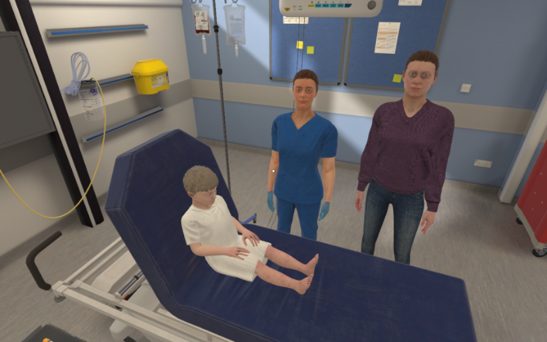
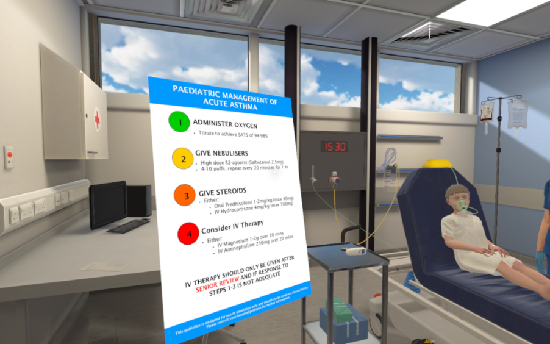
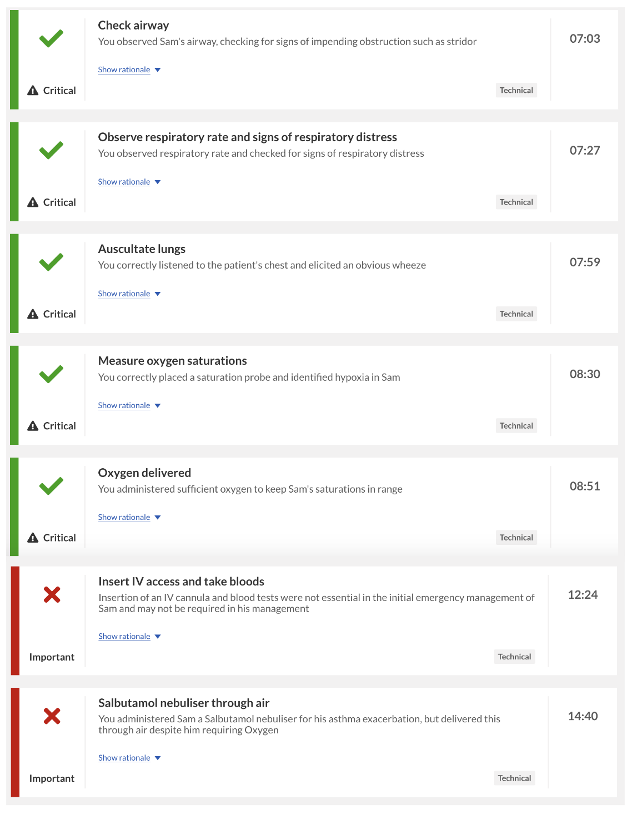

---
# output:
#  bookdown::pdf_document2:
#    template: templates/template.tex
#  bookdown::html_document2: default
#  bookdown::word_document2: default
#documentclass: book
bibliography: [bibliography/references.bib]
---

# Diagnostic Uncertainty and Information Seeking in Virtual Reality Paediatric Scenarios {#chapter-5}

\adjustmtc
\markboth{5. VR Study}{}

<!-- For PDF output, include these two LaTeX commands after unnumbered chapter headings, otherwise the mini table of contents and the running header will show the previous chapter -->

## Introduction

In the previous two studies, we used experimental paradigms that made use of textual vignettes, in which patient information was described to participants as per standardised case descriptions adapted from the work of previous researchers [@friedman_physicians_2005]. The first study was conducted online with medical students from across the UK, whilst the second study used an in-person think-aloud version of a similar paradigm with Oxford medical students. When taking these studies together, we can conceptualise a general model of the diagnostic decision making process. We observe diagnosis to be a process of using early information from history taking on a patient to build up a diagnostic picture of several possible differentials and their relative likelihood. Past this point, we observe a rich interplay between generating differentials, seeking further information on the patient, and reevaluating differentials based on interpretation of this new information. This interplay is managed through variable reasoning strategies for working through the diagnostic process.

\
A common finding across both studies was that medical students showed a reticence to remove differentials from consideration, and instead broadened the differentials they were considering as they received more information. This brings up a question of whether such a tendency would be exhibited in real medical practice. One can imagine that when a patient requires (sometimes urgent) treatment, the situation may then require clinicians to commit to a working diagnosis at some point and remove others from consideration. Whilst we found evidence for a general tendency in medical students to broaden the range of differentials with more information, these studies made use of patient vignettes where there was no requirement to treat the patient and no subsequent observation of improvement or deterioration in the patients' state. This begs the question of whether medical students still show a tendency to broaden the differentials they are considering when beginning a treatment plan for a patient, when they are intuitively required to narrow their diagnoses. Diagnosis and treatment are also likely to be intimately linked in many medical situations, with each influencing the other and altering clinicians' evolving thought process [@brody_diagnosis_1980].

\
There is also a limitation with our work thus far, in that the use of textual vignettes has limits in terms of naturalism (as noted by some participants during the think-aloud study's debrief interviews) despite our use of a flexible decision making paradigm. As we found during our systematic scoping review, the majority of past work on confidence during diagnoses made use of textual vignettes in their experimental paradigms. Past papers seem to make limited use of high-fidelity simulations (e.g. [@yang_effect_2012; @garbayo_metacognitive_2023]) or other types of naturalistic paradigms (although some papers used in-situ questionnaires whilst clinicians were treating actual patients, e.g. [@calman_variability_1992; @hageman_surgeon_2013; @gupta_associations_2023]). Use of such simulation-based paradigms would have increased naturalism when compared to textual vignettes, as well as allowing researchers to look at how confidence impacts the actual treatment of patients in a controlled experimental environment. In the case of our work, we can use simulation of patient scenarios to better understand how confidence impacts diagnoses for patients who actually require treatment (rather than simply being described as per our vignettes) and develop over time in terms of their health. Participants are unable to see the patient during a vignette task, which is important given that the visual state (or distress) of a patient influence how doctors diagnose their patient [@brooks_difficulty_2000; @sibbald_eyeballing_2017].

\
In this study, we aim to extend our previous findings using a virtual reality (VR) experimental paradigm that is more naturalistic to real medical practice. We use VR scenarios to take another important step towards the realism of medical practice and investigate our overarching questions on differential generation, information seeking and confidence using a different experimental method. Similar to our previous studies, we measure the range of diagnostic differentials that students are considering at multiple points during the scenarios. Our online study found that initial diagnostic breadth of students was predictive of their subsequent information seeking and changes in confidence. We not only look to replicate this finding in a more naturalistic medical context but also to investigate whether initial diagnostic breadth is also predictive of patient treatment.

\
VR has seen limited use in previous work on clinical decision making but has potential for studying and improving clinical reasoning and decision making [@jans_examining_2023]. One of the benefits of using a VR paradigm is that we are able to simulate a real medical environment. This includes the wider range of possible actions available to a clinician. Using our paradigm, we are able to record every action or information request made by participants. These actions can then be categorised into a number of areas similar to the previous vignette studies: Patient History, Physical Examinations, Testing and, new to this study, Treatment. Our findings around initial diagnostic breadth and the qualitative theme from the previous study on the importance of an in-depth history to base diagnosis on necessitate a deeper look at history taking during diagnoses. Our vignette paradigm used fairly limited patient histories, with a perceived lack of detail potentially explaining why some participants expressed diagnostic uncertainty. History taking is especially important to study given its high degree of influence on eventual diagnoses compared to other information [@hampton_relative_1975; @sandler_importance_1980; @peterson_contributions_1992] and its importance as a skill to teach to medical students [@keifenheim_teaching_2015].

\
In the VR paradigm, there is much more detail available on the patient's medical history, including follow-up questions to patients to access more detail on their condition. For example, if a patient is feeling pain, the interactive nature of VR allows participants to ask about the nature of the pain (e.g. whether it is a dull or sharp pain, whether anything makes the pain better/worse etc.). With the wider range of actions available to participants, we not only look at information seeking as a whole, but also information seeking within each of these categories. In particular, we are interested in how the comprehensiveness of participants' history taking affects their subsequent confidence and the diagnoses they consider. Given that VR also simulates active medical situations, participants can be graded based on the information they seek, the tests they run and treatment they administer.\

By using a higher fidelity paradigm such as VR, we aim to investigate the link between information seeking and confidence in a more open-ended clinical situation that has a wider range of possible options for history taking, physical examination, testing and treatment options when compared to our vignette paradigm (which constrained the amount of information available on each case for usability). Given this increased flexibility, we can look at more nuanced aspects of information seeking, as well as the effect of ongoing treatment of patients on confidence. Our vignette task was static in time, in that the patient does not change over the course of a case (i.e. improving or deteriorating over time). This VR paradigm then allows doctors to start managing the patient’s symptoms and even using reactions to their treatment plan in order to change their understanding of the patient's condition.

\
The VR methodology in this study is substantially different to our vignette methodology, thus the analysis of accuracy has to change. In the previous studies, we operationalised accuracy given that there was a specific condition/diagnosis that participants were tasked with identifying. In this task however, determining a diagnosis is not the primary focus (although we do ask participants to report the set of diagnostic differentials that they are considering). Instead, participants are required to begin treatment for the patient in the scenario and handover the case to a senior colleague. In addition, the focal condition to be identified may be fairly evident from the patient (e.g. a febrile seizure) but there is a wider range of potential sources/causes underlying this condition. Given this, there are two ways in which performance can be measured for participants: performance in terms of the clinical actions they take (e.g. testing, treatment etc.) they take or in terms of the diagnoses they report. We record both measures of accuracy, with details about they are defined in the Methods section.

### Research Questions

With this study, we investigated the following research questions:

-   Do medical students narrow or broaden their diagnostic differentials in a naturalistic medical scenario where patient treatment is required?
-   Is information seeking, in terms of quantity and quality, linked to more appropriate sets of diagnoses?
-   How do specific types of information seeking (i.e. around Patient History, Physical Examinations and Testing) relate to confidence, both in terms of information seeking preceding confidence, and as a result of confidence?

## Methods

### Participants

We recruited medical students based at the University of Oxford in their second year of clinical training (which equates to three years of pre-clinical and one year of clinical training). 76 students completed this study. Students were randomly split into pairs such that they also observed other students during their scenarios and administered a questionnaire during the scenario.

### Materials

We used VR scenarios implemented by Oxford Medical Simulation (OMS, <https://oxfordmedicalsimulation.com/>), a company that implements bespoke VR software for medical education and simulation. Participants in this study were medical students based in Oxford who were at the time taking part in VR-based teaching sessions as part of their medical degrees. Students performed the scenarios using Oculus Quest 2 VR headsets. The clinical scenarios were paediatric (i.e cases were presented where a child would be attending the hospital with their legal guardian). Each scenario features a visual 3D implementation of a cubicle in an Emergency Department of a hospital (as visualised below in [Figure \@ref(fig:screenshot1vr)](#fig:screenshot1vr)). Participants are shown a range of avatars, including a (child) patient, their guardian and a nurse who can help with certain treatment and investigations/testing. All of the ‘avatars’ in the scenario can be questioned by the participant using a predefined set of requests/actions (e.g. asking the nurse to check blood pressure, asking the patient/child about if they are in pain, [Figure \@ref(fig:screenshot2vr)](#fig:screenshot2vr) below). The scenarios provide a reasonably accurate representation of real life including accurate audiovisual information (i.e. avatar voices are realistic, and it is possible to hear simulated heart sounds, breath sounds or alarms among other sounds). The scenarios, and their associated criteria for assessing performance, were developed using a peer review process with subject matter experts (i.e. recently practicing clinicians) and consultation of best practice guidelines.

\newpage

```{r screenshot1vr, include=TRUE, echo=FALSE, out.width='100%', fig.align='center',fig.cap="Screenshot from the VR software, implemented by Oxford Medical Simulation. Depicted here is the patient/child, their parent/guardian and a nurse (who can be asked to seek tests or administer treatment)",fig.scap="VR Study: Screenshot 1"}



```

```{r screenshot2vr, include=TRUE, echo=FALSE, out.width='100%', fig.align='center',fig.cap="Screenshot from the VR software. Depicted here is the participant consulting available guidelines on the management of asthma in children.",fig.scap="VR Study: Screenshot 2"}



```

\
Each participant completed two scenarios over two separate VR sessions. The sessions were held around one month apart. During each session, the participants each performed one scenario in VR and observed another medical student during their scenario. We chose medical scenarios that were considered fairly common to arise for paediatric patients. The scenarios presented in each session are described below (students are split into two groups, shown below as groups A and B, each performing a different pair of scenarios in a fixed order):

-   Session One:
-   
    -   *Group A:* patient/child is a 6-year-old-girl presenting with a 1-day history of central abdominal pain and thirst. She was generally unwell for 2 days prior, with a reduced appetite and a sore throat. Collateral history reveals Type 1 Diabetes and erratic blood sugars. (**Underlying Condition: Diabetic Ketoacidosis**, henceforth referred to as the 'DKA' scenario)
-   
    -   *Group B:* patient/child is a 5-year-old boy presenting with worsening shortness of breath, wheeze, and signs of respiratory distress, on the background of 2 days of likely viral illness. He has a medical history of asthma and has had similar exacerbations in the past. (**Underlying Condition: Acute Severe Exacerbation of Asthma**, henceforth referred to as the 'Asthma' scenario)
-   Session Two:
-   
    -   *Group A:* patient/child is a 5-year-old boy presenting with shortness of breath and drowsiness (**Underlying Condition: Chest Sepsis/Pneumonia**, henceforth referred to as the 'Pneumonia' scenario)
-   
    -   *Group B:* patient/child is a 5-year-old girl with a 1-day history of sore throat and fever. She starts having a generalised tonic-clonic seizure during the scenario. (**Underlying Condition: Febrile seizure on background of tonsillitis**, henceforth referred to as the 'Seizure' scenario)

### Procedure

The aim for students in the scenarios was to diagnose the patient, begin treatment and hand over the case to a senior with appropriate understanding of the patient. Handovers were conducted using a standardised framework known as SBAR, meaning that clinicians have to brief the senior on the Situation, Background, Assessment and Recommendation for the patient. Participants were expected to take a clinical history, complete a physical examination, start emergency treatment to stabilise the patient and escalate to a senior clinician for further input. Whilst in the scenario, participants can learn about the patient’s medical history, check key parameters (such as temperature, pulse, blood pressure, respiratory rate etc), perform physical examinations or tests and begin certain treatment actions (such as administering oxygen or prescribing medication). All information sought by participants was recorded within the VR software. The full set of information available on each scenario can be viewed in [Table \@ref(tab:vrinforequests)](#tab:vrinforequests) of the Appendices. Participants were also expected by the end of the scenario to be able to give an explanation of the situation to the patient’s parent/guardian. All participants had the same starting point in each scenario and the patient in the scenario deteriorated in an identical way if the participant took no action. If participants undertook certain actions, the patient improved both in terms of vital signs (e.g., blood pressure, heart rate, oxygen saturation etc.) and in their response to questions (e.g., responding, if asked, “Yes, I feel a bit better”). If participants select irrelevant actions, the patient did not improve, and some actions resulted in the patient’s state deteriorating.

\
After 5 minutes in the scenario (by which point it was expected that participants would have gathered key points on the patient's history and started some early assessment of the patient), participants were asked to pause the scenario (taking off their VR headset) and to fill in a brief questionnaire on paper. Multiple VR participants were performing the scenario simultaneously and were paired with another student who would watch their performance. This other student would aid with administering the questionnaire, with the students subsequently switching roles for the other scenario. The VR participant was asked in the questionnaire to answer the following (this is considered time point 1):

-   "Please say all the conditions that you are currently considering or are concerned about for this patient. Include any/all common, rare or contributing conditions you are considering. For each, please rate how likely you think they are on a scale of 1 (low) to 5 (high)."
-   "On a scale of 1-10, how confident are you that you understand the patient’s condition?"
-   "How severe do you think the patient’s condition is on a scale of 1 to 10?" (Each point of the scale represented a different clinical action/course, with 1 representing "Discharge in \<4 hours, no follow up" and 10 representing "Requires arrest/peri arrest team.")

During the scenario, participants had access to a phone on the virtual wall that could be used to call external staff members for help. In terms of general options for external second opinions, participants could call the on-call doctor or the day team on the ward. For more serious situations, participants could call the rapid response team, crash team or push the emergency button (in very severe situations). Participants were expected to at least handover to another staff member using the aforementioned SBAR protocol but could request the help of a senior before this point. Crucially, the structure of the scenario (including the amount of time spent in the scenario) is dictated by the participant, who can handover the case when they feel they have done enough to stabilise the patient and understand enough to handover to a senior. Once the participant is ready to finish, they 'leave the room' in the VR ward. However, the scenario automatically ends after 20 minutes if the participant has not finished it themselves.

\
After the scenario, the participant answered a second questionnaire (this is considered time point 2). This included the same three questions as above in timepoint 1 (so that participants could record their updated responses), as well as the following additional questions:

-   "What is the most likely course of the patient?" (this was a free text response)
-   "To what extent would you be prepared to leave the patient prior to a senior review. Mark your response below on a scale ranging from Not at All to Completely" (this question was answered using a visual analogue scale)
-   "Did you complete all the history, examinations and investigations necessary? If not, what else would you do if given more time?"
-   "What investigation would you give highest priority next?"

Upon completing this second questionnaire, the students in each pair swapped over such that the student who had previously been observed was now performing a VR scenario (from Group B). Each session always featured two different scenarios, with each participant performing one scenario each.

### Data Analysis

In this section, we detail three different groups of dependent variables defined for this study: measures of participant performance, variables from our questionnaires and measures based on information seeking and actions recorded within the VR scenario.

#### Performance Measures

We define two performance measures for this study. Firstly, we make use of predetermined criteria for which clinical actions are considered optimal for each patient scenario. When it comes to diagnostic accuracy (as we defined in our previous studies), given that the scenarios are more naturalistic, there is not a correct (ground truth) condition that the patients have. For example, one of the scenarios sees the patient having a febrile convulsion/seizure. Identifying this as such, as a focal diagnosis, is expected of most medical students due to there being a lack of diagnostic uncertainty. Identifying the causes of this seizure however, is associated with more diagnostic uncertainty as there are several possible causes of such a medical episode. When it comes to identifying these causes, there is not a set correct answer, as the scenario does not comprise of later stages of the patient's care pathway. Because of this, we instead consider a measure of Diagnostic Appropriateness, where we measure how suitable the recorded set of diagnostic differentials is as a whole in terms of whether participants record differentials that would be considered plausible or likely given the patient's condition.

-   **Performance Score**: The OMS software implements a series of objectives for each scenario (designed by a peer review process with clinicians and subject matter experts in consultation with Oxford Medical School), which are tasks or actions that the participant is expected to have completed within the allotted time. These objectives are comprised of a range of actions, including examinations that they were expected to conduct, history questions they should have asked and treatment that should have been administered. These objectives can include administering oxygen, prescribing a particular medication or calculating the Paediatric Early Warning Score (PEWS). Some objectives are required to contribute towards a higher performance score, whilst a participant may be penalised for doing certain other actions (e.g. prescribing a medication without first checking for allergies). The peer review panel differently weighted certain actions/objectives, so some result in a larger point deduction based on how serious the consequences would be for the patient. See [Figure \@ref(fig:scoreimage)](#fig:scoreimage) below for an example of objectives used for the Pneumonia scenario.

\newpage

```{r scoreimage, include=TRUE, echo=FALSE, out.width='100%', fig.align='center',fig.cap="An example of scoring criteria used when calculating the Performance Score. The criteria are pre-defined specifically to each scenario. This example shows objectives that have been met (as denoted by a green tick) and those that have not been met (as denoted by a red cross). This example is taken from the OMS software, which calculates Performance Score internally for each case.",fig.scap="VR Study: Scoring Criteria Example"}




```

\newpage

-   **Diagnostic Appropriateness**: To define this metric formally, we express **Diagnostic Appropriateness (A)** as follows:

\
Let $L = \{ l_1, l_2, \ldots, l_m \}$ be the set of all likelihoods provided across participants for a given scenario, where each array of likelihoods provided for a given scenario $l_j$ has a length $|l_j|$ (i.e. the number of differentials recorded).

\
We define:

-   $n_{\text{max}} = \max(|l_1|, |l_2|, \ldots, |l_m|)$ (length of the longest array in $L$)

-   The penalty for a lower number of provided differentials: $$
    \lambda_j = n_{\text{max}} - |l_j|
    $$

Diagnostic Appropriateness for a given set of differentials and likelihoods $A_j$ for each array $l_j$ can be expressed as:

$$
A_j = \frac{S_{p,j} + \frac{1}{2} S_{u,j}}{S_{L,j} + \lambda_j}
$$

Where:

-   $S_{p,j} = \sum_{l_k \in l_j, l_k = p} l_k$ (sum of likelihoods for probable/possible differentials for that scenario/condition)

-   $S_{u,j} = \sum_{l_k \in l_j, l_k = u} l_k$ (sum of likelihoods for unlikely differentials for that scenario/condition)

-   $S_{L,j} = \sum_{l_k \in l_j} l_k$ (total sum of likelihoods across all differentials in $l_j$)

Hence:

-   $A_j \to 0$ when all listed differentials are incorrect.

-   $A_j \to 0.5$ when all listed differentials are unlikely.

-   $A_j \to 1$ when all listed differentials are correct.

Complementing the Performance Score, this other key metric of diagnostic performance concerns how appropriate each participant's set of differentials are assessed for how appropriate they are for the scenario. Each scenario has a set of differentials that are considered most likely, probable and improbable (with any others considered incorrect). This criteria for provided differentials was developed in consultation with an experienced medical professional (who at the time of this study was an Anaesthetic and Intensive Care Doctor, as well as a medical educator). The full criteria can be found in [Table \@ref(tab:vrmarking)](#tab:vrmarking) of the Appendices. To calculate a score for how appropriate the diagnoses are, we consider what proportion of likelihood values are assigned to likely or probable differentials, whilst penalising participants for providing fewer differentials, such that larger sets of likely or probable differentials are assigned higher scores. This is because we expect participants to provide a wider set of differentials that could be contributing to the patients' conditions (as explained during the Introduction).

\newpage

#### Questionnaire Measures

-   **Number of Differentials**: participants are asked to record all the diagnostic differentials that they are considering at the two aforementioned time points. Hence, the total number of differentials is recorded at each stage. The Initial Number of differentials (also known as Initial Diagnostic Breadth) is the number of diagnoses provided at the pause point.

-   **Confidence Change**: the participants’ confidence in their understanding of the patient’s condition is recorded at two time points, with the first being after 5 minutes (out of the 20-minute time limit) and the second being after the participant has finished the scenario. Confidence at each stage is recorded on a 10-point scale (1-10). The difference between the second and the first confidence rating is taken, such that a positive value indicates that the participant has increased their confidence over the course of the scenario.

#### Information Seeking and VR Scenario Measures

We also derived measures of information seeking similar to previous studies. The VR scenarios are far richer in terms of the available set of information for participants when compared to the vignette paradigm. For our analysis, we record all actions (or ‘clicks) made by participants whilst in the scenario. Actions are categorised into a number of groups. The main categories are labelled as History, Examination or Testing, similar to the vignette studies. This set of information is mostly similar across scenarios though there are minor differences especially in the History category. Across scenarios, there are 35 possible History actions, 29 Examination actions and 18 Testing actions. This especially means that in comparison to the vignette paradigm, participants can take more detailed patient histories and can receive very different pieces of information depending on what they request from patient documentation and from asking the patient/guardian in the scenario. Outside of these categories, there are other actions available to participants, such as administering medication for the patient, calling for help or providing reassurance to the patient/guardian, but these are not used for our analysis. After categorising the participants’ actions, we define a number information seeking measures:

-   **History Taking**: this is the number of History actions for a given scenario that take place before the pause point.
-   **Total Information Seeking**: this is the number of unique actions (i.e. does not include requesting the taking of the same action multiple times) classified under History, Examination or Testing across the scenario.
-   **Information Value**: this measure captures the value of each piece of information sought, similar to our measure of information value used in the vignette studies. We calculate the difference in OMS performance score for participants with or without that information on a given scenario. We then sum all values across all information sought by the participant within each of the information categories (History, Examination, Testing). This allows us to have a measure of value for every possible action, which is not the case within the OMS Performance Score criteria (as only certain objectives/actions have a bearing on the overall scoring).
-   **Amount of Treatment**: this is the number of actions classified as treatment of the patient across the scenario.

\
Given that, unlike our vignette paradigm, participants are able to administer treatment and ask for help from a senior member (using the telephone in the VR ward), we measure how long it takes for students to do both of these:

-   **Time to Treatment**: this is the amount of time (in seconds) between the start of the scenario and the point at which the first treatment action is performed.

-   **Time to Call for Help**: this is the amount of time (in seconds) between the start of the scenario and the point at which the participant uses the phone to call a senior for help.

We expect that confidence will predict how long it takes for participants to both start treatment and call for help, with higher confidence being associated with quicker times to start treatment and slower times to call for help (given that they do call for help at some point during the scenario). We exclude participants from these analyses if they do not ask for help or do not administer any treatment respectively.

#### Planned Analyses

As all actions are recorded with timestamps in the output dataset, we categorise whether actions occurred before or after the pause point (5 minutes in). Hence, we can investigate information seeking before and after the pause point where participants record their initial diagnoses and confidence. For this study, we are particularly interested in the relationship between confidence and information seeking as it follows the time course of a diagnostic decision. To this end, we look at whether information seeking up until the pause point predicts initial confidence (as reported during the pause point). We then look at whether this initial confidence predicts subsequent information seeking (after the pause point). This allows us to look at the relationship between information seeking and confidence in both directions: respectively, how information informs subsequent confidence and how confidence informs subsequent information seeking. Finally, we look at whether the amount of patient treatment during the scenario is predicted by confidence, both before and after participants administer treatment. We investigate this by looking at the number of treatment actions performed and its relationship with both initial and final confidence. These analyses are performed on a case-wise level, and thus we used generalised mixed effects modelling due to the lack of independence between observations. As such, we control for individual participants and the patient condition/case as random effects.

\
Given that Diagnostic Appropriateness is our variable for diagnostic accuracy in this study, we look at information seeking as a predictor of accuracy similar to in our online study (i.e. in our ROC analysis, as depicted in [Figure \@ref(fig:accuracyClassifier)](#fig:accuracyClassifier)). We do not use the OMS performance score as a measure of accuracy to relate to information seeking, as this score is in itself calculated using the information sought and actions taken by students in the scenario. Given the larger set of possible information that could be sought in the VR scenarios, we use Principal Component Analysis (PCA) to reduce the dimensionality of the information seeking data.

## Results

### Overall Performance

```{r anovadf, include=FALSE, warning=FALSE, message=FALSE, echo=FALSE}

anovaDf <- data.frame(c(vrData$t1Confidence,vrData$t2Confidence),
                      c(vrData$t1Severity,vrData$t2Severity),
                      c(vrData$t1numOfDiagnoses,vrData$t2numOfDiagnoses),
                      c(rep("1",nrow(vrData)),rep("2",nrow(vrData))),
                      c(rep(vrData$Scenario,2)),
                       c(rep(vrData$scenGroup,2)),
                      c(rep(vrData$ParticipantID,2)))

colnames(anovaDf) <- c("Confidence","Severity","Differentials", 
                       "Timepoint","Scenario","ScenarioGroup","ID")

```

```{r descstats, include=FALSE, warning=FALSE, message=FALSE, echo=FALSE}

vrDescStats <- vrData %>%
  group_by(Scenario) %>%
  dplyr::mutate(N = n()) %>%
  dplyr::summarise(n = mean(N),
                   DiagScore = round(mean(t1DiagnosisScore,na.rm=T),2),
                   MeanPerformance = round(mean(OMSScore,na.rm=T),2),
                   MeanInformationSeeking = round(mean(filteredActions,na.rm=T),1),
                   MeanInitialConfidence = round(mean(t1Confidence,na.rm=T),1),
                   MeanFinalConfidence = round(mean(t2Confidence,na.rm=T),1),
                   MeanInitialDiagnoses = round(mean(t1numOfDiagnoses,na.rm=T),1),
                   MeanFinalDiagnoses = round(mean(t2numOfDiagnoses,na.rm=T),1))

perfCorr <- cor.test(vrData$t1DiagnosisScore,vrData$OMSScore,method="spearman",exact=F)

```

We report data from `r length(unique(vrData$ParticipantID))` participants. As shown in [Table \@ref(tab:descstatstable)](#tab:descstatstable), some participants only completed a single scenario rather than two (due to absence during a testing session). `r length(unique(vrCompleteData$ParticipantID))` participants completed two scenarios (as part of either Scenario A or B as explained in the Procedure section). Overall, `r vrDescStats[vrDescStats$Scenario=="Asthma",]$n` participants completed the Asthma scenario, `r vrDescStats[vrDescStats$Scenario=="DKA",]$n` participants completed the DKA scenario, `r vrDescStats[vrDescStats$Scenario=="Pneumonia",]$n` participants completed the Pneumonia scenario and `r vrDescStats[vrDescStats$Scenario=="Seizure",]$n` participants completed the Seizure scenario.

\
We first characterise how well medical students performed during the scenario using our two performance measures. In terms of overall performance, the average Diagnostic Appropriateness score (calculated at the pause point) across all scenarios and participants was `r round(mean(vrData$t1DiagnosisScore,na.rm=T),2)` (ranging from `r min(vrData$t1DiagnosisScore,na.rm=T)` to `r max(vrData$t1DiagnosisScore,na.rm=T)`). The mean Diagnostic Appropriateness score for each scenario was as follows: Asthma = `r vrDescStats[vrDescStats$Scenario=="Asthma",]$DiagScore`, DKA = `r vrDescStats[vrDescStats$Scenario=="DKA",]$DiagScore`, Pneumonia = `r vrDescStats[vrDescStats$Scenario=="Pneumonia",]$DiagScore`, Seizure = `r vrDescStats[vrDescStats$Scenario=="Seizure",]$DiagScore`. The average OMS score (calculated at the end of the scenario) across all scenarios and all participants was `r round(mean(vrData$OMSScore,na.rm=T),2)` (ranging from `r min(vrData$OMSScore,na.rm=T)` to `r max(vrData$OMSScore,na.rm=T)`), which indicates the extent to which the predefined 'objectives' for each scenario were successfully completed by participants (each scenario has its own set of objectives, with some overlap). The mean OMS score for each scenario was as follows: Asthma = `r vrDescStats[vrDescStats$Scenario=="Asthma",]$MeanPerformance`, DKA = `r vrDescStats[vrDescStats$Scenario=="DKA",]$MeanPerformance`, Pneumonia = `r vrDescStats[vrDescStats$Scenario=="Pneumonia",]$MeanPerformance`, Seizure = `r vrDescStats[vrDescStats$Scenario=="Seizure",]$MeanPerformance`.

\
We next look at confidence reported by participants and its calibration to objective performance. Across all scenarios, participants increase their confidence between the two timepoints. Average initial confidence (recorded on a 10-point Likert scale) across scenarios was `r round(mean(vrData$t1Confidence,na.rm=T),2)` and average final confidence was `r round(mean(vrData$t2Confidence,na.rm=T),2)`. By scenario, average final confidence was higher than average initial confidence (see [Table \@ref(tab:descstatstable)](#tab:descstatstable) below). Other dependent variables such as the number of differentials are also summarised below in [Table \@ref(tab:descstatstable)](#tab:descstatstable). The distribution of confidence values are shown below in [Figure \@ref(fig:confidencetime)](#fig:confidencetime).

```{r descstatstable, include=TRUE, warning=FALSE, message=FALSE, echo=FALSE,out.width='100%'}

colnames(vrDescStats) <- c("Scenario","n","Diagnostic Score","OMS Score", "Information Seeking", "Initial Confidence", "Final Confidence", "Initial Differentials","Final Differentials")

vrDescStats1 <- vrDescStats[1:5]
vrDescStats2 <- vrDescStats[6:9]

#vrDescStats2 <- cbind(NA,vrDescStats2)
#colnames(vrDescStats2)[1] <- " "

#knitr::kable(vrDescStats) %>%
#  kableExtra::kable_styling(latex_options=c("HOLD_position","scale_down"))

ft1 <- flextable(vrDescStats1)
ft1 <- align(ft1, part = "all", align = "center")

ft2 <- flextable(vrDescStats2)
ft2 <- align(ft2, part = "all", align = "center")
ft2 <- padding(ft2, j=1, padding.left=20)

ft2 <- set_caption(ft2,"Average values for dependent variables by scenario. The n column denotes the number of participants (or 'observations') per scenario. We show mean values for the Diagnostic Appropriateness, Performance Score, Amount of Information Seeking (the number of actions taken belonging to History, Physical Examinations or Testing), Initial Confidence (as reported at the pause point in the scenario), Final Confidence (reported at the end of the scenario), Initial Diagnoses (the number of differentials reported at the pause point) and Final Diagnoses (the number of differentials reported at the end of the scenario).")
ft2 <- width(ft2, width = 1.5)

ft1
ft2

```

\newpage

```{r confidencetime, include=TRUE, echo=FALSE, out.width='100%', fig.align='center', warning=FALSE, message=FALSE, fig.cap="Violin plots showing confidence at timepoint 1 (the pause point at 5 minutes into the scenario) and timepoint 2 (at the end of the scenario) by condition (Asthma = red, DKA = green, Pnuemonia = blue, Seizure = purple). The dark region of the box plot shows the mean value, with the lines of the box plots showing standard deviation.",fig.scap="VR Study: Confidence by Timepoint and Scenario (Violin Plots)"}
p <- ggplot(anovaDf, aes(x=Timepoint, y=Confidence, fill=Scenario)) + 
    geom_violin() +
    stat_summary(fun.data=data_summary, geom="crossbar", width=0.05, position=position_dodge(0.1)) +
    facet_wrap(~Scenario) +
    theme_classic()

print(p)
```

```{r calibrationtestvr, include=FALSE, warning=FALSE, message=FALSE, echo=FALSE}

medp <- median(vrData$t1DiagnosisScore,na.rm = T)
vrData$diagGroup <- ifelse(vrData$t1DiagnosisScore<medp,0,1)

medp <- median(vrData$OMSScore,na.rm = T)
vrData$scoreGroup <- ifelse(vrData$OMSScore<medp,0,1)

diagLowInitialCon <- round(mean(vrData[vrData$diagGroup==0,]$t1Confidence,na.rm=T),2)
diagHighInitialCon <- round(mean(vrData[vrData$diagGroup==1,]$t1Confidence,na.rm=T),2)

scoreLowFinalCon <- round(mean(vrData[vrData$scoreGroup==0,]$t2Confidence,na.rm=T),2)
scoreHighFinalCon <- round(mean(vrData[vrData$scoreGroup==1,]$t2Confidence,na.rm=T),2)

calibrationtestdiag <- lme4::glmer(diagGroup ~ t1Confidence + (1|Scenario) + (1|ParticipantID),family=binomial(link = "logit"),data=vrData)

calibrationtestdiag <- summary(calibrationtestdiag)

calibrationtestscore <- lme4::glmer(scoreGroup ~ t2Confidence + (1|Scenario) + (1|ParticipantID),family=binomial(link = "logit"),data=vrData)

calibrationtestscore <- summary(calibrationtestscore)

```

\
As with previous studies, we look at whether participants provide confidence judgements that are calibrated to their objective performance. We separately determine how calibrated initial and final confidence judgements are. Initial Confidence is compared against the Diagnostic Appropriateness (which is calculated based on the differentials provided at the pause point), whilst Final Confidence is compared against Performance Score (which is calculated at the end of the scenario based on the actions performed and information sought across the scenario). We median split cases into two groups of low and high Diagnostic Appropriateness and also into groups of low and high Performance Score. Participants would be considered calibrated if we found evidence of higher confidence when performance is higher. Contrary to expectations, participants reported lower Initial Confidence when Diagnostic Appropriateness was higher (M = `r diagHighInitialCon`, SD = `r round(sd(vrData[vrData$diagGroup==1,]$t1Confidence,na.rm=T),2)`) compared to when it was low (M = `r diagLowInitialCon`, SD = `r round(sd(vrData[vrData$diagGroup==0,]$t1Confidence,na.rm=T),2)`). Given that the samples from each of these groups are not independent, we test for a difference between these groups using a binomial mixed effects model that predicts performance group using initial confidence as a fixed effect and both the individual participant and condition as random effects. We do not find evidence of confidence being predictive of Diagnostic Appropriateness ($\beta$ = `r round(calibrationtestdiag$coefficients[2],2)`, SE = `r round(calibrationtestdiag$coefficients[,"Std. Error"][2],2)`, z = `r round(calibrationtestdiag$coefficients[,"z value"][2],2)`, p = `r round(calibrationtestdiag$coefficients[,"Pr(>|z|)"][2],2)`). For final confidence, participants reported lower Final Confidence when Performance Score was higher (M = `r scoreHighFinalCon`, SD = `r round(sd(vrData[vrData$scoreGroup==1,]$t2Confidence,na.rm=T),2)`) compared to when it was low (M = `r scoreLowFinalCon`, SD = `r round(sd(vrData[vrData$scoreGroup==0,]$t2Confidence,na.rm=T),2)`). We test for a difference between these groups using a binomial mixed effects model that predicts performance group using final confidence as a fixed effect and both the individual participant and condition as random effects. We do not find evidence of confidence being predictive of Performance Score ($\beta$ = `r round(calibrationtestscore$coefficients[2],2)`, SE = `r round(calibrationtestscore$coefficients[,"Std. Error"][2],2)`, z = `r round(calibrationtestscore$coefficients[,"z value"][2],2)`, p = `r round(calibrationtestscore$coefficients[,"Pr(>|z|)"][2],2)`). Overall, we do not find evidence that participants provide calibrated confidence judgements at either timepoint with either of our measures of accuracy/performance.

### Initial Diagnostic Breadth

```{r initialdiagnoses, include=FALSE, warning=FALSE, message=FALSE, echo=FALSE}

# use other distributions / GLM

model1 <- lme4::glmer(filteredActions ~ t1numOfDiagnoses + (1|Scenario) + (1 | ParticipantID), family=poisson(link = "log"),data=vrData)
pcaModel <- rePCA(model1)
model2 <- lme4::glmer(filteredActions ~ t1numOfDiagnoses + (1 | ParticipantID), family=poisson(link = "log"), data=vrData)
modelcomp <- anova(model2,model1)
model1 <- summary(model1)


model <- lme4::glmer(confidenceChange+2 ~ t1numOfDiagnoses + (1|Scenario) + (1 | ParticipantID), family=poisson(link = "log"),  data=vrData)
pcaModel <- rePCA(model)

model2 <- lmerTest::lmer(confidenceChange ~ t1numOfDiagnoses + (1|Scenario) + (1 | ParticipantID), data=vrData)
modelcomp <- anova(model2,model)
model2 <- summary(model)

##########################

```

```{r diagchange, include=FALSE, warning=FALSE, message=FALSE, echo=FALSE}

diagDf <- data.frame(c(vrData$t1numOfDiagnoses,vrData$t2numOfDiagnoses))
colnames(diagDf) <- c("NumOfDiagnoses")
diagDf$Timepoint <- c(rep(1,nrow(vrData)),rep(2,nrow(vrData)))
diagDf$Scenario <- c(vrData$Scenario,vrData$Scenario)
diagDf$Participant <- c(vrData$ParticipantID,vrData$ParticipantID)

diagmodel <- lmerTest::lmer(NumOfDiagnoses ~ Timepoint + (1|Scenario) + (1 | Participant), data=diagDf)
diagmodel <- summary(diagmodel)$coefficients
diagmodel <- as.data.frame(diagmodel)
colnames(diagmodel)[4] <- "t.value"

```

The distribution of values for the number of differentials at each time point is shown below in [Figure \@ref(fig:diagtime)](#fig:diagtime). Visually, it can be observed that the number of differentials considered by participants decreases between the two timepoints (i.e. a narrowing of differentials). We confirm this using a linear mixed effect that predicts the number of differentials with timepoint as a fixed effect and both scenario and participant as random effects ($\beta$ = `r round(diagmodel$Estimate[2],2)`, t = `r round(diagmodel$t.value[2],2)`, p \< .001). We therefore surmise that participants tend to narrow their differentials between the two timepoints regardless of the scenario.

\
We can ask whether the initial diagnostic breadth (i.e. the number of diagnostic differentials being considered early in the scenario) is predictive of information seeking and change in confidence over the course of the scenario (as we found evidence for such an association in the online vignette study). We fit generalized linear mixed effects models to predict each of these with the number of initial differentials as a fixed effect and both the scenario and participant as random effects. We do not see evidence that the initial diagnostic breadth is predictive of the amount of information seeking ($\beta$ = `r abs(round(model1$coefficients[2],2))`, SE = `r round(model1$coefficients[,"Std. Error"][2],2)`, z = `r abs(round(model1$coefficients[,"z value"][2],2))`, p = `r abs(round(model1$coefficients[,"Pr(>|z|)"][2],2))`) or changes in confidence ($\beta$ = `r abs(round(model2$coefficients[2],2))`, SE = `r round(model2$coefficients[,"Std. Error"][2],2)`, z = `r abs(round(model2$coefficients[,"z value"][2],2))`, p = `r abs(round(model2$coefficients[,"Pr(>|z|)"][2],2))`). As a result, we are not able to replicate findings from Study 2 on a case-level, in which initial diagnostic breadth was predictive of information seeking via a linear mixed effects model (and changes in confidence via an individual differences correlation).

```{r diagtime, include=TRUE, echo=FALSE, out.width='100%', fig.align='center', warning=FALSE, message=FALSE, fig.cap="Violin plots showing the number of reported differentials at timepoint 1 (the pause point at 5 minutes into the scenario) and timepoint 2 (at the end of the scenario) by condition (Asthma = red, DKA = green, Pnuemonia = blue, Seizure = purple). The dark region of the box plot shows the mean value, with the lines of the box plots showing standard deviation.",fig.scap="VR Study: Differentials by Timepoint and Scenario (Violin Plots)"}
p <- ggplot(anovaDf, aes(x=Timepoint, y=Differentials, fill=Scenario)) + 
    geom_violin() +
    stat_summary(fun.data=data_summary, geom="crossbar", width=0.05, position=position_dodge(0.1)) +
    facet_wrap(~Scenario) +
    ylim(0,8) +
    theme_classic()

print(p)


```

### Information Seeking and Confidence

```{r initialconfidence, include=FALSE, warning=FALSE, message=FALSE, echo=FALSE}

model1 <- lme4::glmer(t1Confidence ~ numOfHistoryActionsBeforePause + numOfExamActionsBeforePause + numOfTestingActionsBeforePause + (1|Scenario) + (1 | ParticipantID), family=poisson(link = "log"), data=vrData)

pcaModel <- rePCA(model1)
model2 <- lme4::glmer(t1Confidence ~ numOfHistoryActionsBeforePause + numOfExamActionsBeforePause + numOfTestingActionsBeforePause + (1|Scenario), family=poisson(link = "log"), data=vrData)
modelcomp <- anova(model2,model1)

modelincon <- model2
modelincon <- summary(modelincon)

mod <- lm(t1Confidence ~ numOfHistoryActionsBeforePause + numOfExamActionsBeforePause + numOfTestingActionsBeforePause, data=vrData)
t1conshap <- shapiro.test(rstandard(mod))

```

We ask whether confidence is related to the amount of information sought on a given case. To investigate this, we look at information seeking before and after the pause point and look at both initial and final confidence. This allows us to look at this association in both directions: whether the amount of information seeking predicts subsequent confidence and whether confidence predicts subsequent information seeking. We fit generalised mixed effect models using the amount of information seeking in each of the three categories (Patient History, Physical Examinations and Testing).

\
We first look at whether initial confidence is predicted by information seeking prior to the pause point (i.e. prior to when this initial confidence was reported). In line with our previous results, we would expect participants to be more confident after having sought more information beforehand. For this, we use a generalised mixed effect model with a Poisson distribution (due to a violation of normality of residuals assumption for linear mixed effects models, Shapiro-Wilk Test p = `r round(t1conshap$p.value,3)`). We do not find evidence that initial confidence is predicted by prior information seeking related to Patient History ($\beta$ = `r abs(round(modelincon$coefficients[2],2))`, SE = `r round(modelincon$coefficients[,"Std. Error"][2],2)`, z = `r abs(round(modelincon$coefficients[,"z value"][2],2))`, p = `r abs(round(modelincon$coefficients[,"Pr(>|z|)"][2],2))`), Physical Examinations ($\beta$ = `r abs(round(modelincon$coefficients[3],2))`, SE = `r round(modelincon$coefficients[,"Std. Error"][3],2)`, z = `r abs(round(modelincon$coefficients[,"z value"][3],2))`, p = `r abs(round(modelincon$coefficients[,"Pr(>|z|)"][3],2))`) or Testing ($\beta$ = `r abs(round(modelincon$coefficients[4],2))`, SE = `r round(modelincon$coefficients[,"Std. Error"][4],2)`, z = `r abs(round(modelincon$coefficients[,"z value"][4],2))`, p = `r abs(round(modelincon$coefficients[,"Pr(>|z|)"][4],2))`).\

```{r subinfoseeking, include=FALSE, warning=FALSE, message=FALSE, echo=FALSE}

### Initial confidence predicting subsequent information seeking

model <- lme4::glmer(numOfHistoryActionsAfterPause ~ t1Confidence + (1|Scenario) + (1 | ParticipantID),family=poisson(link = "log"), data=vrData)
pcaModel <- rePCA(model)
model2 <- lme4::glmer(numOfHistoryActionsAfterPause ~ t1Confidence + (1 | ParticipantID),family=poisson(link = "log"), data=vrData)
modelcomp <- anova(model2,model)
histmodel <- model
histmodel <- summary(histmodel)

model <- lme4::glmer(numOfExamActionsAfterPause ~ t1Confidence + (1|Scenario) + (1 | ParticipantID),family=poisson(link = "log"), data=vrData)
pcaModel <- rePCA(model)
model2 <- lme4::glmer(numOfExamActionsAfterPause ~ t1Confidence + (1|Scenario),family=poisson(link = "log"), data=vrData)
modelcomp <- anova(model2,model)
exammodel <- model
exammodel <- summary(exammodel)

model <- lme4::glmer(numOfTestingActionsAfterPause ~ t1Confidence + (1|Scenario) + (1 | ParticipantID),family=poisson(link = "log"), data=vrData)
pcaModel <- rePCA(model)
model2 <- lme4::glmer(numOfTestingActionsAfterPause ~ t1Confidence + (1|Scenario),family=poisson(link = "log"), data=vrData)
modelcomp <- anova(model2,model)
testmodel <- model
# Get the fitted values from the model
fittedValues <- fitted(testmodel)

testmodel <- summary(testmodel)


# Get the actual observed values
obsValues <- vrData[!is.na(vrData$t1Confidence),]$numOfTestingActionsAfterPause

# Create a data frame for plotting
plotDf <- data.frame(
  observedTestingActions = obsValues,
  fittedTestingActions = fittedValues
)

```

To investigate information seeking later in the scenario, we look at whether initial confidence predicts subsequent information seeking. To investigate this, we fit separate generalised mixed effect models with Possion distributions for each type of information seeking as the outcome variable. We would expect that with higher initial confidence, participants subsequently seek less information (as they need less further information to confidently state a diagnosis). We find limited evidence that initial confidence predicts subsequent history taking in a negative direction (i.e. that higher confidence is associated with lower subsequent history taking) ($\beta$ = `r round(histmodel$coefficients[2],2)`, SE = `r round(histmodel$coefficients[,"Std. Error"][2],2)`, z = `r abs(round(histmodel$coefficients[,"z value"][2],2))`, p = `r abs(round(histmodel$coefficients[,"Pr(>|z|)"][2],2))`). We do not find evidence that initial confidence is associated with subsequent Physical Examinations ($\beta$ = `r abs(round(exammodel$coefficients[2],2))`, SE = `r round(exammodel$coefficients[,"Std. Error"][2],2)`, z = `r abs(round(exammodel$coefficients[,"z value"][2],2))`, p = `r abs(round(exammodel$coefficients[,"Pr(>|z|)"][2],2))`). We do find however, unlike our expectation, that initial confidence was associated with higher amounts of Testing ($\beta$ = `r abs(round(testmodel$coefficients[2],2))`, SE = `r round(testmodel$coefficients[,"Std. Error"][2],2)`, z = `r abs(round(testmodel$coefficients[,"z value"][2],2))`, p = `r abs(round(testmodel$coefficients[,"Pr(>|z|)"][2],2))`). We plot the effect sizes and their confidence intervals below in [Figure \@ref(fig:finalconfidenceplot)](#fig:finalconfidenceplot).

```{r finalconfidenceplot, include=TRUE, warning=FALSE, message=FALSE, echo=FALSE, out.width='100%', fig.align='center', fig.cap="Plot of effect sizes (beta values) of each linear mixed effects model, with initial confidence as a fixed effect predicting the number of tests (after the pause point and the recording of this initial confidence value) belonging to each category (Patient History: red, Physical Examinations: green, Testing: blue). For all models, case/condition and participants are both included as random effects. 95% confidence intervals are visualised for each effect size estimate. A confidence interval not intersecting with an effect size of 0 would be interpreted as evidence for an effect of initial confidence on the number of subsequent information requests within each category.",fig.scap="VR Study: Effect Sizes of Initial Confidence Predicting Subseqeuent Information Seeking"}

histmodel <- lme4::glmer(numOfHistoryActionsAfterPause ~ t1Confidence + (1|Scenario) + (1 | ParticipantID),family=poisson(link = "log"), data=vrData)

exammodel <- lme4::glmer(numOfExamActionsAfterPause ~ t1Confidence + (1|Scenario) + (1 | ParticipantID),family=poisson(link = "log"), data=vrData)

testmodel <- lme4::glmer(numOfTestingActionsAfterPause ~ t1Confidence + (1|Scenario) + (1 | ParticipantID),family=poisson(link = "log"), data=vrData)

extractEffects <- function(model, model_name) {
  fixedEffects <- coef(summary(model))
  data.frame(
    Term = rownames(fixedEffects),
    Estimate = fixedEffects[, "Estimate"],
    StdError = fixedEffects[, "Std. Error"],
    Model = model_name
  )
}

# Combine data from all models
effectsData <- bind_rows(
  extractEffects(histmodel, "History"),
  extractEffects(exammodel, "Examinations"),
  extractEffects(testmodel, "Testing")
)

effectsData <- effectsData[effectsData$Term!="(Intercept)",]
# Add confidence intervals
effectsData <- effectsData %>%
  mutate(
    CILower = Estimate - 1.96 * StdError, #95% confidence interval
    CIUpper = Estimate + 1.96 * StdError
  )

# Ensure the Model column is a factor with the desired order
effectsData$Model <- factor(
  effectsData$Model,
  levels = c("History", "Examinations", "Testing")  # Desired order
)

# Plot
ggplot(effectsData, aes(x = Term, y = Estimate, color = Model)) +
  geom_point(position = position_dodge(width = 0.5), size = 3) +
  geom_errorbar(
    aes(ymin = CILower, ymax = CIUpper),
    width = 0.2,
    position = position_dodge(width = 0.5)
  ) +
  labs(
    x = "Test",
    y = "Effect Size Estimate of Initial Confidence"
  ) +
  scale_color_discrete(
    name = "Information Type",         # New legend title
  ) +
  theme_minimal() + 
  theme(axis.text.x = element_blank())

```

```{r finalconfidence, include=FALSE, warning=FALSE, message=FALSE, echo=FALSE}

model <- lme4::glmer(t1Confidence ~ numOfTreatmentActionsAfterPause + (1|Scenario) + (1 | ParticipantID),family=poisson(link = "log"), data=vrData)
pcaModel <- rePCA(model)
model2 <- lme4::glmer(t1Confidence ~ numOfTreatmentActionsAfterPause  + (1 | Scenario),family=poisson(link = "log"), data=vrData)
modelcomp <- anova(model2,model)

inconmodel <- model2
inconmodel <- summary(inconmodel)

model <- lmerTest::lmer(t2Confidence ~ numOfTreatmentActions + (1|Scenario) + (1 | ParticipantID), data=vrData)
pcaModel <- rePCA(model)

finconmodel <- model

# Get the fitted values from the model
fittedValues <- fitted(finconmodel)

finconmodel <- summary(finconmodel)

# Get the actual observed values
obsValues <- vrData[!is.na(vrData$t2Confidence),]$t2Confidence

# Create a data frame for plotting
plotDf <- data.frame(
  observedConfidence = obsValues,
  fittedConfidence = fittedValues
)

```

We also look at whether final confidence (as reported at the end of the scenario) is predicted by the number of treatment actions performed by participants during the scenario. We fit a linear mixed effects model with the number of treatment actions as a fixed effect and both scenario and participant as random effects. We find evidence that final confidence was predicted by the amount of treatment actions administered during the scenario ($\beta$ = `r abs(round(finconmodel$coefficients[2],2))`, SE = `r round(finconmodel$coefficients[,"Std. Error"][2],2)` t = `r abs(round(finconmodel$coefficients[,"t value"][2],2))`, p = `r abs(round(finconmodel$coefficients[,"Pr(>|t|)"][2],3))`), such that higher confidence was associated with more treatment actions being performed during the scenario.

### Diagnostic Appropriateness as a Predictor of Information Seeking

```{r appropinfo, include=FALSE, warning=FALSE, message=FALSE, echo=FALSE}

modBefore  <- lmer(t1DiagnosisScore ~ infoValHistoryBeforePause + (1|Scenario) + (1|ParticipantID), data=vrData) 

modHist <- lmer(infoValHistory ~ t1DiagnosisScore + (1|Scenario), data=vrData) 
modExams <- lmer(infoValExams ~ t1DiagnosisScore + (1|Scenario), data=vrData) 
modTest <- lmer(infoValTesting ~ t1DiagnosisScore + (1|Scenario), data=vrData) 

modHist <- data.frame(summary(modHist)$coefficients)
modExams <- data.frame(summary(modExams)$coefficients)
modTest <- data.frame(summary(modTest)$coefficients)

modHistPercent <- lmer(t1DiagnosisScore ~ percentageHistory + (1|Scenario), data=vrData) 
modHistPercent <- data.frame(summary(modHistPercent)$coefficients)

```

\
We are also interested in whether initial diagnostic appropriateness has an effect on subsequent information seeking. As in previous studies, we look at two aspects of information seeking: the amount of information seeking and informational value. To this end, we look at whether diagnostic appropriateness (at the pause point) predictions the subsequent information seeking amount and value for each of the three categories: History, Physical Examinations and Testing. We fit linear mixed effect models whilst controlling for scenario and participant as random effects. We use this modelling to ask whether, on cases where more appropriate diagnoses are provided early on, participants are found to have sought more information and/or useful information. We find that diagnostic appropriateness is not predictive of the number of actions belonging to any of the information seeking categories (Fs \< 1, ps \> .1). We do however find evidence that diagnostic appropriateness is predictive of the value of Patient History taking ($\beta$ = `r round(modHist$Estimate[2],2)`, t = `r round(modHist$t.value[2],2)`, p = `r round(modHist$Pr...t..[2],2)`), but not with Physical Examination value ($\beta$ = `r round(modExams$Estimate[2],2)`, t = `r round(modExams$t.value[2],2)`, p = `r round(modExams$Pr...t..[2],2)`) or Testing value ($\beta$ = `r round(modTest$Estimate[2],2)`, t = `r round(modTest$t.value[2],2)`, p = `r round(modTest$Pr...t..[2],2)`). The relationship between Patient History Value and Diagnostic Appropriateness is plotted below in [\@ref(fig:historyvalplot)](#fig:historyvalplot). One explanation for this relationship that Diagnostic Appropriateness is necessarily associated with history taking, as information on the Patient History is intuitively mostly sought towards the earlier stages of a diagnostic decision process. If this were the case, we would expect that Diagnostic Appropriateness would be predicted by how much of the history taking took place before the pause point (i.e. when the initial Diagnostic Appropriateness is recorded and measured). To this end, we fit a linear mixed model to predict initial Diagnostic Appropriateness using the proportion of a scenario's history taking that took place before the pause point as a fixed effect. We do not find evidence that this is predictive however ($\beta$ = `r round(modHistPercent$Estimate[2],2)`, t = `r round(modHistPercent$t.value[2],2)`, p = `r round(modHistPercent$Pr...t..[2],2)`).

```{r historyvalplot, include=TRUE, warning=FALSE, message=FALSE, echo=FALSE, out.width='100%', fig.align='center', fig.cap="Scatter plot showing the relationship between information value for information requests in the Patient History category (x-axis) and Diagnostic Appropriateness score (y-axis) calculated based on the initial set of differentials provided at the pause point in the scenario. Each data point in this plot represents a single case/scenario.", fig.scap="VR Study: History Value Against Diagnostic Appropriateness (Scatter Plot)"}

histCon <- ggplot(data = vrData, aes(x=infoValHistory, y=t1DiagnosisScore)) +
  geom_point() +
  geom_smooth(method=lm , color="black", fill="skyblue", se=TRUE) +
  theme_minimal()

print(histCon + 
      labs(y="Diagnostic Score", x = "History Taking Value") +
          theme(axis.text=element_text(size=15),
             axis.title=element_text(size=16)
  ))

```

### Time to Treat and Call for Help

```{r timetohelp, include=FALSE, warning=FALSE, message=FALSE, echo=FALSE}

treatData <- vrData[vrData$treatStart<9999,]

treatExclusions <- nrow(vrData) - nrow(treatData)

model <- lmer(treatStart ~ t1Confidence + (1|Scenario) + (1 | ParticipantID), data=treatData)

treatConModel <- model
treatConModel <- summary(treatConModel)

model <- lmer(treatStart ~ t1Severity + (1|Scenario) + (1 | ParticipantID), data=treatData)

treatSevModel <- model
treatSevModel <- summary(treatSevModel)

######################

helpData <- vrData[vrData$totalHelpStart<9999,]

helpExclusions <- nrow(vrData) - nrow(helpData)

model <- lmer(totalHelpStart ~ t1Confidence + (1|Scenario) + (1 | ParticipantID), data=helpData)

helpConModel <- model
helpConModel <- summary(helpConModel)

model <- lmer(totalHelpStart ~ t1Severity + (1|Scenario) + (1 | ParticipantID), data=helpData)

helpSevModel <- model
helpSevModel <- summary(helpSevModel)

```

We next turn to the time taken for participants to start treatment of patients and to call for help from a senior in the scenarios. We use linear mixed effect modelling to determine if the time taken to start treatment and to call for help is predicted by both confidence judgements and ratings of patient severity. We control for individual participants and scenarios as random effects. `r treatExclusions` cases were excluded from the following analysis involving time taken to treat, as no treatment actions were recorded for these cases. `r helpExclusions` cases were excluded from the analysis involving time taken to call for help, as no help actions were recorded for these cases. We do not find evidence that Initial Confidence predicts the time taken to start treatment or ask for help (ps \> .1). We do not find evidence that initial ratings of severity predict the time taken to start treatment ($\beta$ = `r round(treatSevModel$coefficients[2],2)`, SE = `r round(treatSevModel$coefficients[,"Std. Error"][2],2)`, t = `r round(treatSevModel$coefficients[,"t value"][2],2)`, p = `r round(treatSevModel$coefficients[,"Pr(>|t|)"][2],2)`), but we do find that severity is predictive of the time taken to call for help ($\beta$ = `r round(helpSevModel$coefficients[2],2)`, SE = `r round(helpSevModel$coefficients[,"Std. Error"][2],2)`, t = `r round(helpSevModel$coefficients[,"t value"][2],2)`, p = `r round(helpSevModel$coefficients[,"Pr(>|t|)"][2],2)`). Each unit increase in severity rating was associated with participants seeking help `r abs(round(helpSevModel$coefficients[2],2))` seconds quicker.

## Discussion

This study of 76 medical students utilised paediatric Virtual Reality (VR) scenarios to investigate how medical students seek information and consider diagnostic differentials in a more naturalistic manner than has been in our previous studies. Using VR software, it is possible to emulate realistic situations that doctors may encounter involving paediatric patients and record nuanced aspects of behaviour during the scenario, such as what actions are taken (including treatment) and when participants call for help from a senior member of staff. The strength of this paradigm is allowing participants to interact with a patient, who can improve/deteriorate over the course of a scenario in reaction to any administered treatment (or an absence of it). This represents a significant increase in realism relative to our previous studies, in which patient scenarios were presented and described using textual vignettes. As opposed to textual descriptions of cases, our VR methodology provides visual (e.g. viewing scans) and auditory (e.g. auscultating the patient’s lungs, speaking to the patient) information to participants about the patient. The use of high-fidelity or virtual reality simulations can be also useful for emulating the time pressures [@schmidt_simulation_2013; @jans_examining_2023] that clinicians contend with in daily practice [@yates_physician_2020], especially when simulating patients who are in deteriorating state (as is the case in our VR scenarios). Emulating these aspects of medical practice is especially pertinent given that clinicians may behave differently in a simulation-based study compared to a vignette study [@yang_effect_2012]. Using such simulation-based methodologies is then well-suited to deriving insights into medical decision making that apply to naturalistic contexts. In this section, we summarise the main findings from this VR study and contextualise them within the existing literature.

### Making Appropriate Diagnoses

First, we consider our findings around the predictors of appropriate diagnoses. When assessing the diagnoses provided by medical students in this study, we used a score for diagnostic accuracy that took into account the range of differentials that medical students considered. We adopted this measure to assess diagnostic thinking as a whole, rather than simply identifying a focal diagnosis/condition correctly. This was important to do given that the diagnostic uncertainty came not from the focal condition, but from identifying its source and causes. We note that with this measure, we operationalise diagnostic accuracy quite differently to our previous work (and to previous work in the extant literature, e.g [@meyer_physicians_2013; @kammer_differential_2021]), which only considered whether a single correct differential was mentioned by participants. A measure that considers a set of multiple diagnostic differentials is more analogous to real practice, as clinicians may not always be able to identify a focal diagnosis. Alternatively, identifying a focal diagnosis may not be the central priority for their practice. Rather, their priority is on starting an appropriate treatment plan and being thorough in considering possible causes of the patient’s condition. As we noted in previous chapters however, diagnostic accuracy can be defined in many different ways, which can subsequently impact the calibration of confidence judgements. 
\

In this study, we found that confidence was not calibrated to either of our performance measures (Diagnostic Appropriateness or Performance Score), which marks a difference from our previous vignette-based studies (in which we found confidence judgements to be calibrated to objective accuracy). The lack of calibration in confidence judgements is more in line with findings in past papers [@friedman_are_2001; @meyer_physicians_2013; @jaspan_improving_2022]. One account of self-monitoring of one’s own accuracy (in the case of medical students) from @hautz_accuracy_2019 is that the quality of such self-monitoring is dependent on context: students’ self-monitoring was posited to be reflective of their struggles with a specific case rather than a general ability to tell when they are right or wrong. We did find in our online study that calibration varied as a function of case. Whilst we can collate confidence and accuracy values across cases to calculate overall calibration, this account from @hautz_accuracy_2019 would indicate that such an outcome variable is not meaningful in capturing some aspect of overall self-monitoring ability. We revisit this line of discussion in the Overall Discussion (Chapter 7).
\

We found that information seeking was predictive of differences in diagnostic appropriateness. More specifically, we found more informative/valuable history taking was associated with higher diagnostic appropriateness. There is a heuristic taught within medicine that history taking alone determines between 70% and 90% of diagnoses [@keifenheim_teaching_2015] and this seems to bear out within empirical work comparing the relative contributions of history, physical examinations and laboratory investigations to eventual diagnoses [@hampton_relative_1975; @peterson_contributions_1992; @tsukamoto_contribution_2012]. This would then explain why we observe the positive effect of good history taking on diagnostic performance. We also ruled out that this result is simply due to history taking tending to take place earlier in the scenario (i.e. before the pause point). We show that with a more useful patient history, participants are better able to understand the patient’s condition and its possible causes. This suggests that future work and interventions could be especially effective when focused on history taking and early information seeking by clinicians. We interpret this as evidence for history taking being an important part of the diagnostic process [@tio_effect_2022] that is used as a starting point for differential generation (as supported by our thematic analysis during the think-aloud study). This finding is used in our Overall Discussion to consider an integrative model of the diagnostic process.

### Treatment as a Means of Reducing Uncertainty

One of the other key findings from this study is on the role of treatment to increase confidence during the diagnostic process. We found in this study that the final diagnostic confidence of students was predicted by the amount of treatment administered during the scenario. The consideration of treatment in this study is an important aspect of real medical practice that we emulated. When formulating a diagnosis, clinicians subsequently use this diagnosis to guide their future treatment and care pathway. By administering treatment, both in real medical practice and in our VR scenarios, clinicians can observe the patient’s condition changing in reaction to treatment. If a clinician decides to administer oxygen for example, they may then observe the patient’s oxygen saturation increase if successful. We use this aspect of treatment and patient improvement to explain our finding in this study that differentials narrowed between the two timepoints, rather than broadening as in the previous studies. We did not replicate our finding from the both online vignette study and the think-aloud study that the initial diagnostic breadth of medical students (i.e. the number of differentials recorded during the pause point at 5 minutes in) predicts information seeking or changes in confidence. We explain this difference as a result of the role of treatment in the VR scenario (and in wider medical practice). The act of administering treatment and observing the patient’s reaction to this treatment is a key part of the diagnostic decisional process, as it provides clinicians with a form of feedback on their decisions. When participants could not administer treatment in the vignette studies and observe the patient’s change in condition (either improving or deteriorating), they do not receive feedback that can be used to support or rule out diagnoses. Broadening and narrowing may represent different stages of the diagnostic process, such that clinicians first broaden their differentials as they develop a diagnosis and then narrow as their chosen treatment is observed to be effective (as the patient improves). @arocha_novice_1995 found evidence, from verbal utterances during diagnoses, of initial hypothesis generation and then narrowing of differentials based on subsequent information received (particularly for more experienced medical students).

### Confidence and its Relationship with Information Seeking

We next consider the interplay between confidence and information seeking, building on a theme of our research that we explored in our previous studies. On confidence and information seeking, we were able to look at information seeking in a more fine-grained manner when compared to both of our previous studies and past literature, due to the paradigm’s open-ended nature and greater availability of information requests, testing and treatment options during the VR scenarios. We did not find initial confidence was predicted by information seeking prior to that point. We do however find that initial confidence was positively associated with the amount of subsequent testing that medical students requested. If we intuitively consider the different stages of the diagnostic process, as we observed in Studies 2 and 3 with our vignette methodology, clinicians tend to request tests when they are honing in on a particular diagnosis and want to either confirm their beliefs or rule out an alternative diagnosis. In other words, tests tend to be performed in a hypothesis-driven way. 

\
This would explain why, with higher confidence, medical students in this study subsequently request more tests as they seek to confirm or rule out their diagnostic hypotheses. Conversely, medicals students with lower initial confidence would be less sure of which tests to request, being less able to reduce their differentials. Past work found that higher confidence was associated with a tendency to seek confirmatory evidence [@rollwage_confidence_2020], and that higher confidence decreases the chance that incoming information would change one’s mind [@pescetelli_confidence_2021]. These papers can be used to explain our findings: once clinicians have sufficiently considered enough diagnostic hypotheses (as reflected in their higher confidence), they then use testing as confirmatory evidence to support and then narrow their differentials. The higher confidence in a clinician’s differentials before this narrowing takes place, the less susceptible they are to having their mind changed to consider other possibilities. This corresponds with the hypothetico-deductive ‘ideal’ of the diagnostic process, in which hypotheses are formulated based on patients and then further information is sought to test these hypotheses [@higgs_clinical_2019]. In addition, when clinicians have broadened their set of differentials, they are likely to have competing differentials, necessitating the seeking of information to reduce cognitive dissonance [@adams_reduction_1961]. This is predicated on both having access to and being able to suitably interpret incoming information in order to help narrow differentials. For instance, medical students may lack the necessary knowledge to interpret information as being contradictory of their beliefs and subsequently narrow their differentials [@arocha_novice_1995].
\

When coupled with the previous section on how broadening and narrowing of differentials may represent different parts of the diagnostic process, this could help explain the different directionalities for the relationship between information seeking and confidence. As discussed during the Introduction chapter, one can study how information seeking informs subsequent confidence or how confidence informs subsequent information seeking. Firstly, information is sought to capture a wide range of differentials, with more information increasing confidence. This explains why the absolute magnitude of information (rather than the relative evidence for a particular option) increases confidence in of itself [@ko_divergent_2022]. This higher confidence then, during the narrowing stage of the decision process, increases the extent to which information sampling is biased towards considered options [@kaanders_humans_2022] and confirmatory evidence for these options [@rollwage_confidence_2020]. As a result, during this narrowing stage, confidence decreases the follow-up information that a clinician chooses to receive [@meyer_physicians_2013] as they become more selective in choosing information that helps narrow their differentials. We discussed in the Introduction how there are two potential directionalities to the relationship between confidence and information seeking. With this account in mind, information seeking and confidence can be thought of, rather than influencing each other in one of two possible directions, instead have an interplay that depends on the stage of the decision process and the goal of the decision maker (either broadening or narrowing differentials).

### Implications and Limitations

The implications of this study’s results can be thought of both from a methodological perspective and a theoretical perspective. For the former, the effect of treatment on uncertainty provides an important consideration for future work looking at diagnostic uncertainty, in that methodologies without treatable patients (e.g textual vignettes) may result in different behaviour to how clinicians would approach such diagnoses in everyday practice. The emulation of treatment and observing its effects is novel within the field of diagnostic decision making, and speaks to the strengths of simulation-based methodologies that have not been widely utilised for empirical research aside from a few exceptions [@schmidt_simulation_2013; @jans_examining_2023]. Such methodologies also allow for visual and auditory information on the patient, which is not only more immersive and realistic when compared to textual vignettes, but also such cues (i.e. how a patient presents and looks) are important for making medical diagnoses in practice [@sibbald_eyeballing_2017]. The use of treatment and specialised investigations/testing to guide diagnoses has clear implications for medical practice and for our understanding of decision making. In a medical setting, it appears that increased confidence in diagnostic decisions comes from being able to observe the effects of a treatment plan on a patient. We also interpret our findings as showing that narrowing diagnostic differentials comes from hypothesis-driven testing on patients. Our findings of both broadening and narrowing of differentials across our studies are posited as being different stages of a diagnostic process, with the point at which treatment is started being the transition point between these two stages. We elucidate this account further in the Overall Discussion (Chapter 7).
\

We note some limitations with this study. For one, whilst the use of VR represents an increase in realism when compared to our vignette studies, there is a still a gap between the simulated scenarios and real practice. The VR software allows participants to perform a wide range of actions, but this range is necessarily finite. Hence, not every possibility of what a clinician/medical student might do in a given situation is covered. Future work that requires greater flexibility can utilise other methodologies (e.g. high-fidelity simulations, standardised patients). We note however that the use of VR allowed us to both control the available information during each scenario and also easily record information seeking during the scenarios. For the sake of standardisation (in order to have a controlled experimental procedure), VR was an ideal method for use in our methodology. Recording information seeking would be far more time-intensive for other experimental methods, such as high-fidelity simulations. This trade-off between realism and standardisation is a crucial one for researchers and educators to consider depending on the outcomes and goals of their project. 

\
Another limitation is that of our focus on individual decision making. Whilst participants in the study interact with a virtual nurse during the VR scenarios, real practice involves working with a larger group of clinicians/staff with different levels of experience and different specialty expertise. Emulating the group dynamics of decision making is easier in other simulation-based methodologies when compared to VR. For our purpose of studying individual confidence and information seeking patterns, VR provides an immersive and controlled environment to study individual decision makers. Future work should utilise the aforementioned methodologies in order to emulate and study group decisions and confidence during diagnostic decisions.
\

Our empirical studies during this thesis have utilised a range of experimental methodologies that have increased in realism, with our aim being to capture as much of real medical decision making as possible whilst still affording us a large degree of experimental standardisation and control. We note however, that there may still be lingering aspects of real medical practice that we have not captured during our research, which in turn may limit the applicability of this research's implications. For research that is based on an applied setting and context, it is important to assess how well our research maps onto this context when making claims based on our results. Rather than merely guessing about this research's relevance to real medical practice, we instead sought to ground such assessments of generalisability and ecological validity in observations of actual medical practice. To this end, in the following chapter, we present observations from a rapid ethnography conducted in two hospital settings: an Adult Intensive Care Unit and an Emergency Department. These observations are used to capture and reflect on real instances of diagnostic uncertainty, information seeking and differential evaluation during medical practice. We utilise these observations to increase the validity of our research findings and better assess the applicability of our research in the Overall Discussion chapter. 
