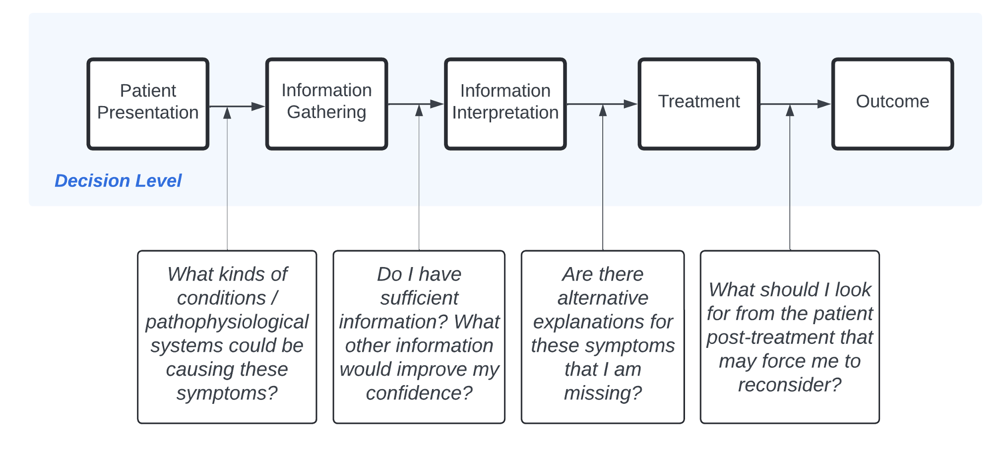

---
#########################################
# options for knitting a single chapter #
#########################################
#output:
  #bookdown::html_document2: default
  #bookdown::word_document2: default
  #bookdown::pdf_document2:
  #  template: templates/template.tex
#documentclass: book
bibliography: [bibliography/references.bib]
---

# Overall Discussion {#chapter-7}

\adjustmtc
\markboth{7. Overall Discussion}{}

*"All the social sciences, in different measure and manner, have been struggling with the place of uncertainty as an aspect of their research and theory."*

[@fiddle_uncertainty_1980] (pg. 6)

\
Over the course of this thesis, we have presented research that represent some of the complexities of real diagnostic decisions to understand the cognitive mechanisms of diagnoses. In particular, we aimed to use the study of information seeking, hypothesis generation and confidence to better understand their interplay. We studied how diagnoses change over time, to investigate potential sources of both diagnostic error and miscalibrations of confidence during diagnoses. This section first provides a brief summary of each of the previous chapter’s findings. We then synthesise these findings into an overall account of the diagnostic process, whilst contextualising this account in both medical practice and past research. We finally provide an evaluation of the strengths and limitations of this thesis, with implications and future work for both researchers in cognitive psychology and medical educators.\

Chapter 2 presented a scoping review of the existing literature on confidence during medical diagnoses. This review revealed evidence that confidence judgements during medical diagnoses are rarely calibrated to objective performance/accuracy. Past findings also linked confidence to other aspects of the patient care process, such as referrals to specialists, prescribing medication and ordering tests. It was noted that the majority of past studies utilised textual patient vignettes to study diagnoses as single decisions (i.e. with information presented in a uniform, linear fashion, followed by a prompt for clinicians/participants to provide a diagnosis), rather than using more dynamic, integrated decisional processes. We used the past findings in the extant literature to propose a conceptual model of decisional, clinician-based and contextual factors that impact diagnostic confidence.\

In Chapter 3, we presented the first empirical study of this thesis, which was an online study that used more dynamic patient vignettes (when compared to the linear, single-decision vignette tasks of previous research). The aim of this study to investigate how medical students seek information and manage a set of differentials over the course of a diagnostic decision. The nature of this task allowed for analysis of information seeking patterns between participants and between cases. It was found in this study that the breadth of differentials initially considered by participants (based on information from the patient’s medical history) was predictive both of how much information they subsequently sought and how much confidence they gained over the course of the case. Participants were also found to broaden the differentials they considered as they received more information. However, seeking more information was not necessarily associated with higher accuracy. Analyses revealed that diagnostic accuracy was predicted by seeking more valuable information and being more standardised in the information that was sought across patient cases, hinting that an efficiency of information seeking is critical to accurate diagnostic decisions.\

In Chapter 4, we presented a think-aloud study, during which we recorded the verbalisations made by medical students whilst seeking information and recording confidence during the same patient cases used in the study from Chapter 3. Compared to the paradigm of the previous chapter, the use of a think-aloud methodology provides a more natural probe of differentials being considered at any given time, rather than using an online interface. By coding verbal utterances made by participants, we were able to detect different reasoning strategies used on each case. We replicated key findings from the online vignette study, notably that students tended to put a lot of weight on generating differentials from the Patient History (based on a thematic analysis of their responses to a debrief interview) and then adopted a general pattern of broadening the differentials they were considering as they received more information (based on coding and comparing the incidence of utterances by students of either adding or removing differentials from their consideration). Despite recruiting medical students based at the University of Oxford (and hence controlling for educational experience), results showed that students displayed a wide range of reasoning strategies that were not simply tied to differences between individuals or between cases.\

In Chapter 5, we presented a study that used a more naturalistic methodology in the form of virtual reality (VR), in which medical students interacted with patient and nursing avatars in real time. We used this methodology to study how different types of information seeking (i.e. around Patient History, Physical Examinations and Testing) related to both confidence and the appropriateness of diagnoses among medical students. This methodology also aided us in asking whether medical students would narrow or broaden their diagnostic differentials in a naturalistic medical scenario where patient treatment was required. We found that higher confidence earlier in the scenario was associated with more tests/investigations being sought later on. We also found that participants were more confident in their diagnosis at the end of the scenario, after they had administered more treatment during the scenario. We found that participants tended to narrow the range of differentials they considered over the course of scenarios, which is posited as being a result of hypothesis-driven investigations and feedback from successful patient treatment, both of which allowed medical students to eliminate differentials from consideration.\

In Chapter 6, we presented observations via a rapid ethnography approach within real medical settings, namely within an Adult Intensive Care Unit (AICU) and an Emergency Department (ED). The aim was to use these observations to assess the strengths and limitations of the empirical studies within this thesis, particularly with regards to their applicability to real medicine. We found that situations of diagnostic uncertainty arose both with respect to a lack of immediately available information on a patient (in AICU) and with respect to projecting forward on how a patient will develop in the future (in ED). We also found that information seeking, such as requesting tests, had a strategic aspect in terms of seeking tests to confirm/rule out a particular diagnostic hypothesis, which varied across clinicians when comparing their approaches. However, the information seeking process was also found to be affected by contextual factors, such as the availability of staff and time pressures, which brought with them different diagnostic reasoning strategies (such as narrowing differentials as quickly as possible during busy shifts).\

Across these chapters, we increased the naturalism of the methodologies used, capturing more aspects of real medical practice with each successive study, with the aim of bridging together the control/rigour of lab studies and the richness/complexity of real medical practice. A key consideration for this research was to generate findings that could be directly applicable to medical decision making. Hence, we utilised a variety of experimental methodologies, including simulation-based and observation-based techniques. To our knowledge, this is the first work of this kind to study diagnostic decisions with such a variety of approaches, whilst maintaining a consistent focus on information seeking, hypothesis generation and diagnostic confidence across all studies. By utilising this variety of techniques, we can validate what is observed in controlled lab experiments within real clinical settings, and conversely elucidate the contributing factors from clinical settings that affect behaviour in these controlled experimental settings.

## An Integrative Model of Diagnosis

The origin of this research was the preponderance of past work that quantified the large scale of diagnostic error [@kohn_errors_2000; @mcglynn_measurement_2015], alongside other work that has made links between diagnostic errors and cognitive biases [@crowley_automated_2013; @restrepo_annals_2020]. There is also a rich extant literature that has consistently found diagnostic confidence to be miscalibrated relative to the objective accuracy of clinicians across different experience levels [@friedman_are_2001; @yang_effect_2012; @meyer_physicians_2013]. We therefore aimed to understand how such miscalibrations occurred and whether they occur due to certain (perhaps suboptimal) information seeking patterns. As our research findings have evolved, our focus has broadened. Our aim has instead been to better understand and model the diagnostic decision process, in terms of the differentials considered and the information sought, as it develops over time. This has meant focusing instead on improving our understanding of what constitutes a ‘good’ diagnostic decision, rather than identifying biases (which can be empirically challenging to directly link to incidences of errors).\

When we consider our key findings across studies, we can propose an account of the diagnostic process as it emerges in medical practice, which builds on the account provided during the discussion section of Chapter 3 (on our online study). In [Table \@ref(tab:integrative)](#tab:integrative) below, we detail the main stages of the diagnostic process, alongside a summary of the corresponding findings from our studies that support each of these stages.

```{r integrative, include=TRUE, warning=FALSE, message=FALSE, echo=FALSE,out.width='100%'}

integrative <- as.data.frame(read_excel("./assets/diagnosisIntegrativeSimple.xlsx"))

colnames(integrative) <- c("Stage of the Diagnostic Process", "Description", "Associated Study Findings")

#ft <- flextable(integrative)
# ft <- align(ft, part = "all", align = "center")
# ft <- width(ft, j = 1, 1)
# ft <- width(ft, j = 2, 2)
# ft <- width(ft, j = 3, 3)
# ft <- set_caption(ft,"Integrative model of diagnostic decisions, with respect to information seeking and hypothesis generation, based on findings from our studies. The Description column details the three stages of the diagnostic decision process. The main findings from our studies that support each of these stages is provided in the Associated Study Findings column, including the section/figure of the thesis from which these findings are taken. We note that these stages are not considered as constituting a linear process. Rather, it is envisioned that clinicians reflect on their decision making by ‘going back’ to previous steps (e.g. revisiting initial differential generation whilst determining a diagnosis, cycling between broadening and narrowing differentials).")
# ft <- hline(ft, i = 3, j = 1:3)
# ft <- hline(ft, i = 5, j = 1:3)
# ft <- valign(ft, j = 1:3, valign = "top", part = "all")
# 
# ft

 # knitr::kable(integrative, col.names = c("Stage of the Diagnostic Process", "Description", "Associated Study Findings"), longtable = TRUE, caption="Integrative model of diagnostic decisions, with respect to information seeking and hypothesis generation, based on findings from our studies. The Description column details the three stages of the diagnostic decision process. The main findings from our studies that support each of these stages is provided in the Associated Study Findings column, including the section/figure of the thesis from which these findings are taken. We note that these stages are not considered as constituting a linear process. Rather, it is envisioned that clinicians reflect on their decision making by ‘going back’ to previous steps (e.g. revisiting initial differential generation whilst determining a diagnosis, cycling between broadening and narrowing differentials).") %>% 
 #   column_spec(1, width = "5em") %>%
 #   column_spec(2, width = "12em") %>%
 #  column_spec(3, width = "16em") %>%
 #   collapse_rows(columns = 1:2,target=3,valign = "top",row_group_label_position="identity",longtable_clean_cut = FALSE) %>%
 # kableExtra::kable_styling(latex_options=c("HOLD_position", "condensed"))

 integrative %>%
  knitr::kable(col.names = c("Stage of the Diagnostic Process", "Description", "Associated Study Findings"), longtable = TRUE, escape = FALSE,caption="Integrative model of diagnostic decisions, with respect to information seeking and hypothesis generation, based on findings from our studies. The Description column details the three stages of the diagnostic decision process. The main findings from our studies that support each of these stages is provided in the Associated Study Findings column, including the section/figure of the thesis from which these findings are taken. We note that these stages are not considered as constituting a linear process. Rather, it is envisioned that clinicians reflect on their decision making by ‘going back’ to previous steps (e.g. revisiting initial differential generation whilst determining a diagnosis, cycling between broadening and narrowing differentials).") %>%
  kableExtra::kable_styling(latex_options=c("HOLD_position")) %>%
  column_spec(1, width = "5em") %>%
  column_spec(2, width = "12em") %>%
 column_spec(3, width = "16em")


```

On step 1 of this process, we found the influence of early differentials generated from the Patient History during the online vignette study (Chapter 3) on the subsequent decision process. We also found, from qualitative thematic analysis, that medical students tended to adopt an approach of progressive investigation, starting from history taking (Chapter 4). During our vignette-based paradigms, participants always started with information on the patient’s medical history. Starting with history taking is taught within medical education, and it is only when patients are unconscious, non-compliant or lacking in capacity that this might change. The major role of history taking corresponds with past findings that history taking contributes to around 70%-80% of final diagnoses, relative to physical examinations and laboratory investigations [@hampton_relative_1975; @peterson_contributions_1992; @tsukamoto_contribution_2012] (or 56% when using a more conservative estimate from @sandler_importance_1980). Adopting an approach that stems from history taking also has clear advantages, as clinicians have been found to be more accurate in their diagnoses when presented with a patient history first during a case rather than other information [@tio_effect_2022]. It has also been found that differentials are more influential when considered earlier on in the decision process [@kourtidis_influences_2022], which would speak to the importance of early history taking and the differentials generated from said history. History taking, when done well, could also lead to more selective and cost-effective choices for specialised tests [@muhrer_importance_2014]. While beginning with information from the patient’s medical history makes intuitive sense for a clinician seeking to understand a patient’s condition, it also seems to have benefits for diagnostic accuracy.\

On step 2 of this process, we found evidence that medical students tended to broaden rather than narrow the differentials they were considering in both the online vignette study (Chapter 3) and the think-aloud study (Chapter 4). Consideration of a broad set of differentials has been cited as a positive result of history taking, leading to a consideration of a broad range of etiologies/pathophysiological systems [@devries_improving_nodate], which deviates from the supposed ‘gold standard' for diagnosis: logical deduction via ruling out possible hypotheses [@kassirer_teaching_1983]. We found in our online study that confidence was positively associated with both the amount of information sought and how much the number of differentials being considered changed over the course of the decisional process. In our studies, confidence was defined in terms of readiness to treat, and the following step of this integrative model is related to using patient treatment to narrow diagnostic differentials. With this in mind, this second step involves clinicians being as comprehensive as possible (with respect to differentials) up until the point of beginning treatment for the patient. This is also seen in medical practice. Within primary care, common strategies that have been identified for diagnoses and treatment plans among physicians include staying open to alternative diagnoses, taking actions to minimise the chance of missing critical diagnoses and allowing symptoms to develop to gain more information [@hewson_strategies_1996]. Maintaining an open-minded approach to diagnoses is also important for avoiding premature closure, whereby a clinician closes off their thinking for other diagnostic possibilities too early and subsequently ignoring incoming, crucial information [@eva_difficulty_2006]. Before the patient’s response to treatment provides feedback to the clinician (helping them narrow their diagnostic thinking), remaining open-minded is important for safe and accurate diagnoses. This step of the process is then about increasing confidence enough to the point where clinicians feel ready to begin treatment (and, accordingly, the following step 3).\

On step 3 of this process, we posit that the act of administering treatment and ordering hypothesis-driven tests is key to narrowing the differentials being considered from the broad range being considered just prior. As noted for both the online (Chapter 3) and the think-aloud (Chapter 4) studies, we showed that the vast majority (around 90%) of participants broadened their differentials with more information (with a small minority tending to narrow their differentials on average across cases). This marks a key difference from our VR study (Chapter 5), during which participants tended to narrow their differentials over the course of the scenarios. We note a few main differences in the methodology of our VR study relative to both vignette studies:

-   Participants could visually inspect a patient and even talk to them in real time.
-   Participants could request a wider range of specific tests/investigations.
-   The presented patient deteriorated over the course of the scenario if no action/intervention was taken.
-   Participants could administer treatment to improve the patient’s current state.

The vignette studies were useful for allowing us to experimentally control the available information and observe diagnostic decision making using discrete stages of information seeking. The differences between the VR and vignette studies can be used to explain why participants narrowed their differentials in the former. Participants could use the administration of treatment and the requests for specific hypothesis-driven tests to narrow their differentials, especially given that a patient’s reaction to treatment (i.e. whether they improve or not) is useful as a marker for whether the clinician’s diagnostic thinking is correct or not. This corresponds with the view that treatment is not only an end goal of diagnosis, but is itself a form of diagnosis [@brody_diagnosis_1980]. As our vignette studies did not contain an observable patient who could be treated, as well as the same tests across all cases, participants may not have been able to gain enough specific knowledge that could help narrow their differentials. This is similar to the decision process found by @arocha_novice_1995 (using a think-aloud methodology) for intermediate medical students, who would broaden their differentials but then lack the knowledge to use the information provided to narrow their differentials. As can be seen in the Appendices, expert participants also tended broaden the differentials they were considering, indicating that it is a lack of either feedback to treatment or hypothesis-driven information, rather than a lack of expertise, that prevents clinicians from narrowing their differentials. Taken together, this marks a deviation from our thinking based on the vignette studies that broadening and narrowing differentials mark different types of diagnostic decision processes or reasoning strategies, but instead can be thought of different parts/stages of the same process.

## Constraints on Generalisability

Given our efforts during this research to ensure that our findings are applicable to real medical decisions, we now explore the generalisability of our findings in this section, in light of limitations to generality within the field of psychology [@yarkoni_generalizability_2022]. Across all of our studies, we emulated some key aspects of real medical practice, such as the re-evaluation of diagnoses in the face of new information (in our vignette studies) and the urgency of some medical scenarios prompted by a visible patient who is deteriorating (in our VR study). We have utilised methodologies that emulate diagnosis as an evolving decisional process, rather than a single decision. Nevertheless, as noted during observations in real medical settings (see Chapter 6), there are aspects of medical practice that are not emulated within our empirical paradigms. Broadly speaking, it is likely that clinicians would behave differently in the workplace compared to how they would behave in a controlled experimental environment. For example, healthcare staff are often balancing competing tasks and multiple patients during their work, whereas participants in our studies were able to focus on a single patient case at a time. Whilst our VR study comes closest to emulating real medical scenarios (e.g. when a patient is severely deteriorating in front of a clinician, demanding action to be taken), the wider medical context has been demonstrated to impact decision-making on the part of individual clinicians. Such contextual factors include shift busyness and time pressures [@yang_effect_2012; @soares_accuracy_2019; @gupta_associations_2023].

\
Staff also tend to have access to more resources than were made available during our experiments, such as help from other colleagues and online tools (e.g. guidelines, frameworks, best practices etc.). We do emphasise however, that this research has emulated many aspects of the diagnostic process within real medical practice (based on observations in AICU and ED). As a result, not emulating some aspects of medical practice does not diminish our findings. We also note that studying how clinicians make decisions in an individual context allows us to isolate aspects of the decision process and clinician (as per our conceptual model, Figure 1.3) that affect diagnostic accuracy and confidence. This then allows us to posit how contextual factors may impede this process, which has implications for healthcare practitioners. Finally, we note that our work has mainly been concerned with the decision making processes of medical students, as opposed to more experienced clinicians. The focus on medical students allows us to consider direct implications for medical education. Future work should consider how the cognitive mechanisms of diagnostic decisions may be different for experienced clinicians (though we expect our results with medical students to help explain how experienced clinicians make decisions as well).

## Implications for Cognitive Psychology Research

Before considering this work’s implications for medical practice and education, we first consider its implications within the field of cognitive psychology. Whereas previous work has looked at confidence within medical diagnoses, this thesis marks one of the first attempts (to our knowledge) to understand the cognitive mechanisms of the diagnostic process using such a variety of methodologies and approaches, with increasing realism in each successive study. We also note this as an example of using cognitive psychology to study a specific type of safety-critical decision making that takes place in the real world [@boag_evidence_2023], which improves our confidence in the validity of the field’s theories and methods. Increasingly, methods and theories from psychology have been used to understand naturalistic decision making [@hunt_formalizing_2021], particularly when those decisions have high stakes and high degrees of uncertainty [@shortland_choice_2020]. Whilst we focus on medical decisions during this thesis, one could also apply this kind of approach to studying other safety-critical decisions. For example, military decisions are often made with similar conditions of uncertainty and incomplete information to medicine [@zhou_information_2020]. Future work could apply similar methodologies to those used in this thesis to other types of decisions, particularly those with multiple hypotheses and a large amount of available information. For example, previous research within problem solving has used think-aloud methodologies [@groot_thought_1978] and memory tasks [@chase_perception_1973] to understand expertise and problem solving in chess. Researchers could also use similar methods for more common and important decisions with a rich set of options and information, such as deciding which house to buy or which candidate to vote for in an election. These represent examples of important life decisions that psychology could emulate and use to develop ecologically valid theories of decision making [@hechtlinger_psychology_2024].\

The use of think-aloud and simulation-based methods allows for much richer data on how individuals make important decisions by providing ongoing insight into one’s evolving thought process. Classifying unstructured verbal data into strategies used to perform tasks can be useful for developing cognitive models and testing psychological assumptions [@ostrovsky_verbal_2024]. In addition to such think-aloud methodologies, we also recommend future work make use of simulation-based methodologies, be they using VR or high-fidelity simulations (e.g. using standardised actors). As shown by the difference in behaviour between vignette-based and VR studies (i.e. broadening versus narrowing differentials respectively), participants in research studies may exhibit different behaviour in a controlled, lab-based testing environment when compared to a more naturalistic study. Whilst this does not necessarily call into question past results using simpler methodologies, this highlights the importance of utilising naturalistic experimental procedures in order to ensure that researchers' findings/claims are applicable to real-life decisions. This is especially important for specialised, safety-critical contexts such as medical decision making.\

In terms of theoretical implications, our results contribute to existing work on hypothesis generation and information seeking. An aspect of note is how individuals consider multiple hypotheses at the same time. We found that medical students (in the vignette studies) were able to have in mind several hypotheses based on the patient history and then considered even more hypotheses with more information. Hence, medical students are able to consider multiple hypotheses/differentials at the same time. Past work within psychology has shown that individuals fail to eliminate hypotheses from consideration [@wason_failure_1960] or to have their mind changed [@akaishi_autonomous_2014] especially when highly confident [@rollwage_confidence_2020; @pescetelli_confidence_2021]. What we find in our work is that individuals can pull away from previously considered hypotheses if they have specific enough information to help rule them out (in the VR study). In the real world, it can be difficult to obtain information that is ‘diagnostic’ enough to help one’s process of elimination. The lack of helpful information can explain why individuals sometimes do not change their mind, or why individuals are not able to narrow their hypotheses (which could cause them to be ‘paralysed’ with indecision). Although information seeking has been studied in previous work, it has not tended to focus on the value of information, even though the expected value of information has been cited as a guide for our attention [@manohar_attention_2013]. In the context of diagnosis, the identification of critical information (in among other, less useful, information) is important to improve diagnostic accuracy [@kostopoulou_predictors_2008]. Future work could then consider information seeking for contexts in which not all information is equal when considering their value/relevance (which is more analogous to the real world).\

This work also contributes to ongoing research on metacognition, which has been previous defined as the thoughts that one has about their own thoughts [@flavell_metacognition_1979]. Decision making can be thought of as a cycle between states of monitoring and control, such that decision makers self-reflect and monitor how the decision is made [@nelson1990], such as how confident/uncertain they are that their decision is correct. For example, a doctor may decide on a diagnosis for a patient, prescribe a corresponding course of treatment and then monitor how the patient develops after this treatment. If the patient does not improve, the doctor might reconsider their initial diagnosis. This is an example of how we may monitor our decisions after we make them and then use this monitoring to change our behaviour. More generally, when we believe we have made an error on a decision (whether this is objectively the case or not), we slow down on subsequent decisions in order to minimise future errors in a phenomenon known as ‘post-error slowdown’ [@rabbitt_three_1968]. Similarly, we may speed up when we perceive ourselves to be making few errors. This trade-off between speed and accuracy is a common example of how monitoring our own performance influences future behaviour. This monitoring of our own performance can be thought of representative of metacognition, with confidence being an example of this self-monitoring.\

In our vignette studies, we found that medical students provided confidence judgements that tended to be calibrated to objective accuracy, indicating an ability to accurately, metacognitively introspect. In our VR study however, we did not find evidence that confidence judgements were well calibrated to objective accuracy. These divergent findings could be explained by the different measures used to operationalise accuracy across our studies. In the vignette studies, accuracy was operationalised as the likelihood assigned to the correct differential if one is included. In the VR study, accuracy was considered across the participants’ differentials as a whole for a measure of Diagnostic Appropriateness, taking in to account the likelihood values assigned to each differential, how probable each objectively is for the scenario and how many differentials were considered in total. Each of these measures was chosen based on the specific study and the types of decision being made. When considering these findings together, there is scope for future work to establish a common best practice for defining accuracy and confidence during diagnosis studies (and other decision making studies). As we found during our VR study, ‘accuracy’ as a concept can be hard to establish in a context such as medical diagnosis. For research on metacognition, particularly confidence, a ‘ground truth’ is usually needed to ascertain the quality of one’s metacognition. Future work could then use naturalistic decisions to consider what would constitute high accuracy/performance in situations where ‘ground truth’ is not as easy to define as in controlled lab experiments (in which findings related to accuracy may not be as ecologically valid).\

When modelling decisions, studies on decision making have tended to use tasks with binary choices (i.e. two-alternative forced-choice or 2AFC tasks). However, as is the case with medical decision making as well as other real-world contexts, decisions often involve far more than simply two choice alternatives. This aspect of real-world decision making has inspired research within cognitive psychology to apply and validate existing classical decisional models to situations with several decision alternatives [@churchland2012; @tajima2019; @busemeyer2019; @trueblood2022]. One such model is that of evidence accumulation: confidence is usually considered to reflect the relative strength of evidence accumulated in favour of a decision alternative/choice [@vickers_effects_1982]. This process is closely related to the time it takes to respond, such that quicker decisions usually correspond with higher confidence [@kiani_choice_2014]. This evidence accumulation process is thought to be affected by the rate at which information is used to updates one’s beliefs [@kloosterman_humans_2019].\

In the same way that psychology research often studies using 2AFC tasks, such research has also tended to characterise decisions using a single evidence accumulation strategy. In our think-aloud study however, we found that participants utilised a range of reasoning strategies that were not simply tied to individual decision makers or cases. Given our focus on understanding the reasoning strategies used by clinicians, we should consider whether such strategies are observable for more general tasks and whether they result in different evidence accumulation strategies. For instance, if an individual adopts a more thorough reasoning strategy (e.g. scheme induced), they can expect to receive much more information given the thoroughness of the process. We would expect then that each piece of information would be weighted less and update beliefs to a smaller extent than for decision processes with more selective information seeking. This process would also be affected by the presence of action consequences (e.g. treatment) or explicit feedback that does not leave room for interpretation (e.g. a patient’s reaction to treatment), neither of which are considered in dominant lab-based paradigms within cognitive psychology research.\

We also consider here types of decision with many alternatives. Models of evidence accumulation have tended to consider two competing options for a decision [@mcmillen_dynamics_2006], but could be extended to decisions with several options [@brown_observing_2009]. @trueblood2022 notes that context effects occur when a new decision alternative is added (i.e. a broadening of hypotheses), which violate classical decision theories. @churchland2012 found evidence of lower neural activity in the face of new evidence/information when there were more decision alternatives, hinting at how decision making strategies could affect the underlying evidence accumulation process. We postulate that the study of reasoning strategies could aid with this, as it could be that individuals do not always consider several hypotheses at once for a decision (as with a pattern recognition approach) even if there are several potential options. We also note that decisions such as diagnoses often do not involve decision alternatives/options that are laid out for participants to choose from. Rather, such alternatives are generated by the individuals themselves. This facet of decision making has received less attention within cognitive psychology research, especially insofar as it involves individuals applying their own decision making strategy. Taken together, these aspects of real decisions offer a novel path for future research on the cognitive psychology of decision making.\

One other aspect of diagnoses that has broader relevance to other decisions in cognitive psychology is about how we decide that we have enough information. Individuals may have a bias towards assuming that they have adequate information to make a decision rather than seeking more [@gehlbach_illusion_2024] and they may evaluate less information than we might expect before making a decision [@klein_people_2018]. Having agency over one's own information seeking has also been shown to impact confidence. Individuals have been found to report a ‘boost’ in their confidence when they are permitted to decide when to stop seeking information (and make a decision based on this information), which is not present when this decision point is forced upon them [@wei_confidence_2021]. When asked to seek information for a decision rather than being provided all available information up front, clinicians reported lower confidence in their diagnoses [@gruppen_information_1991]. In our vignette studies, participants were given freedom to choose when they had sufficient information to proceed from one stage to another. Clinicians may not be afforded complete freedom in medical contexts, where they may have to make decisions in a time-critical manner. But when there are not overt time pressures, it seems logical to seek as much information as is available, and it would be counterintuitive to not do so. Taken together, how individuals decide to stop seeking information is an interesting path for future work.\

Future research can also consider how information seeking relates to hypothesis generation. As we have explained in this chapter, the diagnostic process can be thought of as comprising different stages of broadening and narrowing of differentials. This would then imply differing goals for information seeking. It has been found that individuals prefer confirmatory information when there is more information available, and prefer contradictory information when less information is available [@fischer_selective_2008]. With this mind, when clinicians are broadening their differentials, they may seek information to confirm (rather than rule out) differentials (referred to as a ‘positive test strategy’ by @klayman_confirmation_1987), meaning they seek more information. As we found in the online study, higher information seeking was associated with higher gains in confidence. When narrowing differentials however, clinicians seek less information, but select such information to be disconfirmatory of certain differentials. What is considered ‘enough’ information is likely to be quite different depending on which of these types of decision stages the individual is going through. For instance, do individuals decide they have enough information sooner when narrowing their hypotheses, rather than broadening them? Future work could consider psychological tasks that demand a broadening or narrowing of hypotheses, and how these might affect information seeking patterns.\

Further study of the link between information seeking and hypothesis generation could help improve metacognitive awareness (i.e. how calibrated our judgements of confidence/certainty are). Judgements of confidence could be prone to biases, due to insufficient weighing up of available information in a rational, systematic matter. Prompting judgements of certainty that consider the available balance of information (i.e. the available information either affirming or contradicting one’s beliefs) could improve judgements of uncertainty. Within research on medical decision making, there have been claims that prompting clinicians to slow down would improve their decision making [@lambe_dual-process_2016]. This is referred to as deliberative reflection, which has had mixed results in terms of actually improving diagnostic accuracy and confidence calibration [@mamede_effect_2010; @lambe_guided_2018; @costa_filho_effects_2019; @kuhn_learning_2023]. There is agreement from a theoretical perspective that slowing down would improve these decisions (such that individuals utilise their more rational System 2 mode of thinking as per @kahneman_thinking_2011). However, these underwhelming results may stem from a lack of agreement on what individuals actually do when they slow down and how they should reflect on their decision making during this time. This is especially important given our results that show the range of different reasoning strategies being used by medical students. A path for future work could be on designing aids for deliberative reflection that prompt decision makers to consider the balance of information they have and forecasting what information would change their mind or increase their confidence. Such a cognitive intervention has not currently been considered within medical education, or indeed in other decision making contexts.

## Implications for Medical Practice and Education

We now turn to the implications of our work for future medical education and practice. Firstly, our results have implications for how medical educators think about clinical reasoning and how it is taught. In our think-aloud study, we showed that medical students did not have a conscious awareness overall of the reasoning strategies that they tended to use when making diagnoses by comparing the reasoning strategies used to the students’ subjectively preferred strategies. It has been shown in past research that individuals tend to be much better at seeing cognitive biases in others when compared to themselves [@pronin_bias_2002], indicating that individuals may lack insight into their own decision process. It has been suggested that teaching about cognitive biases and reasoning could help reduce diagnostic errors [@royce_teaching_2019]. What belies the focus on such educational interventions is that a single, optimal approach to diagnostic reasoning should be taught to students [@kassirer_teaching_1983]. As our findings suggest however, medical students vary in how they approach diagnoses even when relatively homogeneous in terms of their medical education (i.e. being educated within the UK at the same medical school). When resolving diagnostic uncertainty, there can be room for both structured, analytic approaches and more intuitive approaches to clinical reasoning [@custers_medical_2013]. Rather than teaching a single approach to clinical reasoning, we recommend that medical students are taught a number of approaches that they could choose to utilise depending on the situation at hand. Our research currently does not provide a clear answer as to the properties of a patient case that demand a particular strategy to maximise diagnostic accuracy. For example, should a clinician seek to broaden their differentials (and not rule any differentials out) if they are not very confident? If a patient case is complex, should clinicians adopt a pattern recognition approach (i.e. identifying if the patient condition resembles a ‘textbook’ case of a common condition)? This could be a promising avenue for future work: integrating multiple reasoning strategies into medical curricula and determining when clinicians should utilise a particular strategy.\

Our work also underscores the importance of studying uncertainty in medical decision making. As reflected during observations in an Emergency Department (ED) (Chapter 6), diagnostic uncertainty has an impact on patients too. The lack of a definitive diagnosis can lead to delays in treatment and it can be distressing for patients and their next of kin to not understand the source of their symptoms [@dahm2023]. From thematic analysis of interviews following patient vignettes, @cox_role_2024 found that doctors were hesitant to express diagnostic uncertainty to patients during the safety netting process (i.e. advising patients on what to do going forward, especially if symptoms persist or worsen), as this was viewed to be likely to cause distress. This may lead doctors to display overconfidence to patients relative to their actual diagnostic uncertainty. Diagnostic uncertainty can also have an impact on the wellbeing of clinicians. Stress stemming from the management of uncertainty has been linked to lower resilience among trainees [@simpkin_stress_2018], with medical students varying in how much they can tolerate uncertainty and ambiguity [@hancock_tolerance_2020]. For both patients and clinicians, education around uncertainty is crucial for improving wellbeing, and is also a natural part of medicine. As put by Sir William Osler (as posthumously recorded by @bean1954), *“medicine is a science of uncertainty and an art of probability.”*\

One recommended focus for medical education is on the role of information seeking in formulating clinicians’ uncertainty. @wray_diagnosis_2015 differentiates this as informational uncertainty (i.e. from deficits in knowledge) as opposed to intrinsic uncertainty (i.e. from the natural complexities of anatomy and pathologies). This dichotomy is similar to the distinction from @ülkümen2016 between epistemic and aleatory uncertainty respectively. We have found in our own work and in past work [@gruppen_information_1991; @ko_divergent_2022] that having more available information increases confidence. As discussed in the previous subsection (Implications for Cognitive Psychology Research), a key decision for clinicians to make is when they feel they have enough information to make a decision. Given that decision aids and frameworks have tended to focus on reducing diagnostic error in the first instance [@dave_interventions_2022], an intermediate (and more tangible) goal could be to design interventions to aid clinicians’ judgements of whether their current information (on patient history, examinations, tests/investigations) is enough to make a diagnosis (be it accurate or not). What may be underlying overconfidence in diagnoses is clinicians seeking insufficient information before making a decision [@meyer_calibrating_2017], with further information then being interpreted to fit that decision. More appropriate expressions of uncertainty in diagnoses could stem from fostering greater humility [@fischer_intellectual_2024], both about what information is currently unknown and what information cannot be known [@gehlbach_illusion_2024]. Past psychology research has also shown that appropriate confidence judgements can be provided when asking individuals to provide both confirmatory and contradictory reasons for their decisions [@koriat_reasons_1980].

\
Prompting clinicians and medical students to consider their current balance of information for and against their diagnostic differentials may help aid judgements of whether further information seeking is required. Such an intervention would have a positive effect. For example, one study found that the use of a cognitive framework known as SNAPPS (**S**ummarize relevant patient history and findings; **N**arrow the differential; **A**nalyse the differential; **P**robe the preceptor about uncertainties; **P**lan management; and **S**elect case-related issues for self-study) increased the expressions of uncertainty among medical students during clinical rounds [@wolpaw_student_2012]. There is promise in prompting uncertainty to facilitate discussions between clinicians, which can contribute to spotting potential diagnostic errors earlier on in the decisional process. However, future research is still needed to determine the right balance between prompting clinicians to be open to other diagnostic hypotheses and treating patients before any negative consequences arise from undertreatment.\

A starting point for medical education would be to clearly differentiate diagnostic accuracy and diagnostic confidence among trainees and students, to promote discussion about how further tests/information could improve either or both [@santhosh_diagnostic_2019]. This is especially given past findings that show confidence and accuracy to be decoupled during diagnoses [@friedman_are_2001; @yang_effect_2012; @meyer_physicians_2013; @garbayo_metacognitive_2023]. Explicit teaching interventions on cognitive biases have currently not been shown to be sufficient in addressing such biases in actual medical decisions [@fraundorf_cognitive_2023]. Future work could then consider interventions embedded within clinical practice that prompt clinicians to monitor their own decisions and consider their uncertainty.\

Enhancing our understanding of how clinicians make diagnoses and express uncertainty is of wider relevance to the growing adoption of AI tools for medical diagnoses, especially Large Language Models (LLMs). Understanding medical decision making can shed light on how to best design AI tools to aid such decisions and help determine the situations in which clinicians would be more accurate when aided by AI tools. LLMs, such as ChatGPT, have been found not to improve diagnostic accuracy even if the LLM alone outperforms most individual clinicians [@goh_large_2024]. In fact, the use of AI during decisions (of several types/contexts) has not been found to consistently improve the accuracy of human decision makers [@vaccaro_when_2024]. Research on AI-aided medical decision making will only grow in stature as LLMs are developed and optimised specifically for medical diagnoses [@mcduff_towards_2023]. Therefore, understanding how clinicians themselves express uncertainty is important for understanding how such AI tools can express uncertainty in their own diagnoses, given there are several ways that expressions of uncertainty can be implemented [@savage_large_2025]. Our research showed that diagnostic confidence was predicted by either the receipt of information or by the provision of specialised tests, if available. This indicates that in order for AI tools to provide readouts of confidence/certainty that are aligned with how clinicians provide diagnoses, they should take into account how much information is made available, whether it is sufficient and whether any treatment has had an appreciable effect on the patient. AI models that express uncertainty in their decisions should be trained to avoid the same biases and tendencies towards miscalibrated confidence that clinicians have.

## Prompting Uncertainty During the Diagnostic Process

One potential implication for our work is that clinicians may adopt an approach of increasing uncertainty (i.e. broadening differentials, lower confidence) at different points in the diagnostic process. This brings with it a question of how future cognitive interventions or frameworks consider the point in the decision process at which they are administered to ‘prompt’ uncertainty. Uncertainty, in this case, is framed not as a barrier to good decisions (e.g. if clinicians end up paralysed by indecision), but as an essential aspect of the diagnostic decision process that is sometimes actively sought to help clinicians better evaluate their own decision making. For example, clinicians could reflect on and forecast what information would change their confidence or prompt some reconsideration of their current thinking.\

In [Figure \@ref(fig:uncertprompts)](#fig:uncertprompts) below, we provide examples of what prompting uncertainty might look like at different stages of the decisional process (using the stages outlined in the Decision Level of our conceptual model in [Figure \@ref(fig:reviewmodel)](#fig:reviewmodel)). Although past work has reviewed cognitive interventions that aimed to reduce diagnostic error [@graber_cognitive_2012; @lambe_dual-process_2016; @dave_interventions_2022] using methods such as deliberative reflection [@norman_etiology_2014; @lambe_guided_2018; @costa_filho_effects_2019; @kuhn_learning_2023], such work has not considered when during the decisional process it is best to administer these interventions. Given that diagnosis is an evolving process, clinicians can be prompted to ‘broaden’ their thinking at different points during the process. As found during our research, clinicians can utilise different reasoning processes that bring with them different focuses on narrowing or broadening the differentials being considered. We also found that broadening and narrowing of diagnostic differentials can happen at different points within the same diagnostic decision. Ensuring that clinicians do not prematurely close off their thinking from considering other diagnostic possibilities has been highlighted as a goal for research on diagnosis [@krupat_avoiding_2017].

```{r uncertprompts, include=TRUE, echo=FALSE, out.width='100%', fig.align='center', fig.cap="Decision Level of our conceptual model, developed from our scoping review (as shown in Figure 2.3). Here we provide examples of prompts of uncertainty that could take place between different stages of the process. For example, the first of these prompts (“What kinds of conditions...”) would take place after the clinician has been presented with the patient but before they have started gathering more information on the patient. The goal for these prompts would be for clinicians to broaden their thinking to consider other diagnostic possibilities that are beyond what they are considering at that point in the process.", fig.scap="Overall Discussion: Conceptual Model for Prompting Uncertainty"}



```

Considering the optimal time to administer an intervention that prompts uncertainty is important, because, as found in our think-aloud study with medical students, clinicians may use different reasoning strategies whilst making diagnoses. As a result, they would focus on narrowing their differentials at different points in the process. When using pattern recognition, a clinician is seeking to narrow their differentials as quickly as possible by only considering a single differential at a time that most resembles the patient’s current symptoms. By contrast, when using a scheme inductive approach, clinicians aim to consider as broad a set of differentials as possible by systematically considering each possible pathophysiological system that could be implicated in the patient’s condition. An example of this is the VITAMINSABCDEK mnemonic proposed by @zabidi-hussin2016, which guides clinicians through potential etiologies/causes (e.g. vascular, infectious, trauma, autoimmune etc.) for a patient condition with the express purpose of broadening differentials. Future work should then consider how diagnostic accuracy and confidence changes depending on when in the process clinicians are asked to reconsider their thinking, and what reasoning strategy clinicians are using to make their diagnosis.\

In the same way that frameworks using theory and research around metacognition have been used to design better revision techniques for students [@dunlosky_strengthening_2013; @putnam_optimizing_2016], the same could be applied for medical students. Where this line of work would have most value is considering cognitive interventions in a manner that is dependent on the reasoning strategy being used. An ideal goal for future research would be determining the properties of a patient case that should necessitate a particular reasoning strategy and a particular time point to prompt reconsideration of one’s diagnostic thinking. This also involves detecting when clinicians may be narrowing in on a diagnosis too soon. The prompts of uncertainty to reconsider a diagnosis (discussed above) may be especially useful for individuals prone to ‘diagnostic momentum bias’ [@ryan_diagnostic_2021; @aron_diagnostic_2024], where a diagnosis is harder to pull away from if more investigations/time has been put into pursuing it. This is related to the more general phenomenon of ‘decision inertia’ cited in the psychological literature [@akaishi_autonomous_2014].\

Taken together, our work has implications for both the fields of cognitive psychology and medical education. We note that our work is not without limitations, especially with regards to some remaining questions around when certain diagnostic reasoning strategies are considered optimal. The use of different methodologies with different levels of naturalism has also allowed us to consider how contextual factors within healthcare settings impact decision making, which is crucial for future work to incorporate and consider.

## Conclusion

The aim of this research was to understand diagnostic decision making from a cognitive perspective, particular how the ways in which clinicians seek information affect how they evaluate hypotheses, and in turn the confidence they have in their diagnoses. The rationale for this research was past work that found high incidences of both diagnostic error and miscalibrations of diagnostic confidence. The research presented in this thesis used a mixed-methods approach to explore the richness of the diagnostic process. The results of this research have shown a number of interesting findings: namely, that there is a range of reasoning strategies used for diagnoses, that information seeking efficiency, particularly with respect to history taking, is a predictor of diagnostic accuracy and that the diagnostic process comprises of different stages of broadening or narrowing differentials. We also found that diagnostic confidence is related to administering treatment for patients and observing the patient’s state change as a result of this treatment. Taken together, the link between information seeking and confidence is an important part of medical diagnoses, as it is for other decisions that individuals make. Our findings can be used to model the diagnostic process in such a way that future researchers and medical educators can design decision aids to improve the calibration of diagnostic confidence, namely by considering the balance of sought information and forecasting what information individuals might need to improve their confidence.
